来自[豆瓣网友](https://book.douban.com/review/8930999/)，原文在有道云笔记，为方便浏览转载至此。

现代艺术 150 年全书提及的作品图集，按书本出现顺序，来源为 Wiki, MoMA 和泰特的官网等，大部分附有链接，在原文基础增加了部分作品，替换了部分图片。

# 导论：你在看什么

## 1. Equivalent VIII 等价物 8 1966 （Carl Andre, 卡尔·安德烈）

[作品链接](http://www.tate.org.uk/art/artworks/andre-equivalent-viii-t01534)

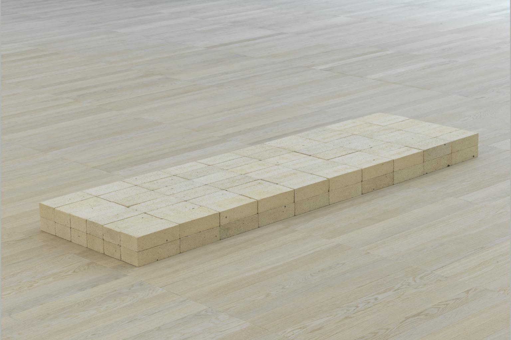

## 2. Puppy 小狗 1992 （Jeff Koons, 杰夫·昆斯）

[作品链接](https://www.guggenheim.org/artwork/48)

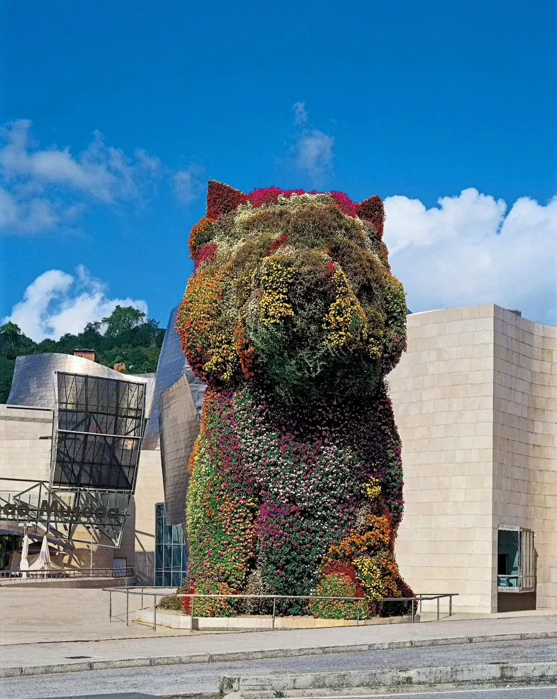

# 1 泉，1917

## 3. Fountain 泉 1917（Marcel Duchamp, 马塞尔·杜尚）

[作品链接](https://en.wikipedia.org/wiki/Fountain_(Duchamp))

# 2 前印象派：走向真实，1820—1870

## 4. Reflections of Clouds on the Water-Lily Pond 睡莲 1920 （Claude Monet, 克劳德·莫奈）

[作品链接](https://en.wikipedia.org/wiki/Water_Lilies_(Monet_series))

## 5. The Raft of the Medusa 美杜莎之筏 1818-1819（Théodore Géricault, 泰奥多尔·席里柯）

[作品链接](https://en.wikipedia.org/wiki/The_Raft_of_the_Medusa)

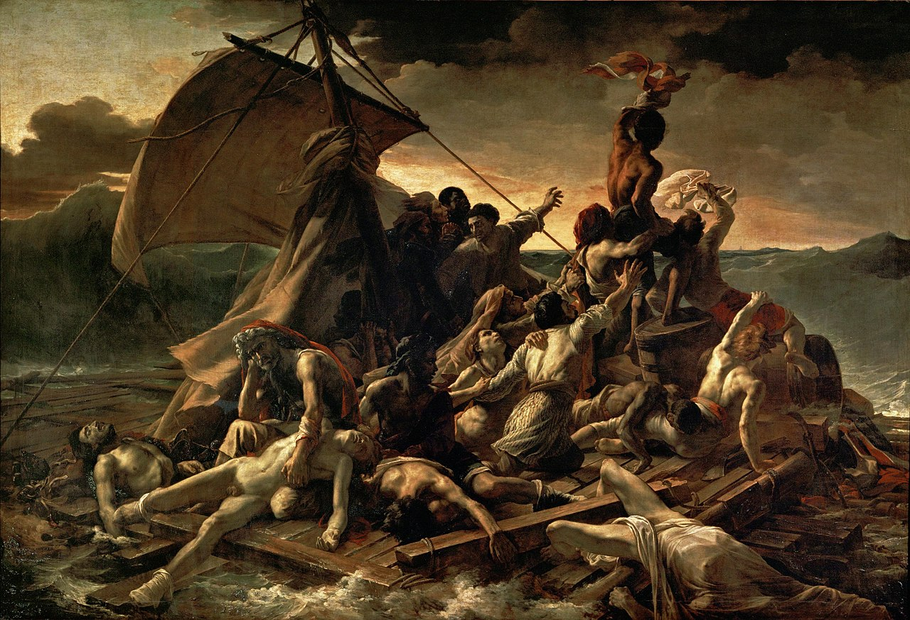

## 6. Liberty Leading the People 自由引导人民 1830 （Eugène Delacroix, 欧仁·德拉克罗瓦）

[作品链接](https://en.wikipedia.org/wiki/Liberty_Leading_the_People)

## 7. L'Origine du monde (The Origin of the World) 世界的起源 1866 （Gustave Courbet, 古斯塔夫·库尔贝 ）

[作品链接](https://en.wikipedia.org/wiki/L%27Origine_du_monde)

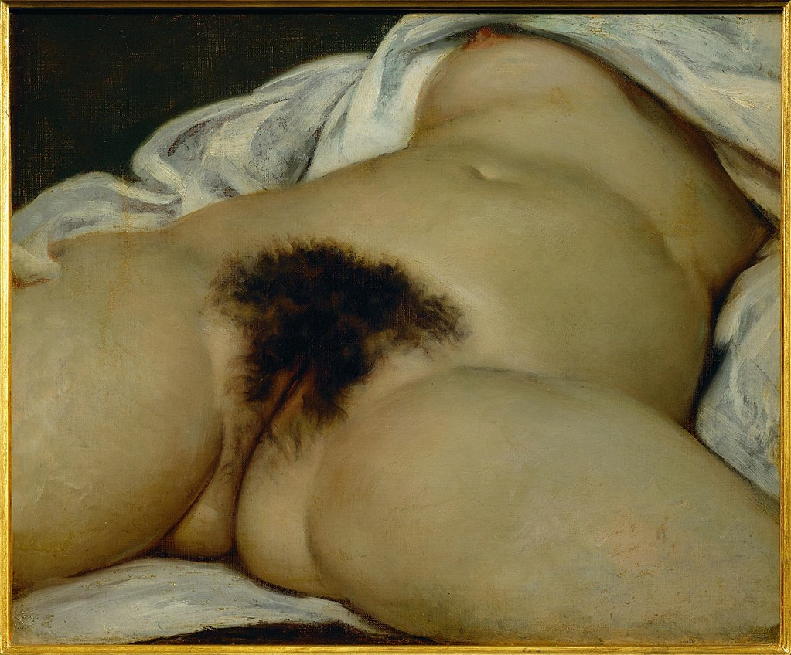

## 8. The Absinthe Drinker (Le Buveur d'absinthe) 喝苦艾酒的人 1859 （Édouard Manet, 爱德华·马奈）
[作品链接](https://en.wikipedia.org/wiki/The_Absinthe_Drinker_(Manet_painting))

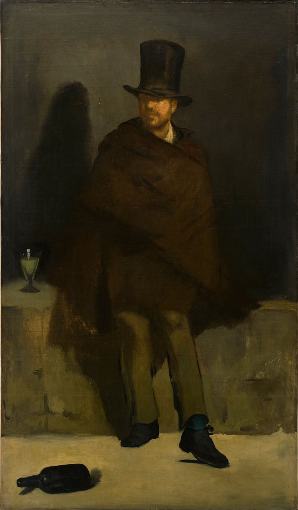

## 9. Le Déjeuner sur l'herbe (The Luncheon on the Grass) 草地上的午餐 1863 （Édouard Manet, 爱德华·马奈）

[作品链接](https://en.wikipedia.org/wiki/Le_D%C3%A9jeuner_sur_l%E2%80%99herbe)

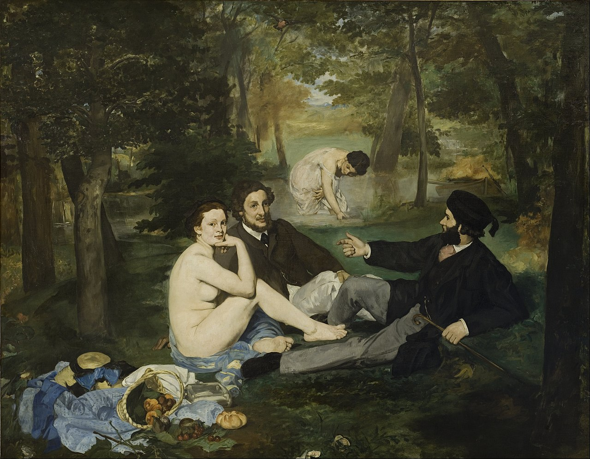

## 10. The Judgement of Paris 帕里斯的审判 （Raffaello Sanzio da Urbino, 拉斐尔·圣齐奥）

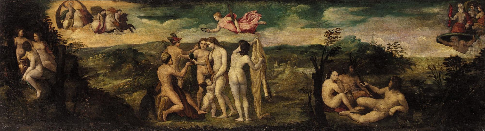

## 11. Pastoral Concert 田园音乐会 1509 （Tiziano Vecelli, 蒂齐亚诺·韦切利奥（提香））

[作品链接](https://en.wikipedia.org/wiki/Pastoral_Concert)

## 12. The Tempset 暴风雨 1508（Giorgione, 乔尔乔内）

[作品链接](https://en.wikipedia.org/wiki/The_Tempest_(Giorgione))

## 13. Olympia 奥林匹亚 1863（Édouard Manet, 爱德华·马奈）

[作品链接](https://en.wikipedia.org/wiki/Olympia_(Manet))

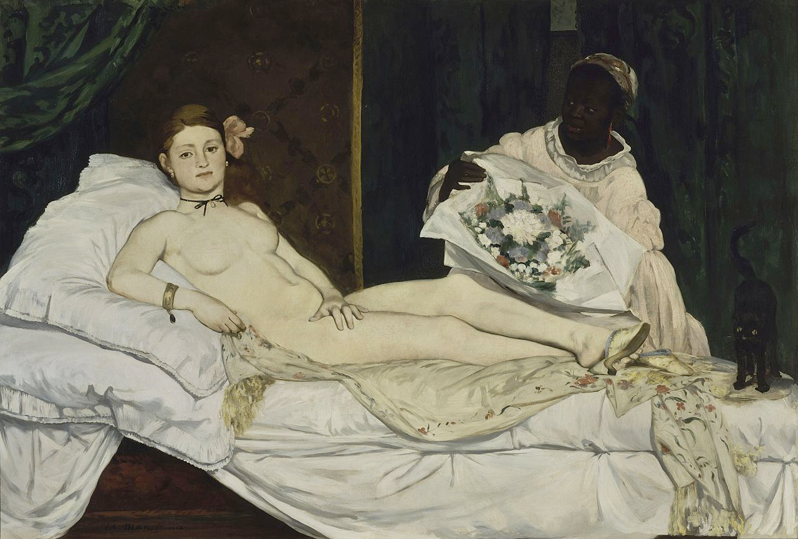

## 14. Venus of Urbino 乌尔比诺的维纳斯 1534 （Tiziano Vecelli, 蒂齐亚诺·韦切利奥（提香））

[作品链接](https://en.wikipedia.org/wiki/Venus_of_Urbino)

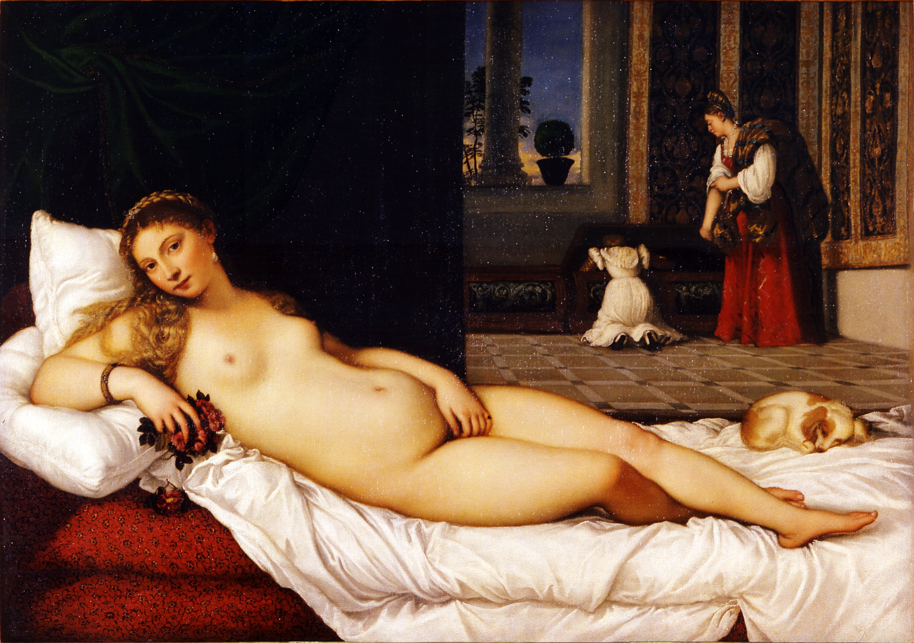

# 3 印象派：现代生活的画家，1870—1890

## 15. Impression, Sunrise (Impression, soleil levant) 印象，日出 1872（Claude Monet 克劳德·莫奈）

[作品链接](https://en.wikipedia.org/wiki/Impression,_Sunrise)

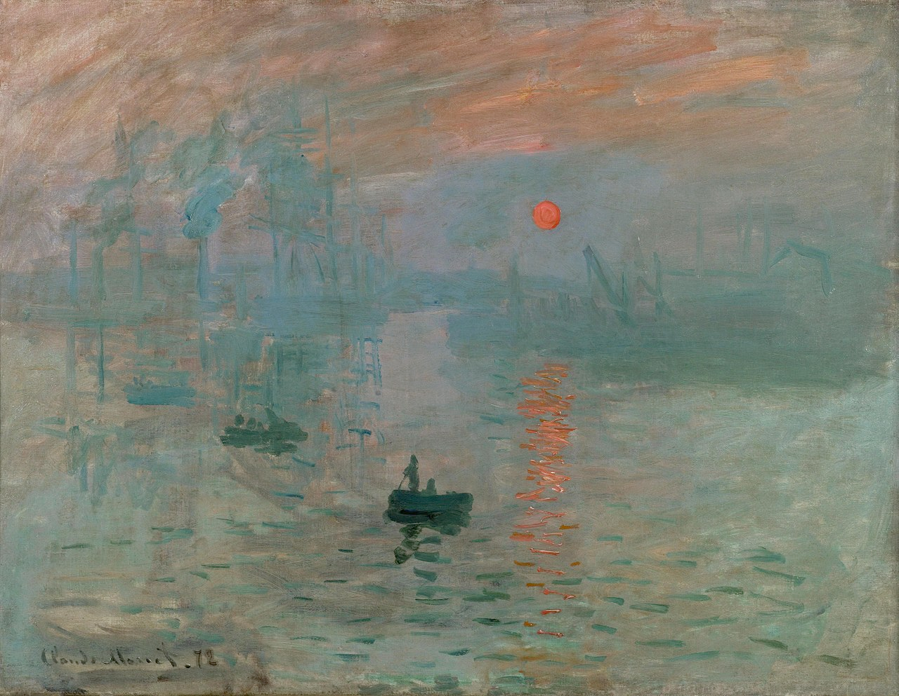

## 16. Stacks of Wheat (End of Summer) 干草堆（夏末） 1890-1891（Claude Monet 克劳德·莫奈）

[作品链接](https://en.wikipedia.org/wiki/Haystacks_(Monet_series))

.jpg)

## 17. A Modern Olympia 现代奥林匹亚 1870（Paul Cézanne, 保罗·塞尚）

[作品链接](http://www.paulcezanne.org/a-modern-olympia.jsp#prettyPhoto)

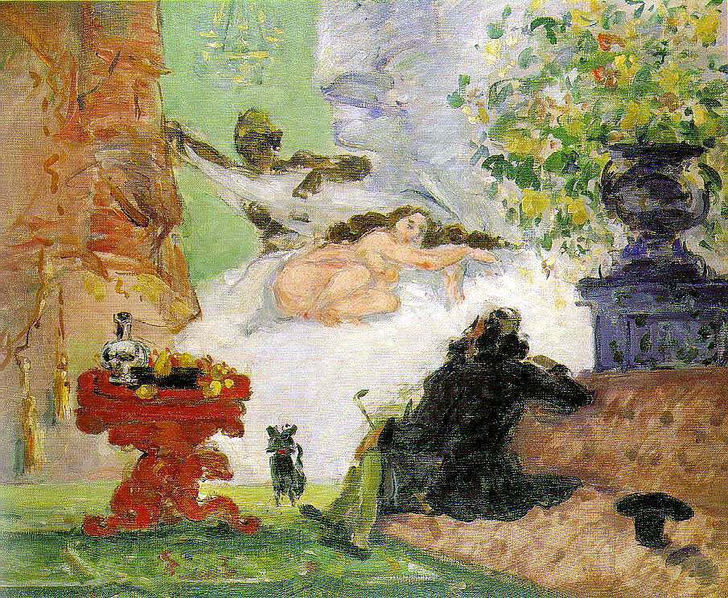

## 18. Hoar Frost, the Old Road to Ennery 白霜，通往埃纳里的老路 1873（Camille Pissarro, 卡米耶·毕沙罗）

[作品链接](https://artbookannex.com/tag/ennery/)

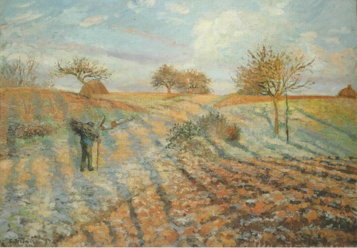

## 19. Bain à la Grenouillère 青蛙塘 1869 （Claude Monet, 克劳德·莫奈）

[作品链接](https://en.wikipedia.org/wiki/Bain_%C3%A0_la_Grenouill%C3%A8re)

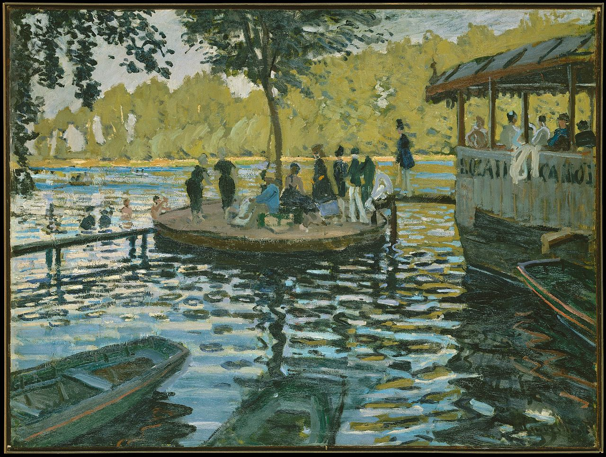

## 20. La Grenouillère 青蛙塘 1869 （Pierre-Auguste Renoir, 皮埃尔-奥古斯特·雷诺阿）

[作品链接](https://en.wikipedia.org/wiki/Pierre-Auguste_Renoir)

## 21. Rain, Steam and Speed – The Great Western Railway 雨、蒸汽和速度 1844 (J. M. W. Turner, J.M.W 特纳)

[作品链接](https://en.wikipedia.org/wiki/Rain,_Steam_and_Speed_%E2%80%93_The_Great_Western_Railway)

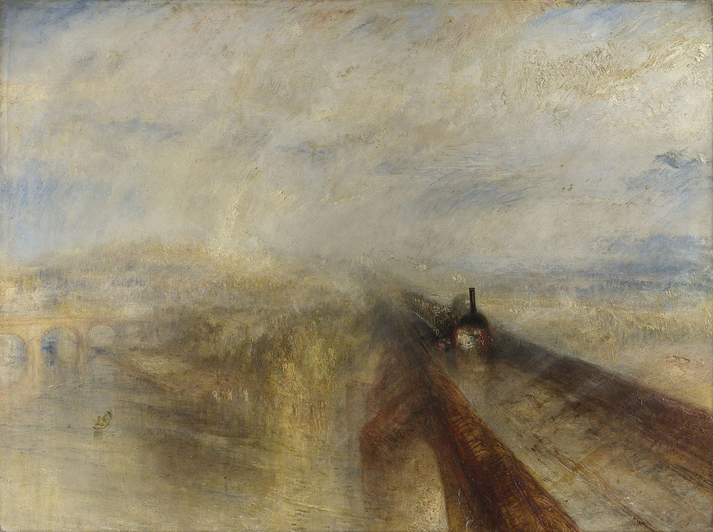

## 22. The Thames below Westminster 威斯敏斯特下的泰晤士河 1871 (Claude Monet, 克劳德·莫奈)

[作品链接](https://artuk.org/discover/artworks/the-thames-below-westminster-115865)

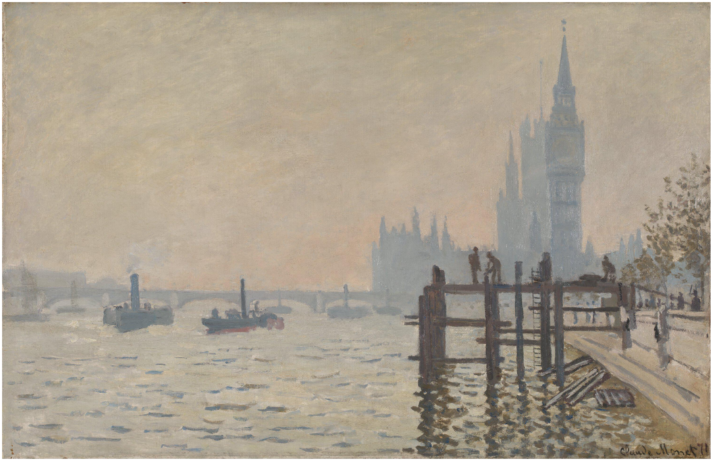

## 23. 神奈川沖浪裏  The Great Wave off Kanagawa 神奈川巨浪 1829-1833 (葛飾北斎，Katsushika Hokusai, 葛饰北斋)

[作品链接](https://en.wikipedia.org/wiki/The_Great_Wave_off_Kanagawa)

## 24. 大津駅 Station of Otsu 大津站 1840（安藤 広重, Ando Hiroshige, 安藤广重（后改名 歌川 広重, Utagawa Hiroshige, 歌川广重））

[作品链接](https://www.metmuseum.org/toah/works-of-art/JP804/)

## 25. The Dance Class (La Classe de Danse) 舞蹈课 1874（Edgar Degas, 埃德加·德加）

[作品链接](https://en.wikipedia.org/wiki/The_Ballet_Class_(Degas,_Mus%C3%A9e_d%27Orsay))

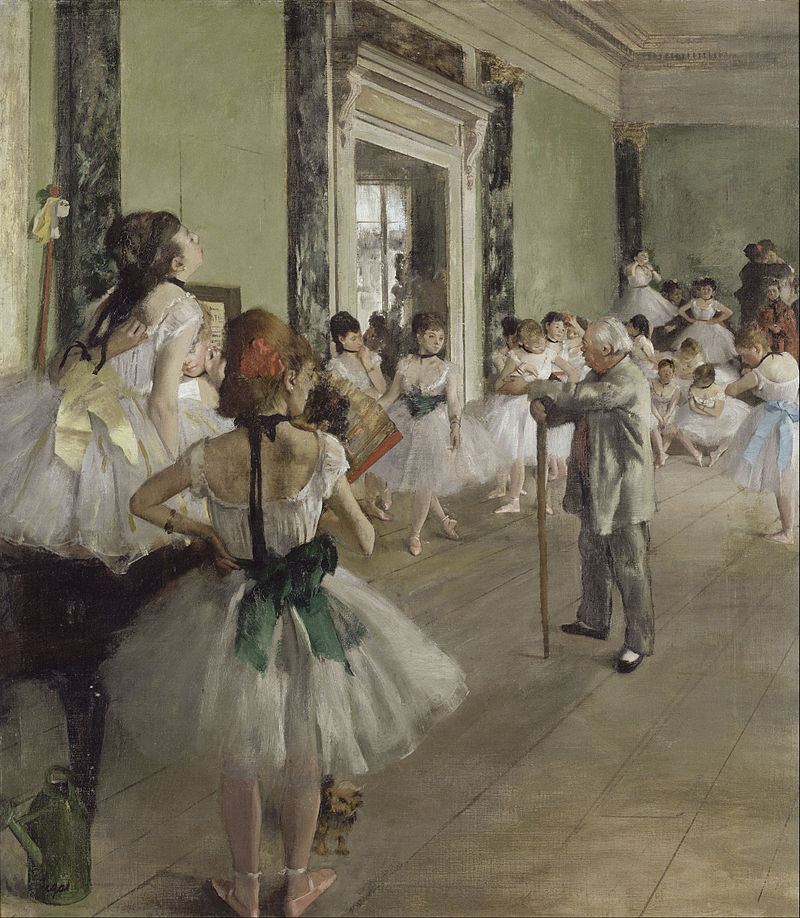

## 26. A Carriage at The Races 赛马场上的马车 1870 （Edgar Degas, 埃德加·德加）

[作品链接](https://www.wikiart.org/en/edgar-degas/a-carriage-at-the-races-1872)

# 4 后印象派：拓展领域，1880—1906

## 27. The Potato Eaters 吃土豆的人 1885（Vincent Willem van Gogh, 文森特·梵高）

[作品链接](https://en.wikipedia.org/wiki/The_Potato_Eaters)

## 28. The Yellow House 黄房子 1888 （Vincent Willem van Gogh, 文森特·梵高）

[作品链接](https://en.wikipedia.org/wiki/The_Yellow_House)

## 29. Still Life With a Plate of Onions 静物：一盘洋葱 1889 （Vincent Willem van Gogh, 文森特·梵高）

[作品链接](https://commons.wikimedia.org/wiki/File:Still_life_with_a_plate_of_onions.jpg)

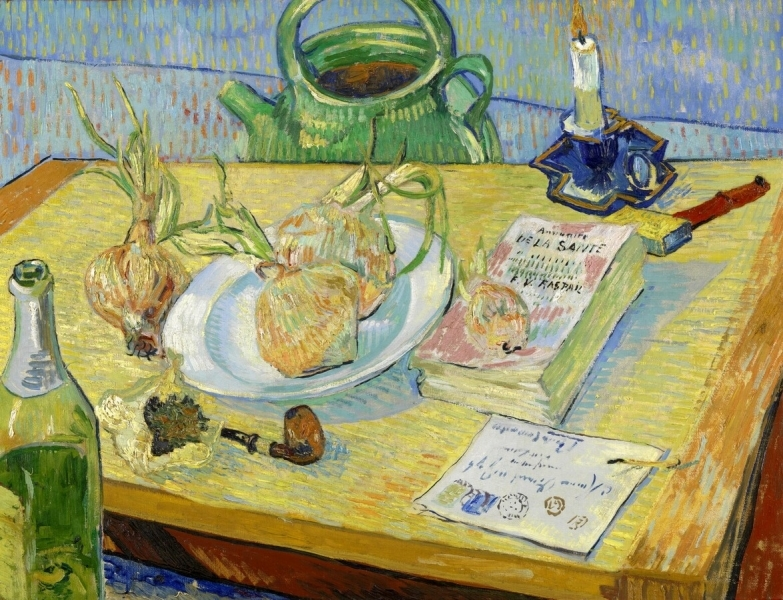

## 30. The Sower 播种者 1888（Vincent Willem van Gogh, 文森特·梵高）

[作品链接](https://en.wikipedia.org/wiki/Vincent_van_Gogh#/media/File:The_Sower.jpg)

## 31. The Night Café 夜间咖啡馆 1888（Vincent Willem van Gogh, 文森特·梵高）

[作品链接](https://en.wikipedia.org/wiki/The_Night_Caf%C3%A9)

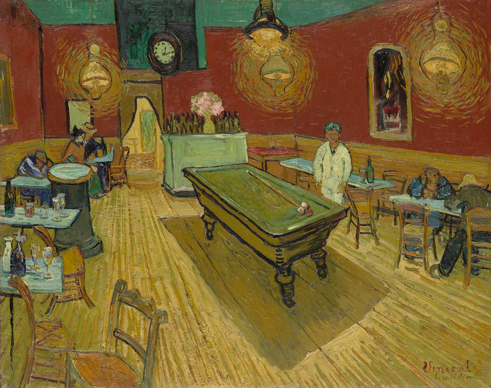

## 32. Sunflowers 向日葵 1888（Vincent Willem van Gogh, 文森特·梵高）

[作品链接](https://en.wikipedia.org/wiki/Sunflowers_(Van_Gogh_series))

## 33. Starry Night Over the Rhône 满天星斗下的罗纳河 1888 （Vincent Willem van Gogh, 文森特·梵高）

[作品链接](https://en.wikipedia.org/wiki/Starry_Night_Over_the_Rh%C3%B4ne)

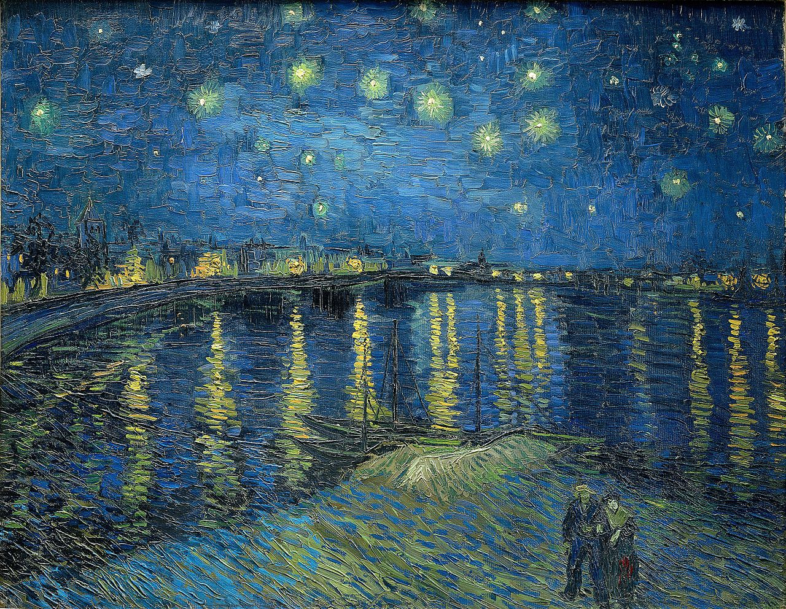

## 34. Bedroom in Arles 寝室 1888（Vincent Willem van Gogh, 文森特·梵高）

[作品链接](https://en.wikipedia.org/wiki/Bedroom_in_Arles)

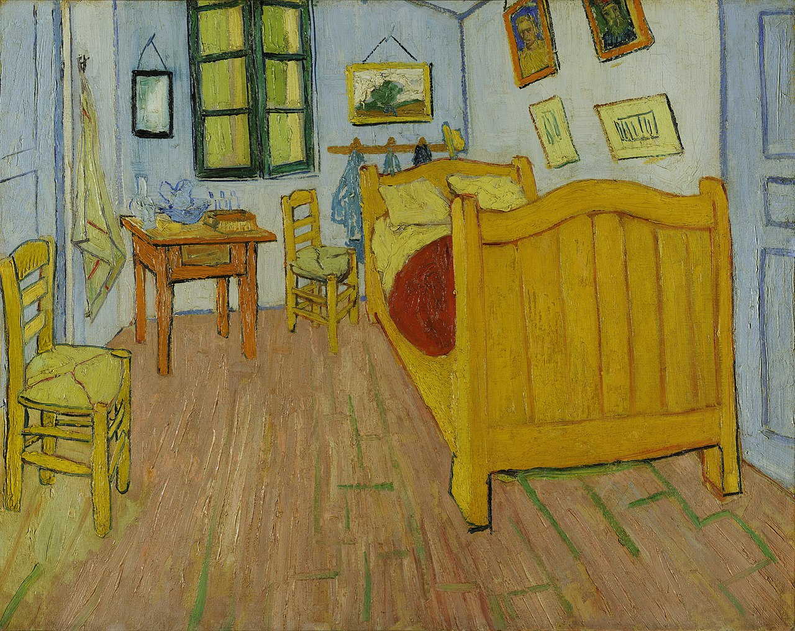

## 35. The Scream 呐喊 1893 （Edvard Munch, 爱德华·蒙克）

[作品链接](https://en.wikipedia.org/wiki/The_Scream)

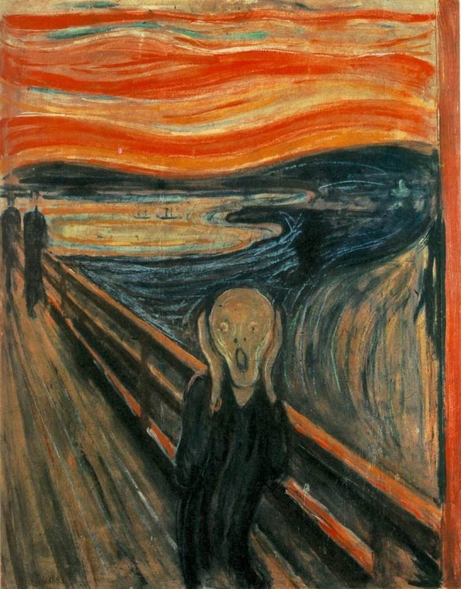

## 36. Study after Velázquez's Portrait of Pope Innocent X 临摹委拉斯开兹的《教皇英诺森十世肖像》1953（Francis Bacon, 弗朗西斯·培根）

[作品链接](https://en.wikipedia.org/wiki/Study_after_Vel%C3%A1zquez%27s_Portrait_of_Pope_Innocent_X)

## 37. Homage to Van Gogh 向梵高致敬 1960 （Francis Bacon, 弗朗西斯·培根）

[作品链接](https://www.artimage.org.uk/3087/francis-bacon/homage-to-van-gogh--1960)

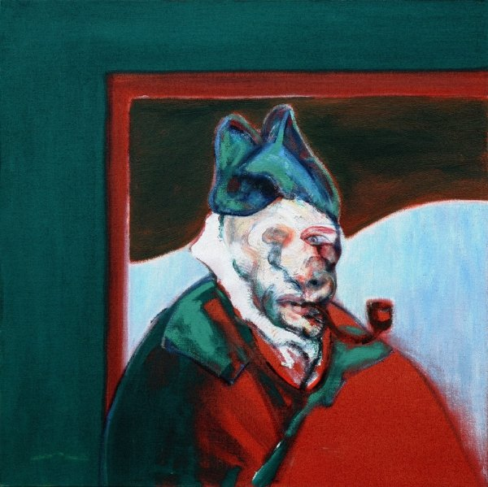

## 38. Painter on the Road to Tarascon (destroyed by fire in the Second World War) 去往塔拉斯孔路上的画家 1888 （Vincent Willem van Gogh, 文森特·梵高）

[作品链接](https://en.wikipedia.org/wiki/Vincent_van_Gogh#/media/File:Vincent_Van_Gogh_0013.jpg)

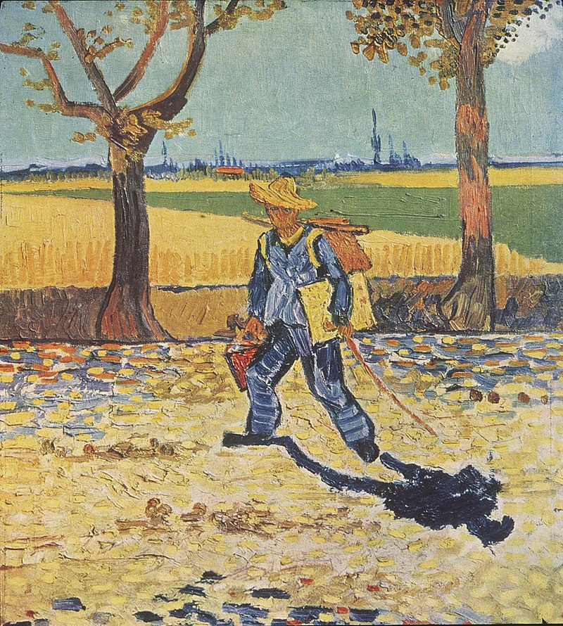

## 39. Vision after the Sermon (Jacob Wrestling with the Angel) 布道后的幻象（雅各与天使搏斗） 1888（Paul Gauguin, 保罗·高更） 

[作品链接](https://en.wikipedia.org/wiki/Vision_After_the_Sermon)

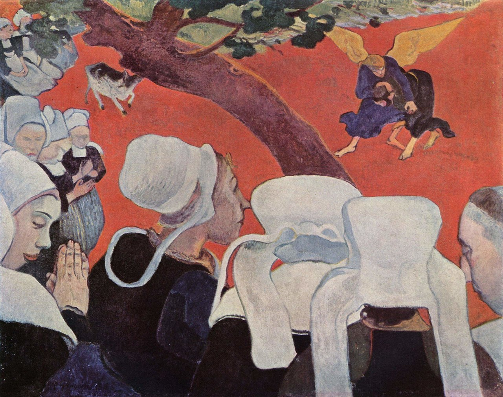

## 40. No te aha oe riri (Why Are You Angry?), 你为何生气 1896（Paul Gauguin, 保罗·高更） 

[作品链接](http://www.artic.edu/aic/collections/artwork/16496)

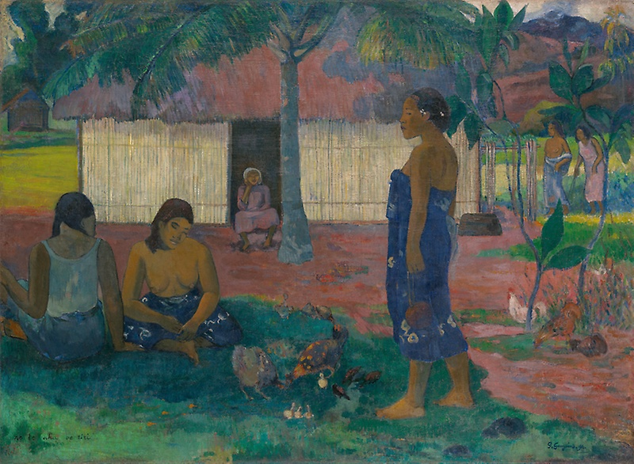

## 41. Bathers at Asnières (Une Baignade, Asnières)  阿尼埃尔的浴场 1884（Georges Seurat, 乔治·修拉）

[作品链接](https://en.wikipedia.org/wiki/Bathers_at_Asni%C3%A8res)

## 42. A Sunday Afternoon on the Island of La Grande Jatte 大碗岛的星期天下午 1884-1886（Georges Seurat, 乔治·修拉）

[作品链接](https://en.wikipedia.org/wiki/A_Sunday_Afternoon_on_the_Island_of_La_Grande_Jatte)

# 5 塞尚：吾人之父，1839—1906

## 43. Still Life with Apples and Peaches 有苹果和桃子的静物 1905（Paul Cézanne, 保罗·塞尚）

[作品链接](https://www.nga.gov/Collection/art-object-page.45986.html)

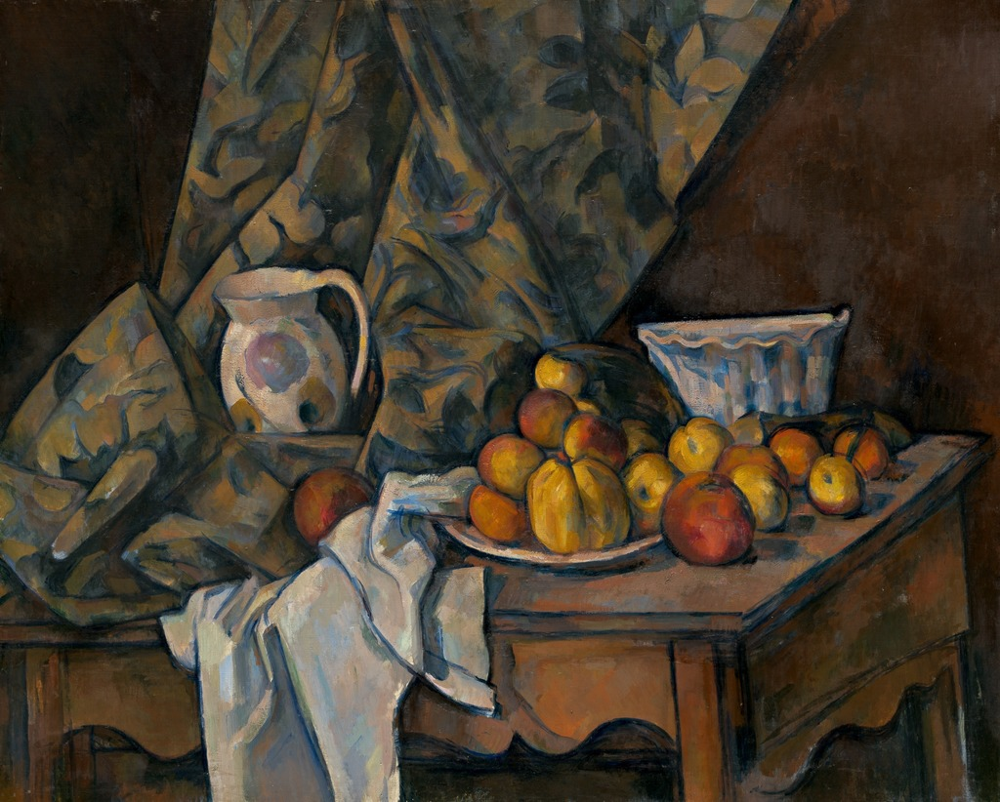

## 44. Mont Sainte-Victoire with Large Pine 圣维克多山 1887 （Paul Cézanne, 保罗·塞尚）

[作品链接](https://en.wikipedia.org/wiki/Mont_Sainte-Victoire_with_Large_Pine)

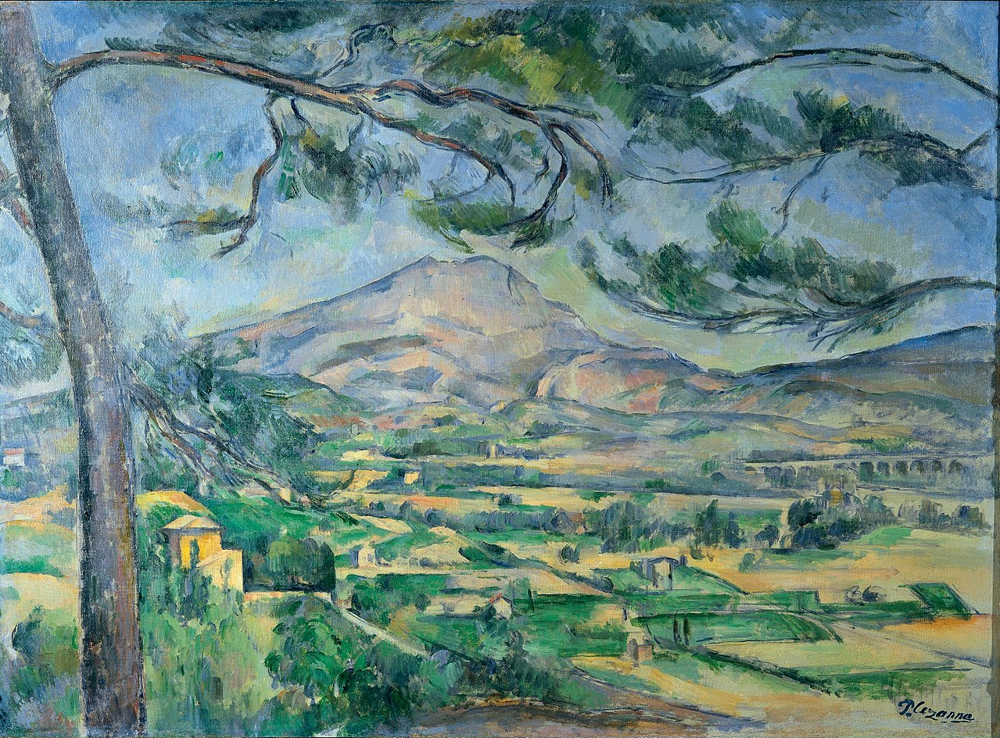

# 6 原始主义，1880—1930/野兽派，1905—1910：原始的呐喊

## 45. The Kiss 吻 1907-1908 （Gustav Klimt, 古斯塔夫·克里姆特） 

[作品链接](https://en.wikipedia.org/wiki/The_Kiss_(Klimt))

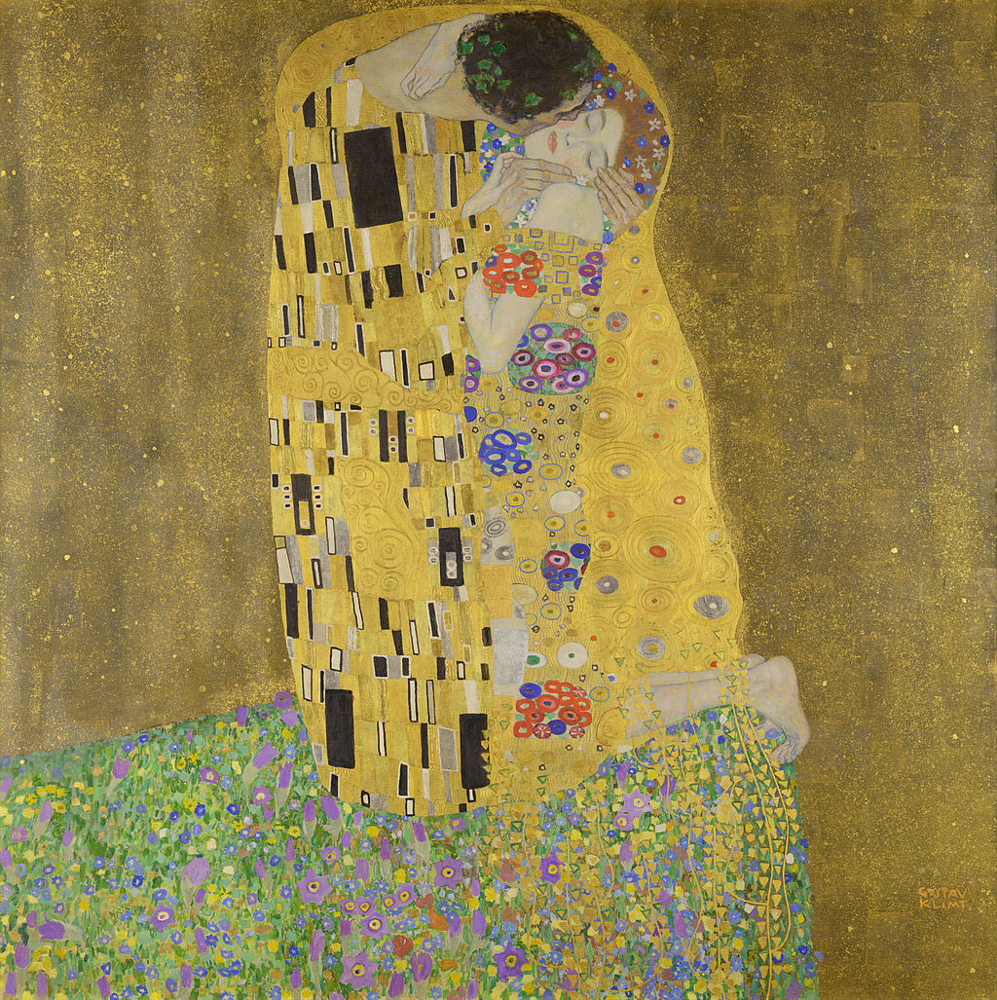

## 46. Boats in the Harbour at Collioure 科利乌尔港的船 1905 （André Derain, 安德烈·德兰）

[作品链接](https://www.aaronartprints.org/derain-boatsintheharbour.php)

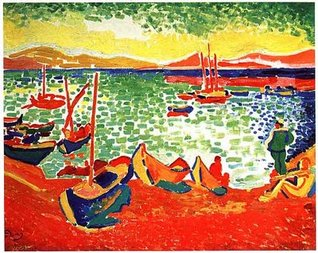

## 47. Restaurant de la Machine at Bougival 布吉瓦尔的餐馆 1905（Maurice de Vlaminck, 莫里斯·德·弗拉芒克）

[作品链接](https://www.musee-orsay.fr/fr/oeuvres/restaurant-de-la-machine-bougival-8048)

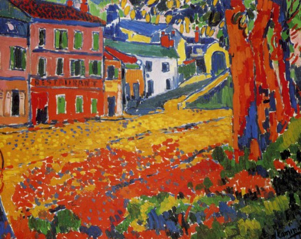

## 48. Woman with a Hat 戴帽子的妇人 1905 （Henri Matisse, 亨利·马蒂斯）

[作品链接](https://en.wikipedia.org/wiki/Woman_with_a_Hat)

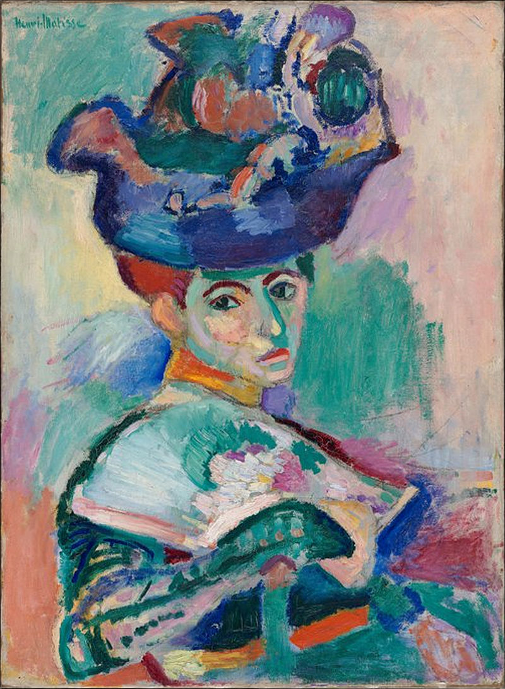

## 49. Le bonheur de vivre (The Joy of Life) 生之欢乐 1905-1906 （Henri Matisse, 亨利·马蒂斯）

[作品链接](https://en.wikipedia.org/wiki/Le_bonheur_de_vivre)

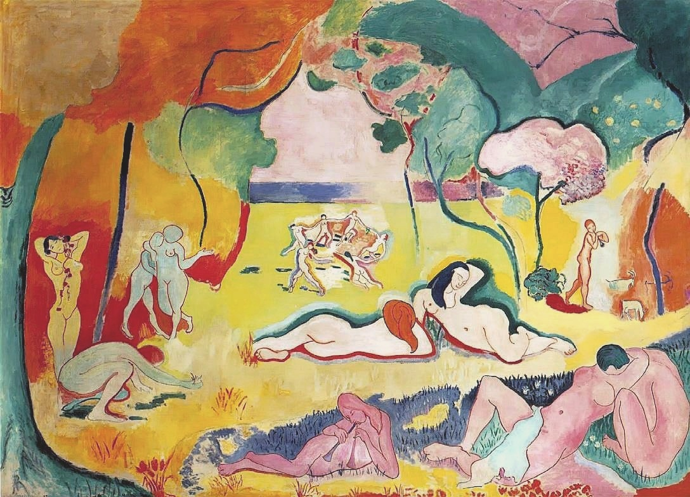

## 50. Reciproco Amore 互爱 1589-1595（Agostino Carracci, 阿戈斯蒂诺·卡拉奇）

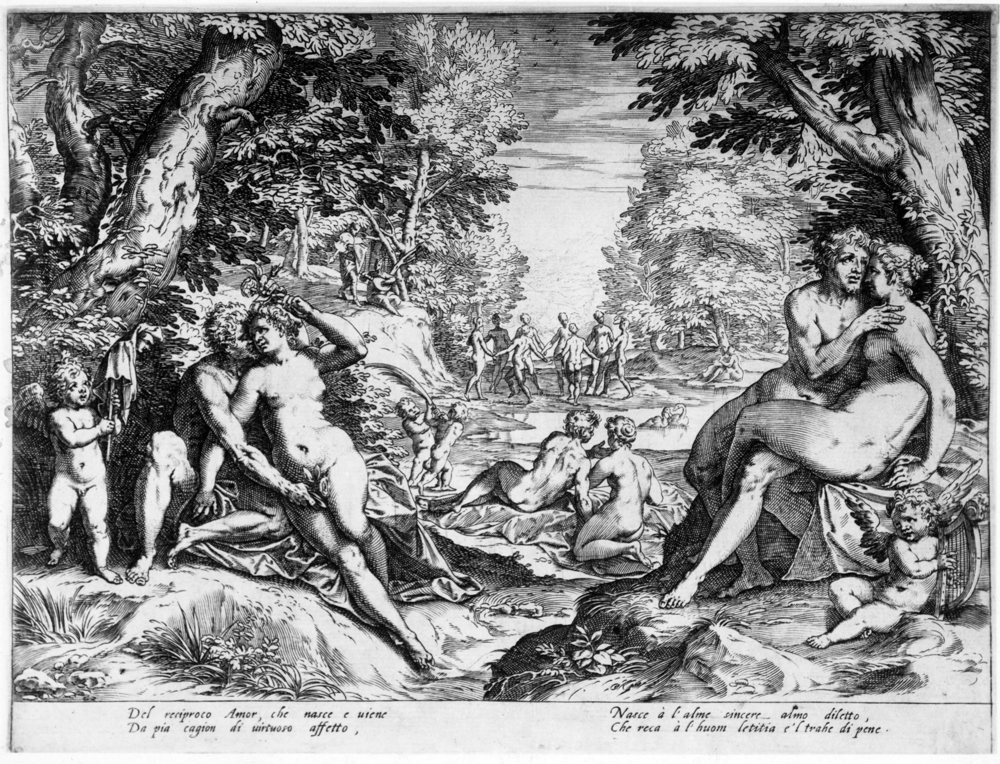

## 51. Portrait of Gertrude Stein 格特鲁德·斯泰因肖像 1905-1906 （Pablo Picasso, 巴勃罗·毕加索）

[作品链接](https://en.wikipedia.org/wiki/Portrait_of_Gertrude_Stein)

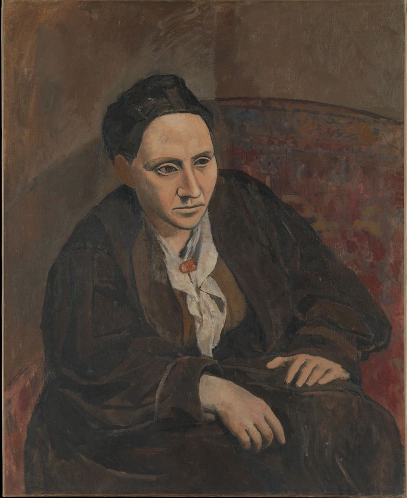

## 52. Les Demoiselles d'Avignon (The Young Ladies of Avignon, and originally titled The Brothel of Avignon) 亚维农少女 1907 （Pablo Picasso, 巴勃罗·毕加索）

[作品链接](https://en.wikipedia.org/wiki/Les_Demoiselles_d%27Avignon)

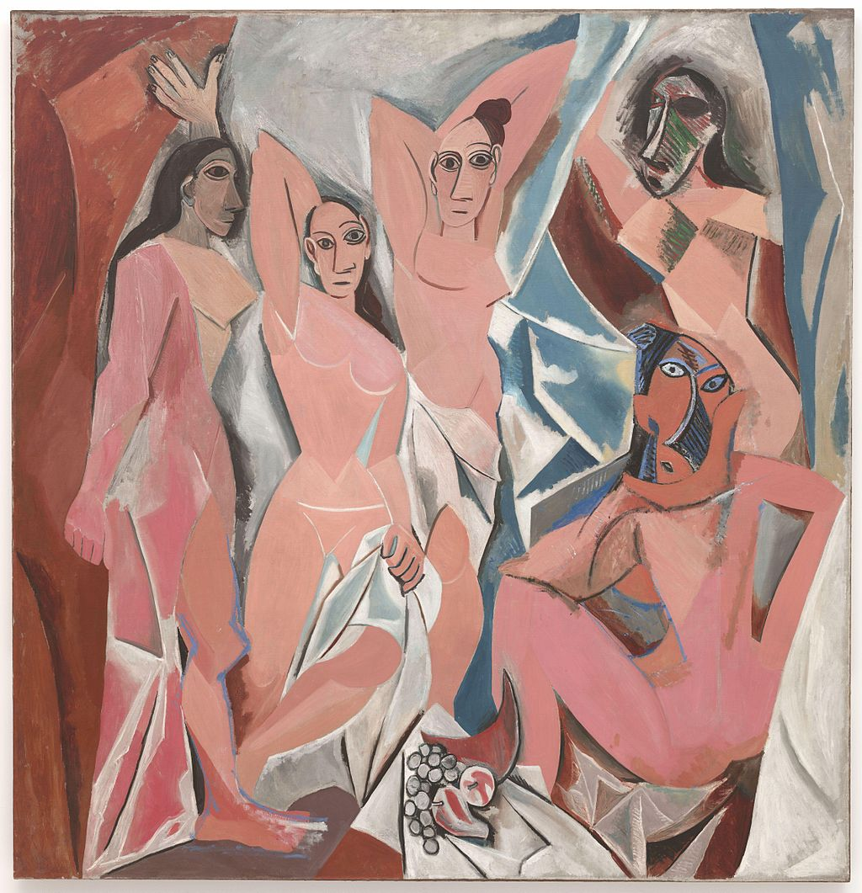

## 53. A Carnival Evening 狂欢节之夜 1886（Henri Rousseau, 亨利·卢梭）

[作品链接](https://www.philamuseum.org/collection/object/59593)

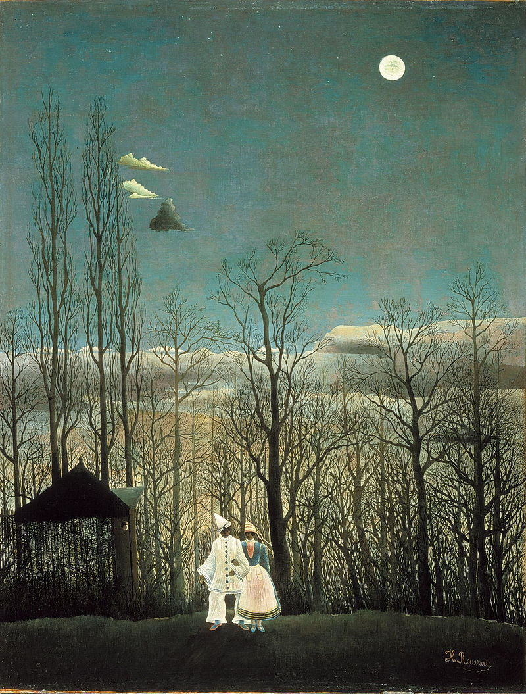

## 54. The Hungry Lion Throws Itself on the Antelope (Le lion ayant faim se jette sur l'antilope)  饿狮猛扑羚羊 1905（Henri Rousseau, 亨利·卢梭）

[作品链接](https://en.wikipedia.org/wiki/The_Hungry_Lion_Throws_Itself_on_the_Antelope)

## 55. Portrait of a Woman 一个女人的肖像 1895 （Henri Rousseau, 亨利·卢梭）

[作品链接](https://commons.wikimedia.org/wiki/File:Henri_Rousseau__Portrait_of_a_Woman_(1895).jpg)

## 56. The Kiss (French: Le Baiser) 吻 1882（Auguste Rodin, 奥古斯特·罗丹）

[作品链接](https://en.wikipedia.org/wiki/The_Kiss_(Rodin_sculpture))

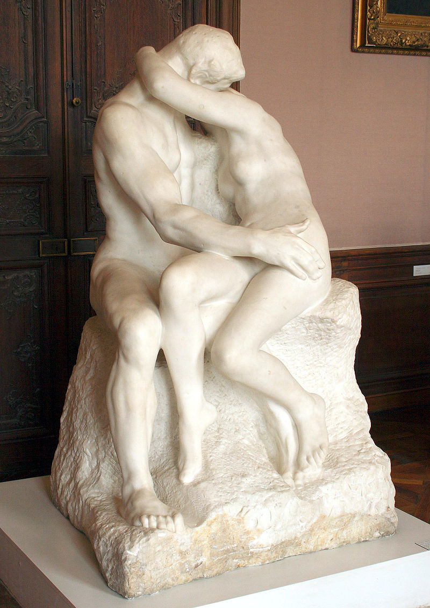

## 57. The Kiss 吻 1907-1908（Constantin Brâncuși, 康斯坦丁·布朗库西）

[作品链接](https://en.wikipedia.org/wiki/The_Kiss_(Br%C3%A2ncu%C8%99i_sculpture))

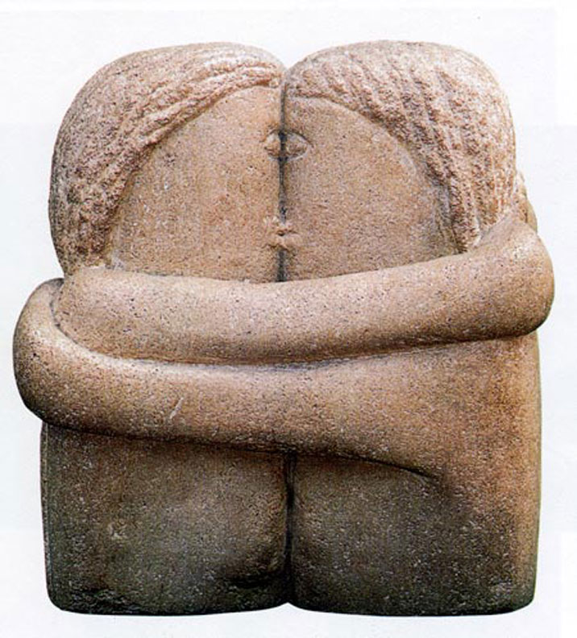

## 58. Sleeping Muse, 沉睡的缪斯 1910 （Constantin Brâncuși, 康斯坦丁·布朗库西）

[作品链接](http://www.artic.edu/aic/collections/artwork/9024)

## 59. Head 头 1911-1912（Amedeo Modigliani, 阿梅代奥·莫迪利亚尼）

[作品链接](https://www.wikiart.org/en/amedeo-modigliani/head)

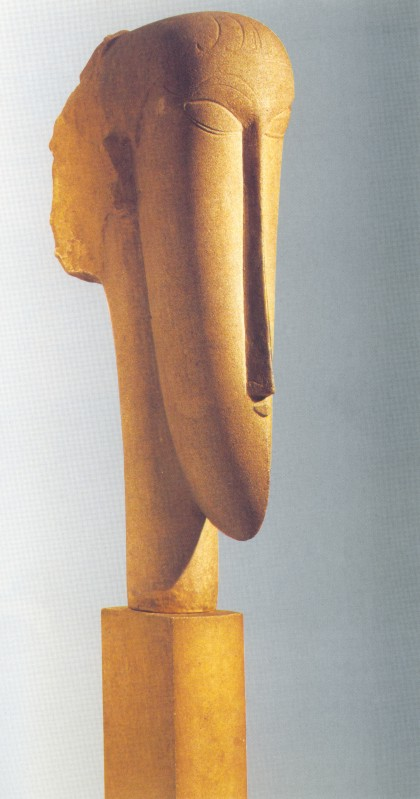

## 60. Walking Man I 行走的人1 1960（Alberto Giacometti， 阿尔伯托·贾科梅蒂）

[作品链接](https://www.artsy.net/artwork/alberto-giacometti-walking-man-i)

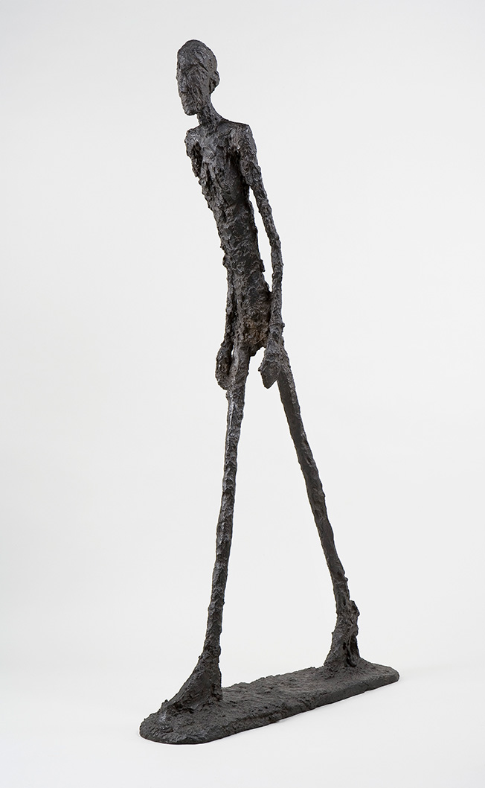

## 61. Spoon Woman勺形女人 1927 （Alberto Giacometti， 阿尔伯托·贾科梅蒂）

[作品链接](http://www.artic.edu/aic/collections/artwork/37761)

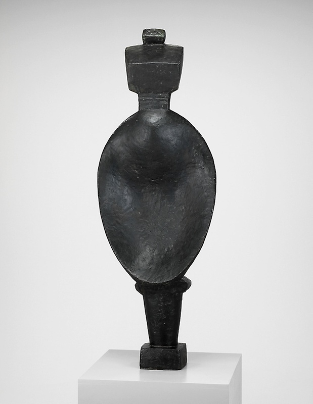

## 62. Pierced Form 穿孔之形 1963-1964（Barbara Hepworth, 芭芭拉·赫普沃斯）

[作品链接](http://www.tate.org.uk/art/artworks/hepworth-pierced-form-t00704)

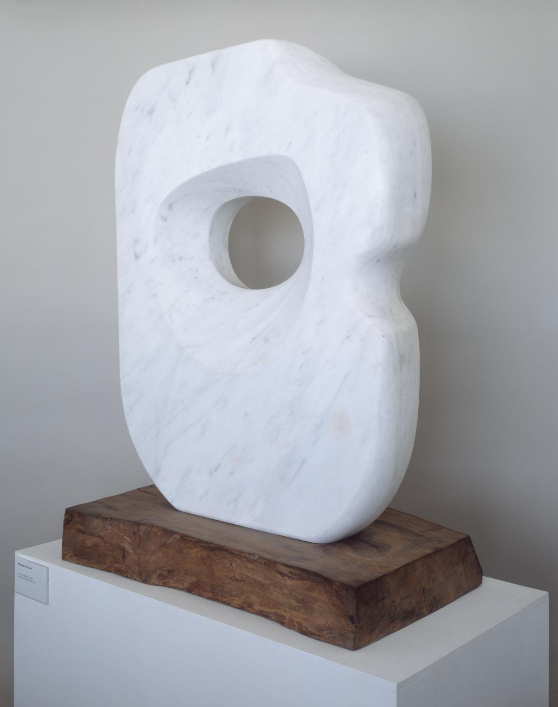

## 63. Pelagos 海洋生物 1946 （Barbara Hepworth, 芭芭拉·赫普沃斯）

[作品链接](http://www.tate.org.uk/art/artworks/hepworth-pelagos-t00699)

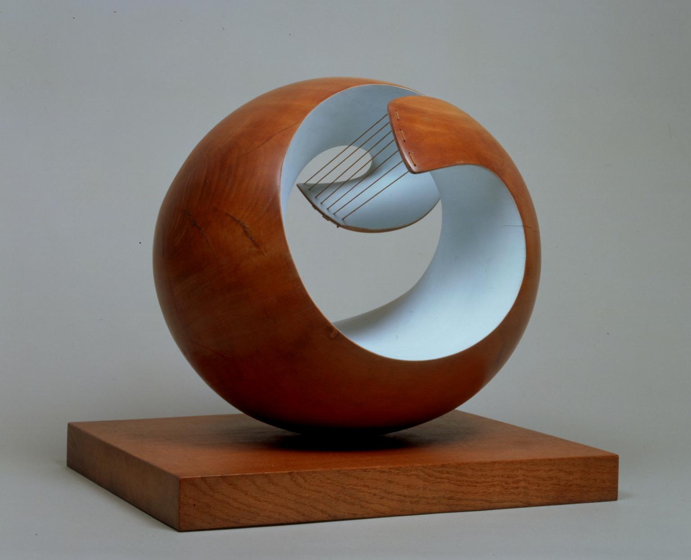

## 64. Single Form 单一的形式 1961 （Barbara Hepworth, 芭芭拉·赫普沃斯）

[作品链接](https://en.wikipedia.org/wiki/Single_Form)

# 7 立体主义：另一种视角，1907—1914

## 65. Opening of the Fifth Seal 揭开第五印 1608（El Greco, 埃尔·格列柯）

[作品链接](https://en.wikipedia.org/wiki/Opening_of_the_Fifth_Seal)

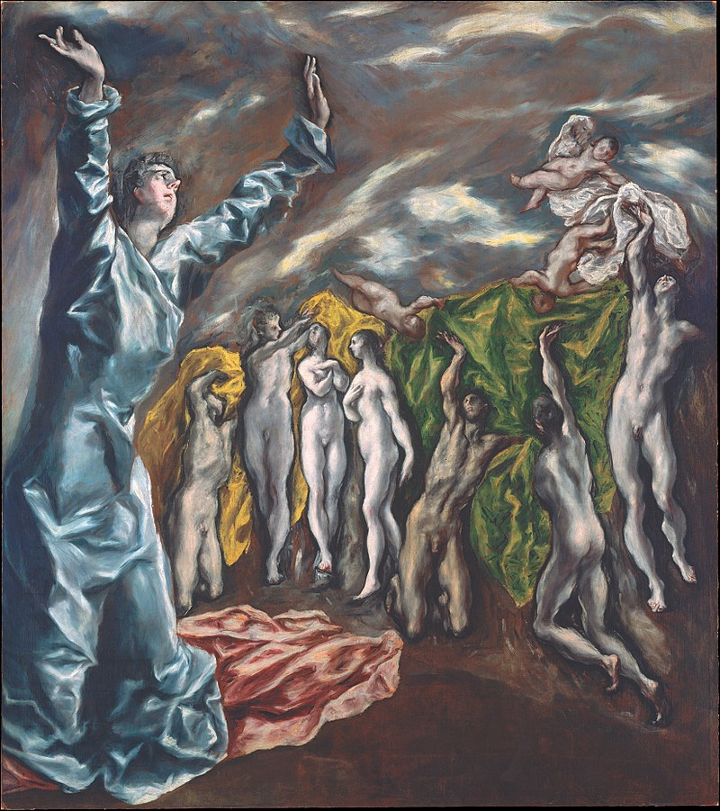

## 66. Houses at l'Estaque 埃斯塔克的房子 1908（Georges Braque, 乔治·布拉克）

[作品链接](https://en.wikipedia.org/wiki/Houses_at_l%27Estaque)

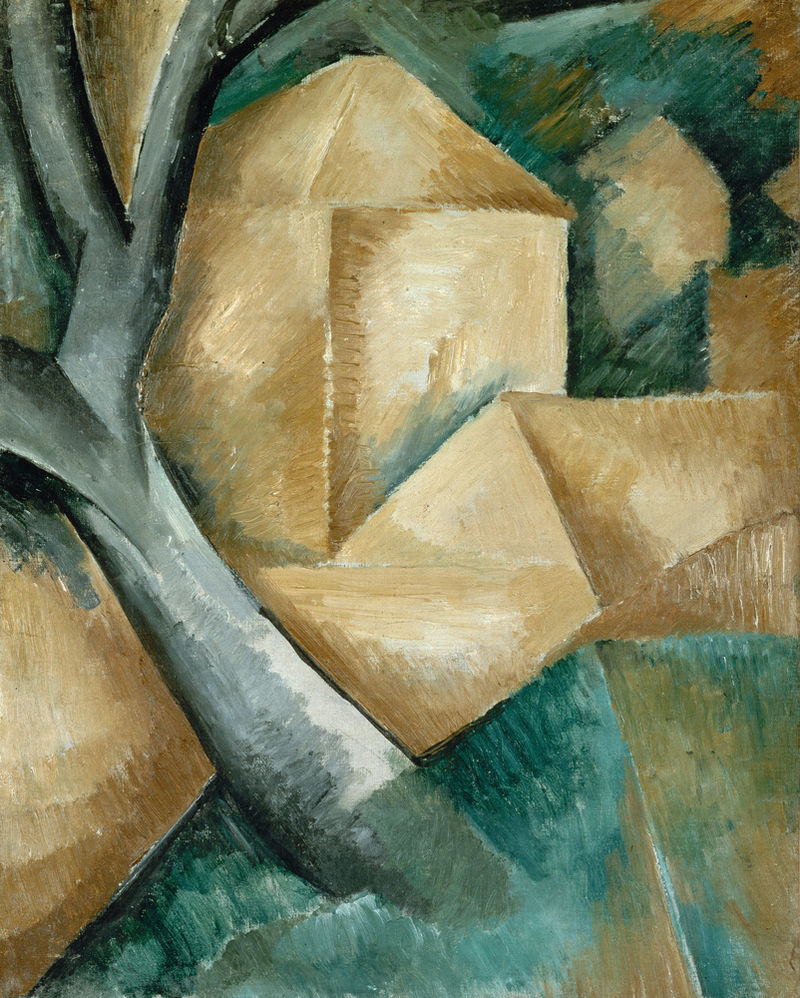

## 67. Violin and Palette 小提琴与调色板 1909（Georges Braque, 乔治·布拉克）

[作品链接](https://www.wikiart.org/en/georges-braque/violin-and-palette-1909)

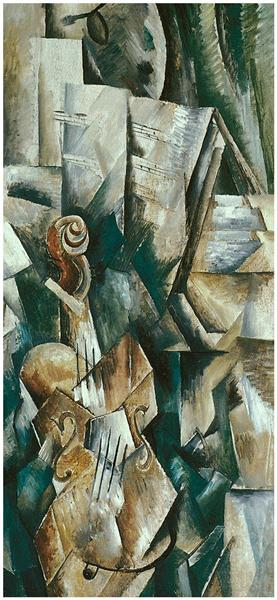

## 68. Still Life with Flowers 静物花卉 1912（Juan Gris, 胡安·格里斯）

[作品链接](https://www.wikiart.org/en/juan-gris/still-life-with-flowers-1912)

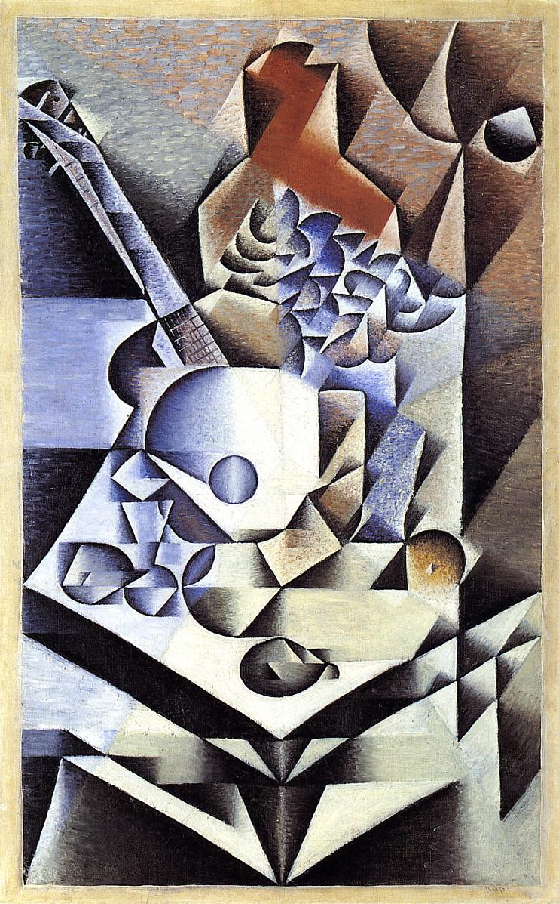

## 69. Ma Jolie 我的美人 1912（Pablo Picasso, 巴勃罗·毕加索）

[作品链接](https://www.moma.org/collection/works/79051)

## 70. Still-Life with Chair Caning有藤椅的静物 1912（Pablo Picasso, 巴勃罗·毕加索）

[作品链接](http://www.pablo-ruiz-picasso.net/work-88.php)

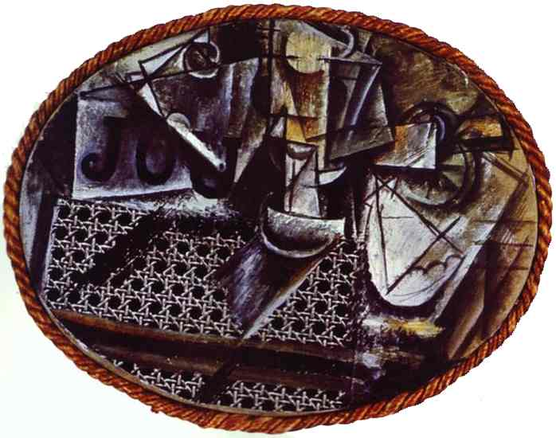

## 71. Fruit Dish and Glass 水果盘与玻璃杯 1912 （Georges Braque, 乔治·布拉克）

[作品链接](https://en.wikipedia.org/wiki/Fruit_Dish_and_Glass)

## 72. The Little Fourteen-Year-Old Dancer (La Petite Danseuse de Quatorze Ans)  小舞女 1880-1881 （Edgar Degas, 埃德加·德加）

[作品链接](https://en.wikipedia.org/wiki/Little_Dancer_of_Fourteen_Years)

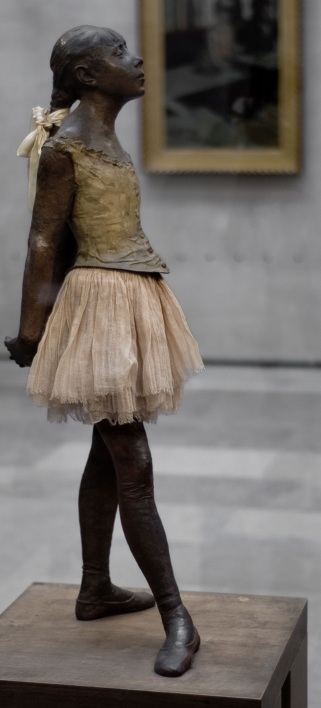

## 73. Guitar 吉他 1912（Pablo Picasso, 巴勃罗·毕加索）

[作品链接](https://www.wikiart.org/en/pablo-picasso/guitar-1912)

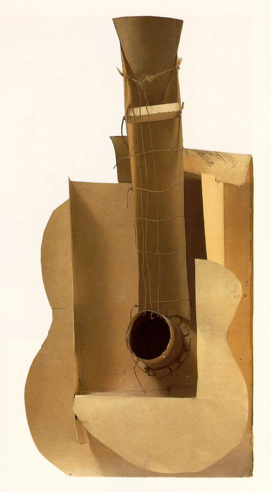

# 8 未来主义：快进，1909—1919

## 74. Dynamism of a Dog on a Leash (Dinamismo di un cane al guinzaglio) 拴着皮带的狗的动态 1912（Giacomo Balla, 贾科莫·巴拉）

[作品链接](https://en.wikipedia.org/wiki/Dynamism_of_a_Dog_on_a_Leash)

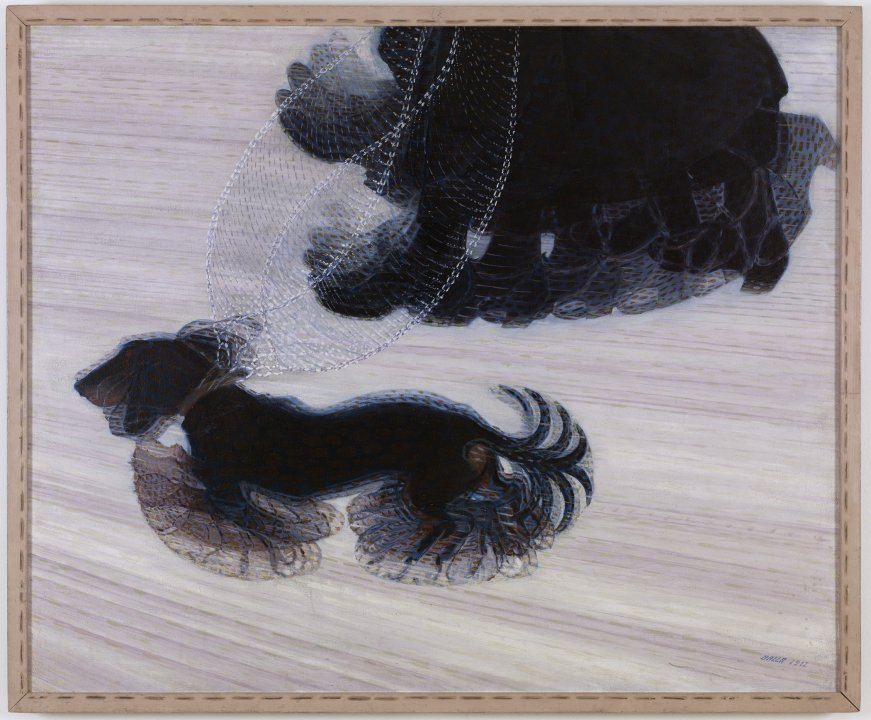

## 75. Unique Forms of Continuity in Space 空间中连续的唯一形体 1913（UmbertoBoccioni, 翁贝托·薄丘尼）

[作品链接](https://en.wikipedia.org/wiki/Unique_Forms_of_Continuity_in_Space)

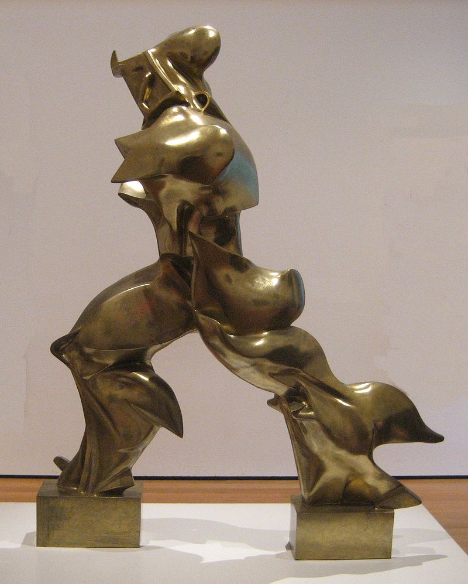

## 76. States of Mind 心境 （UmbertoBoccioni, 翁贝托·薄丘尼） 

States of Mind I: The Farewells 心境 1 告别 1911 [作品链接](https://www.wikiart.org/en/umberto-boccioni/states-of-mind-i-the-farewells-1911) 

States of Mind II: Those Who Go 心境 2 离开的人 1911 [作品链接](https://www.wikiart.org/en/umberto-boccioni/states-of-mind-ii-those-who-go-1911)

States of Mind III: Those Who Stay 心境 3 留下的人 1911 [作品链接](https://www.wikiart.org/en/umberto-boccioni/states-of-mind-iii-those-who-stay-1911-1)

## 77. L'Équipe de Cardiff 加迪夫队 1913（Robert Delaunay, 罗伯特·德劳内）

[作品链接](https://fr.wikipedia.org/wiki/L%27%C3%89quipe_de_Cardiff)

## 78. Rock Drill 凿岩机 1913（Jacob Epstein, 雅各·爱泼斯坦）

[作品链接](https://en.wikipedia.org/wiki/Rock_Drill_(Jacob_Epstein))

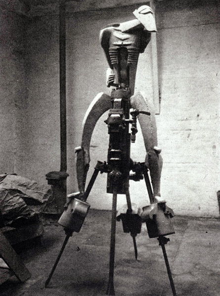

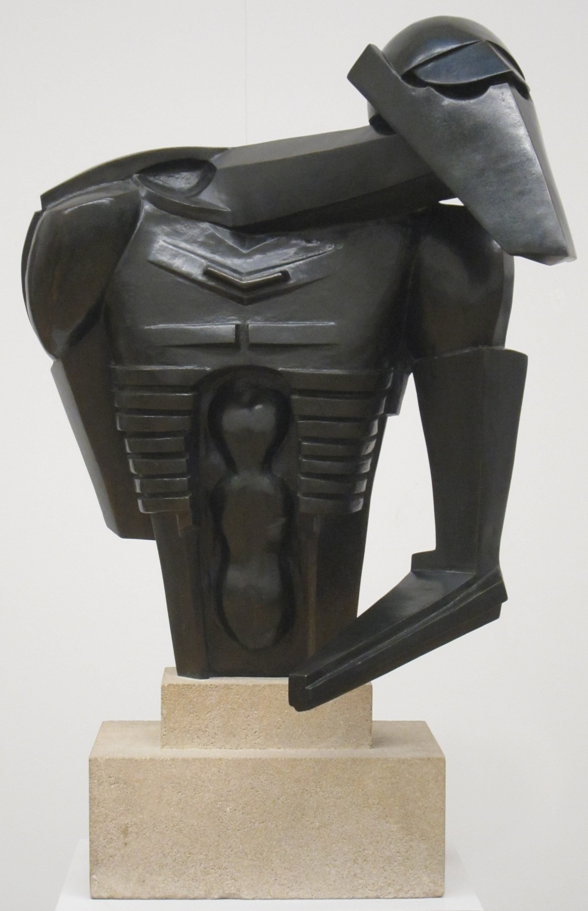

# 9 康定斯基/俄耳甫斯主义/青骑士：音乐之声，1910—1914

## 79. The First Step 第一步 1910（František Kupka, 弗朗齐歇克·库普卡）

[作品链接](https://www.moma.org/collection/works/79969)

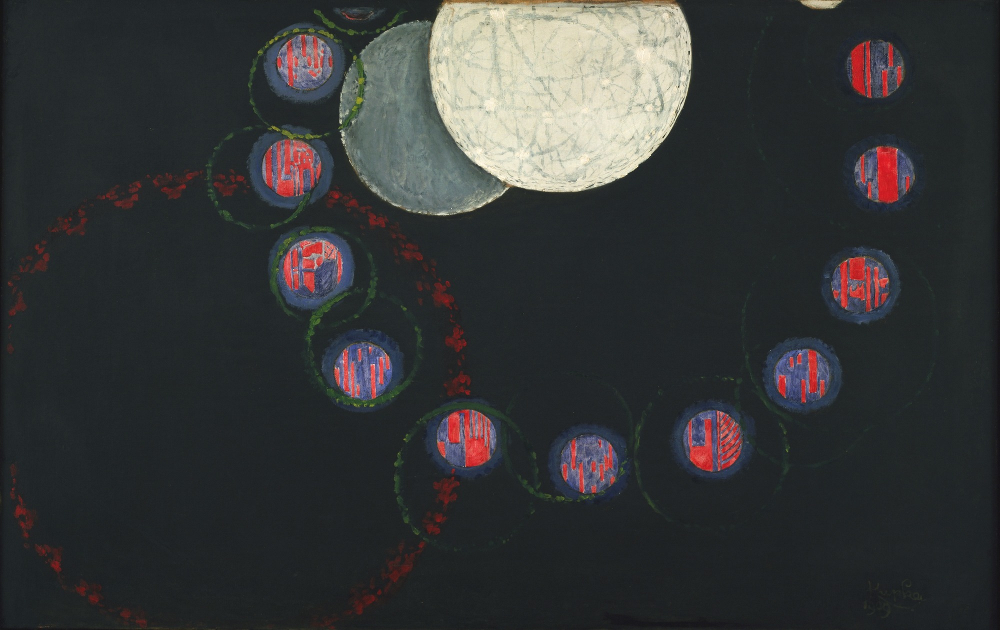

## 80. Disque simultané（Simultaneous Disc）共时的圆盘 1912（Robert Delaunay, 罗伯特·德劳内）

[作品链接](https://fr.wikipedia.org/wiki/Disque_simultan%C3%A9)

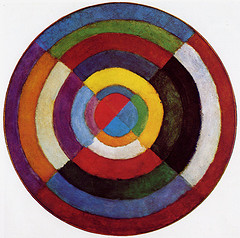

## 81. München - Planegg I 慕尼黑-普拉内格 1 1901（Wassily Kandinsky, 瓦西里·康定斯基）

[作品链接](https://www.akg-images.de/archive/Munchen-%25E2%2580%2593-Planegg-I-2UMDHUORFRFR.html)

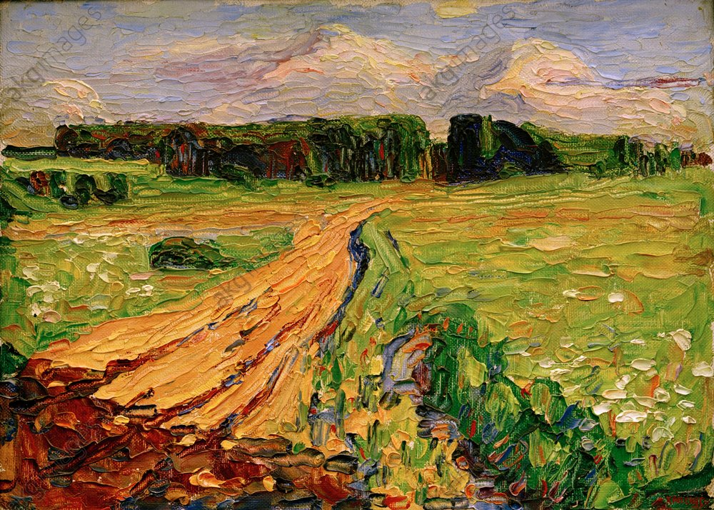

## 82. Murnau, Dorfstrasse (A Village Street) 穆尔瑙，乡村道路 1908 （Wassily Kandinsky, 瓦西里·康定斯基）

[作品链接](https://commons.wikimedia.org/wiki/File:Vassily_Kandinsky,_1908,_Murnau,_Dorfstrasse.jpg)

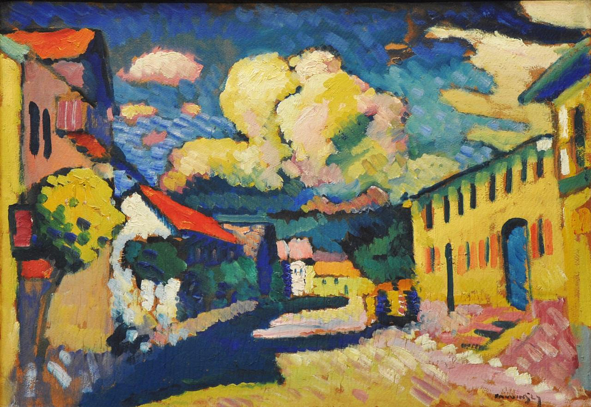

## 83. Kochel - Straight Road 科黑尔，笔直之路 1909（Wassily Kandinsky, 瓦西里·康定斯基）

[作品链接](http://www.the-athenaeum.org/art/detail.php?ID=116422)

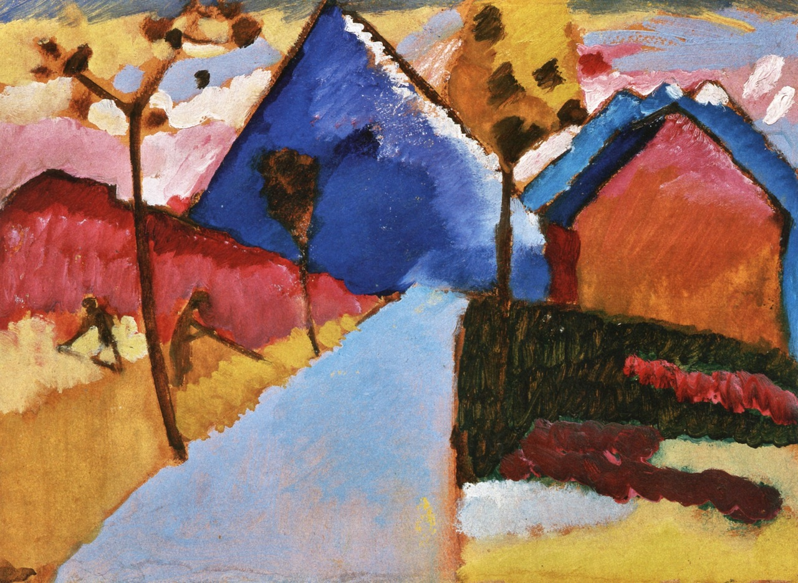

## 84. Improvisation 4 即兴 4 1909（Wassily Kandinsky, 瓦西里·康定斯基）

[作品链接](https://www.wikiart.org/en/wassily-kandinsky/improvisation-4-1909)

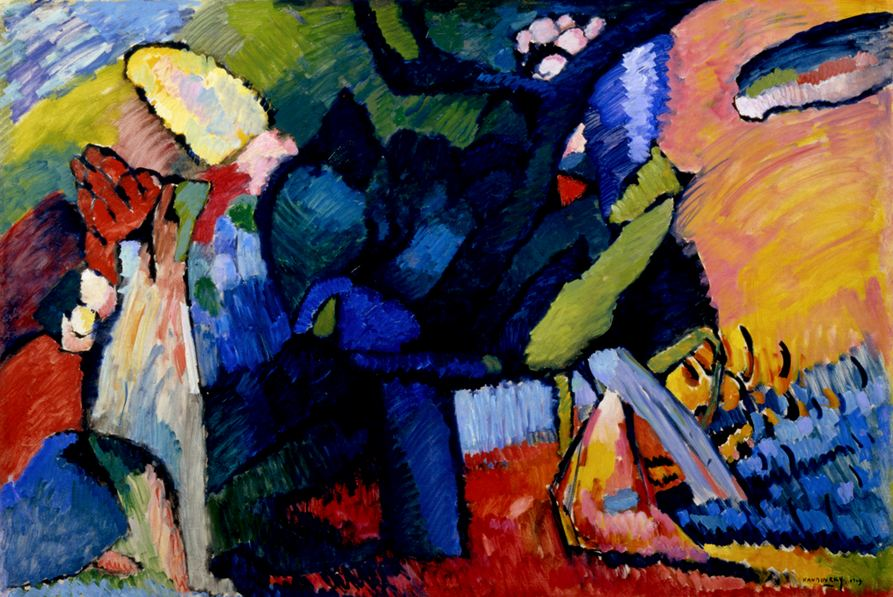

## 85. Impression III (Concert) 印象 3（音乐会） 1911 （Wassily Kandinsky, 瓦西里·康定斯基）

[作品链接](https://www.wikiart.org/en/wassily-kandinsky/impression-iii-concert-1911)

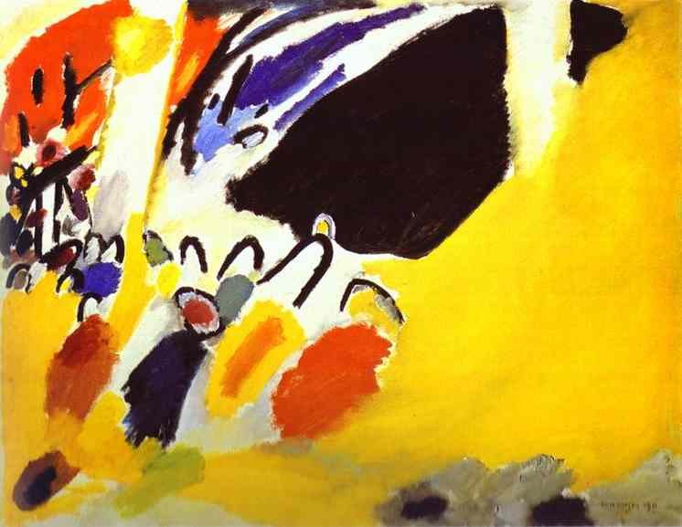

## 86. Picture with a Circle 带圆的画 1911 （Wassily Kandinsky, 瓦西里·康定斯基）

[作品链接](http://www.wassilykandinsky.net/work-432.php)

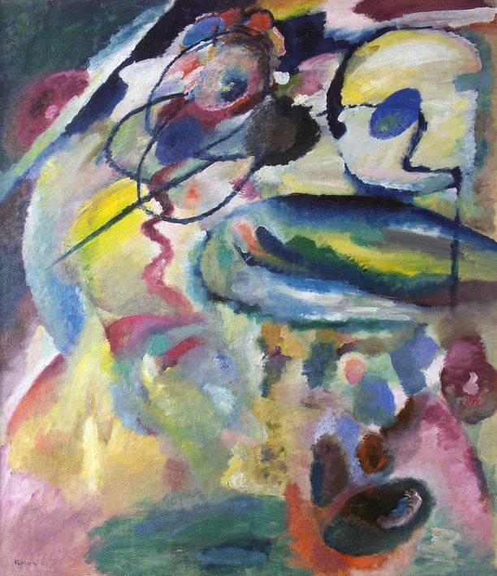

## 87. Composition IV 作曲 4 1911（Wassily Kandinsky, 瓦西里·康定斯基）

[作品链接](https://www.wikiart.org/en/wassily-kandinsky/composition-iv-1911)

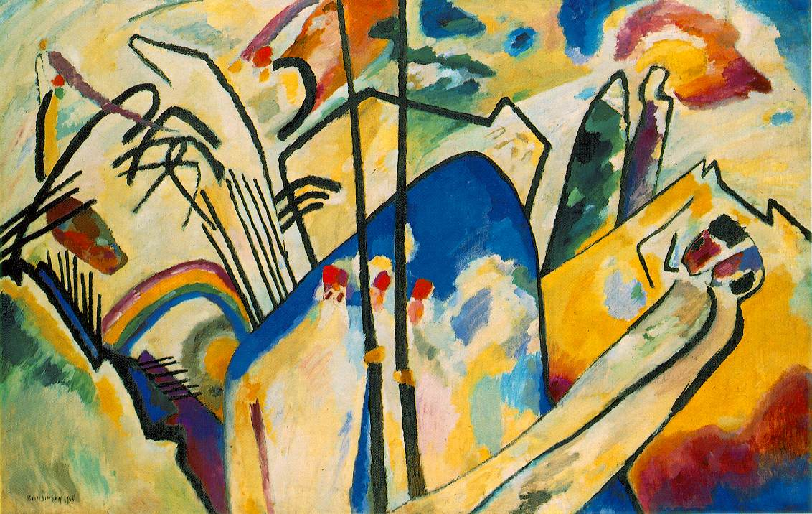

## 88. Composition VII 作曲 7 1913（Wassily Kandinsky, 瓦西里·康定斯基）

[作品链接](http://www.wassilykandinsky.net/work-36.php)

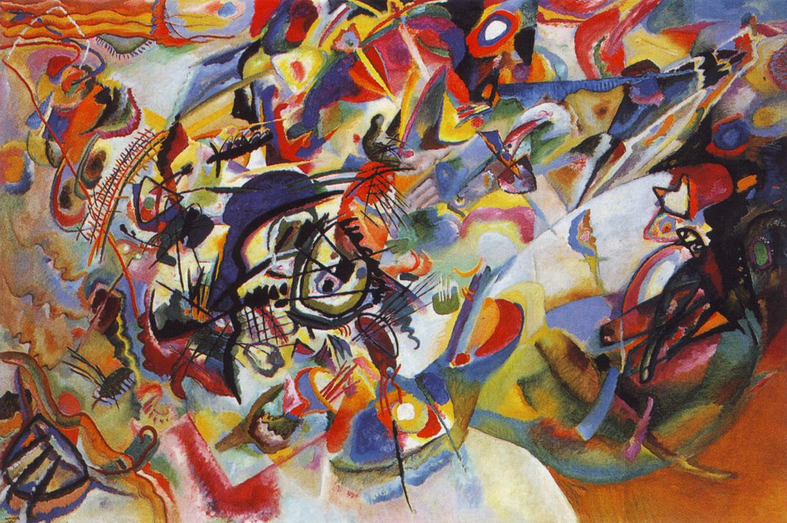

## 89. Hammamet with mosque 哈马马特的清真寺 1914（Paul Klee, 保罗·克利）

[作品链接](https://www.wikiart.org/en/paul-klee/hammamet-with-mosque-1914)

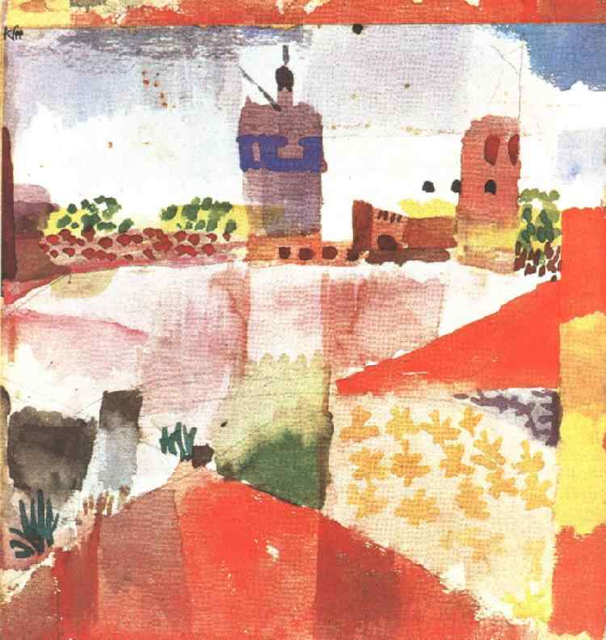

# 10 至上主义/构成主义：俄国人，1915—1925

## 90. Cow And Violin 奶牛和小提琴 1913（Kazimir Malevich, 卡济米尔·马列维奇）

[作品链接](http://russianartgallery.org/famous/malevich_cow.htm)

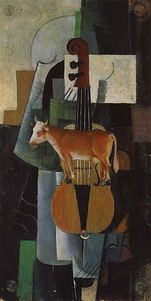

## 91. Black Square 黑色正方形 1915 （Kazimir Malevich, 卡济米尔·马列维奇）

[作品链接](https://en.wikipedia.org/wiki/Black_Square_(painting))

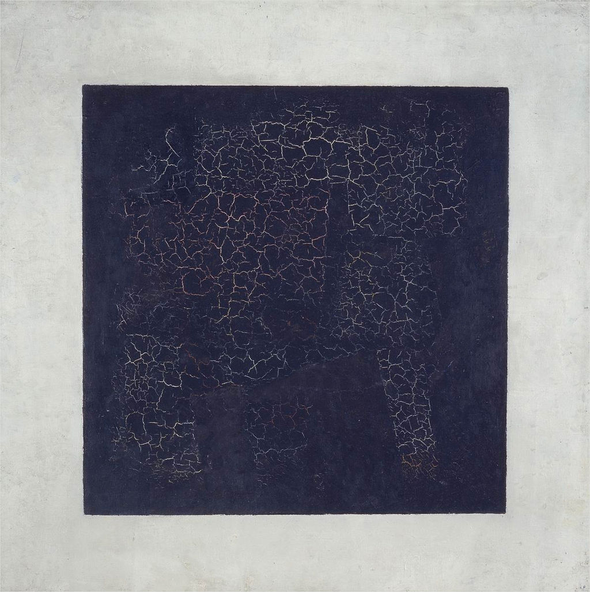

## 92. Suprematist Painting 至上主义 1915 （Kazimir Malevich, 卡济米尔·马列维奇）

[作品链接](http://www.ibiblio.org/eldritch/el/mpix.html)

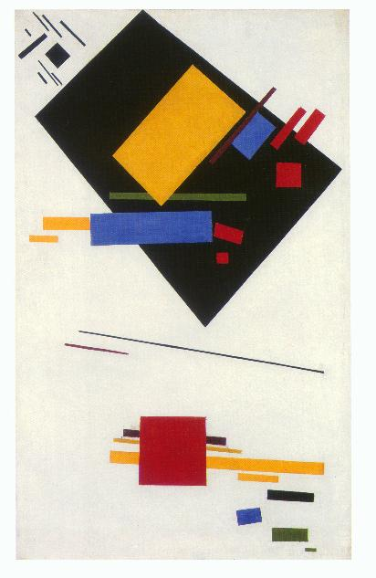

## 93. Corner Counter-Relief 1914 角落的反浮雕（Vladimir Tatlin, 弗拉基米尔·塔特林）

[作品链接](http://rusmuseumvrm.ru/data/collections/sculpture/20/tatlin_ve_uglovoy_kontrrelef_1914/index.php?lang=en)

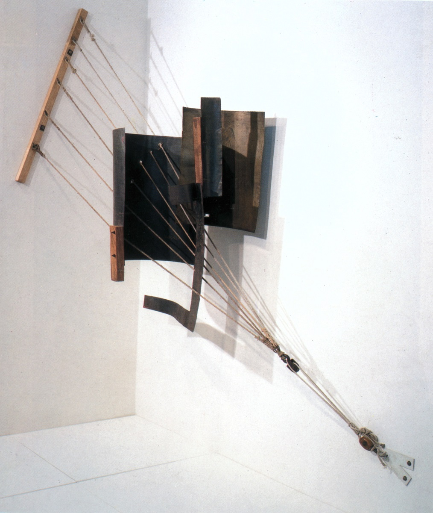

## 94. Monument to the Third International 第三国际的纪念（塔） 1919-1920（Vladimir Tatlin, 弗拉基米尔·塔特林）

[作品链接](https://en.wikipedia.org/wiki/Tatlin%27s_Tower)

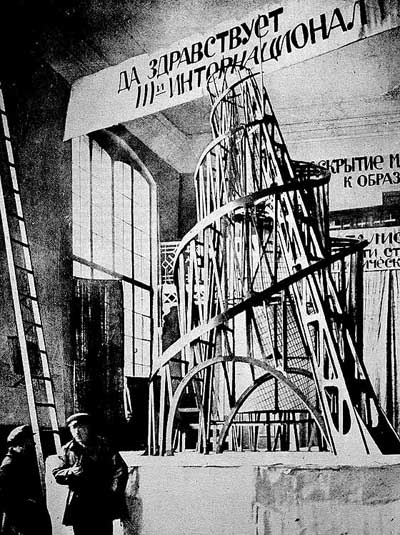

## 95. Pure Red Color, Pure Yellow Color, Pure Blue Color 纯红、纯黄和纯蓝 1921（Alexander Rodchenko, 亚历山大·罗琴科）

[作品链接](https://www.tate.org.uk/whats-on/tate-modern/exhibition/rodchenko-popova/rodchenko-and-popova-defining-constructivism-6)

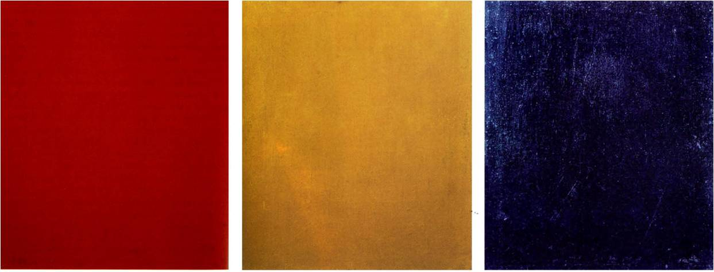

## 96. Beat the Whites with the Red Wedge 以红锲攻打白军 1919（El Lissitzky, 埃尔·利西茨基）

[作品链接](https://en.wikipedia.org/wiki/Beat_the_Whites_with_the_Red_Wedge)

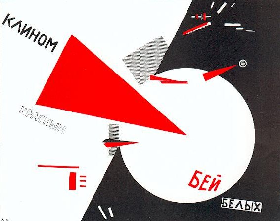

# 11 新造型主义：网格，1917—1931

## 97. Composition C (No.III) with Red, Yellow and Blue 构成 C（第三号），红黄蓝 1935 （Piet Mondrian, 皮埃特·蒙特里安）

[作品链接](https://theartstack.com/artist/piet-mondrian/composition-c-no-iii-with-red-yellow-and-blue#)

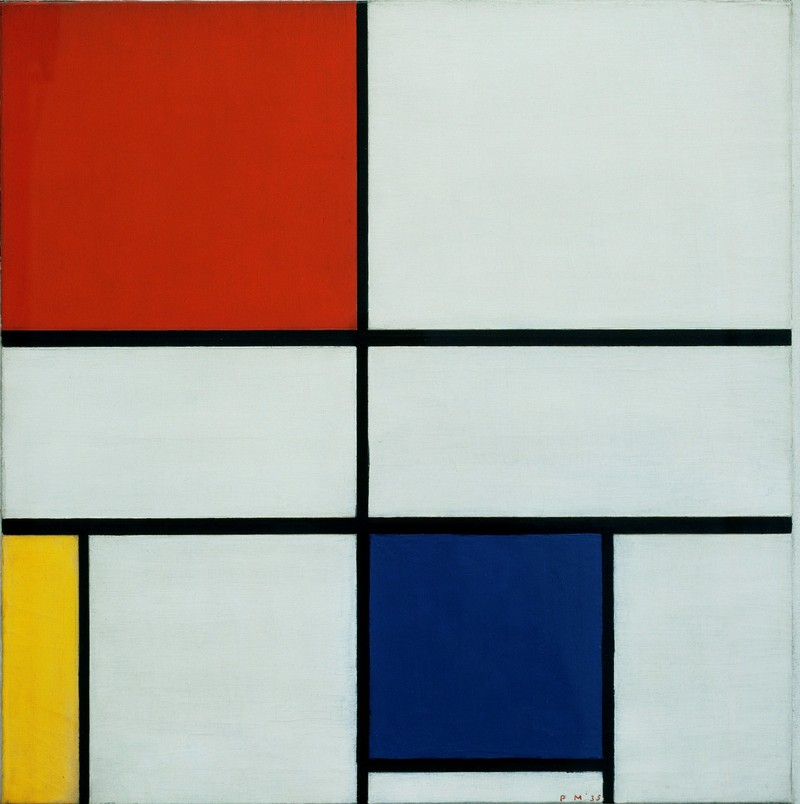

## 98. Evening; Red Tree 夜晚，红树 1908 （Piet Mondrian, 皮埃特·蒙特里安）

[作品链接](https://en.wikipedia.org/wiki/Evening;_Red_Tree)

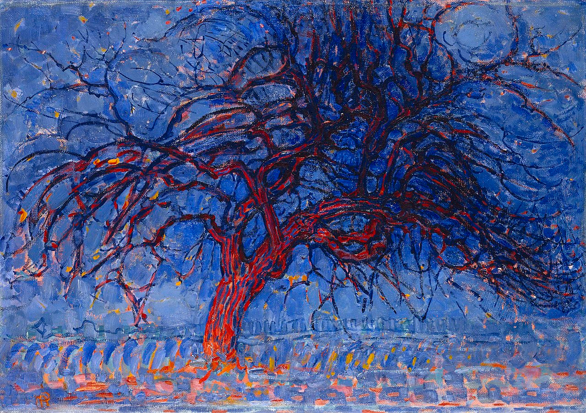

## 99. Gray Tree 灰色的树 1912 （Piet Mondrian, 皮埃特·蒙特里安）

[作品链接](https://en.wikipedia.org/wiki/Gray_Tree)

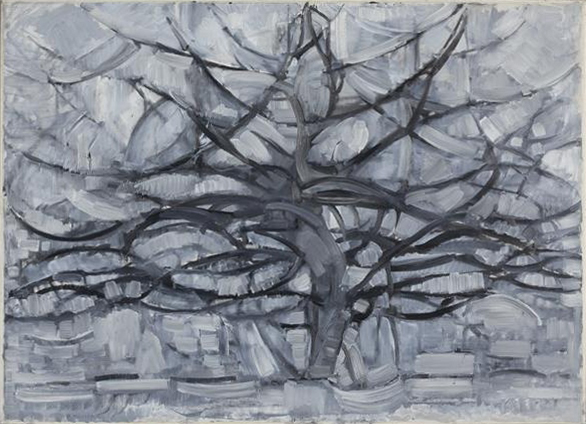

## 100. Blossoming Apple Tree 开花的苹果树 1912 （Piet Mondrian, 皮埃特·蒙特里安）

[作品链接](https://en.wikipedia.org/wiki/Evening;_Red_Tree#/media/File:Blossoming_apple_tree,_by_Piet_Mondriaan.jpg)

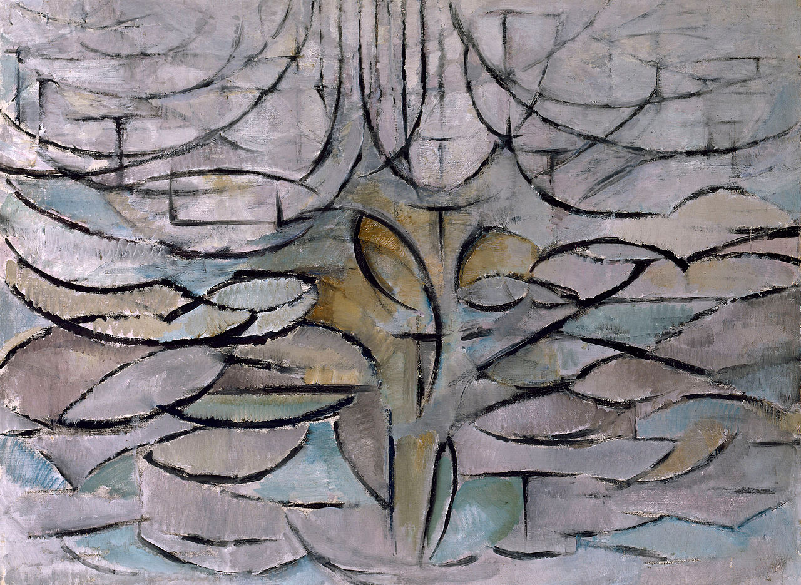

## 101. Tableau No. 2/Composition No. VII 画面 2/构成 7 1913 （Piet Mondrian, 皮埃特·蒙特里安）

[作品链接](https://theartstack.com/artist/piet-mondrian/tableau-no-2-compositio)

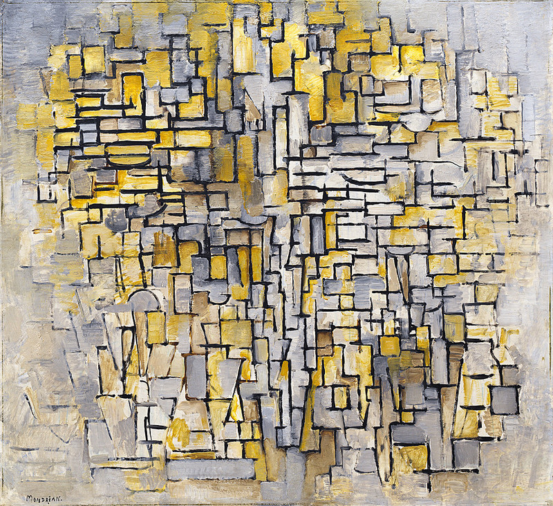

## 102. Composition No VI 构成 6 1914 （Piet Mondrian, 皮埃特·蒙特里安）

## 103. Ladder Back Chair 梯形靠背椅 1903 （Charles Rennie Mackintosh, 查尔斯·雷尼·麦金托什）

[作品链接](https://collection.maas.museum/object/36784)

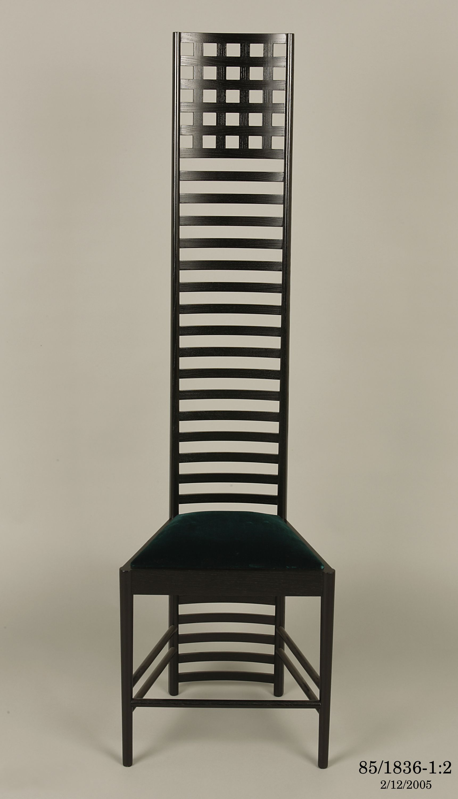

## 104. Red and Blue Chair 红蓝椅 1918-1923 （Gerrit Rietveld, 赫里特·里特费尔德）

[作品链接](https://www.moma.org/collection/works/4044)

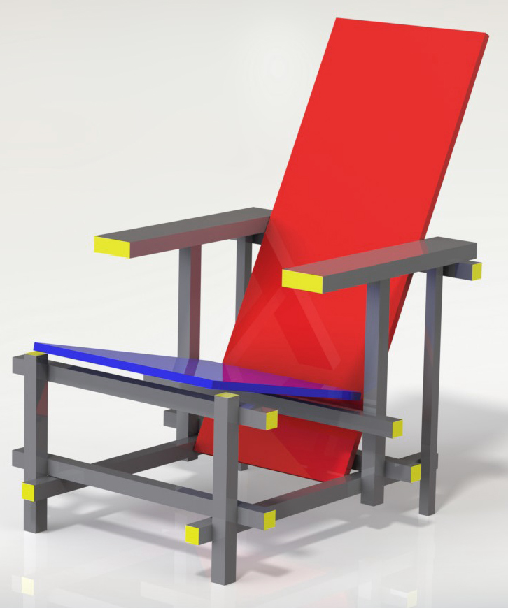

## 105. Rietveld Schröder House 施罗德住宅 1924 （Gerrit Rietveld, 赫里特·里特费尔德）

[作品链接](https://en.wikipedia.org/wiki/Rietveld_Schr%C3%B6der_House)

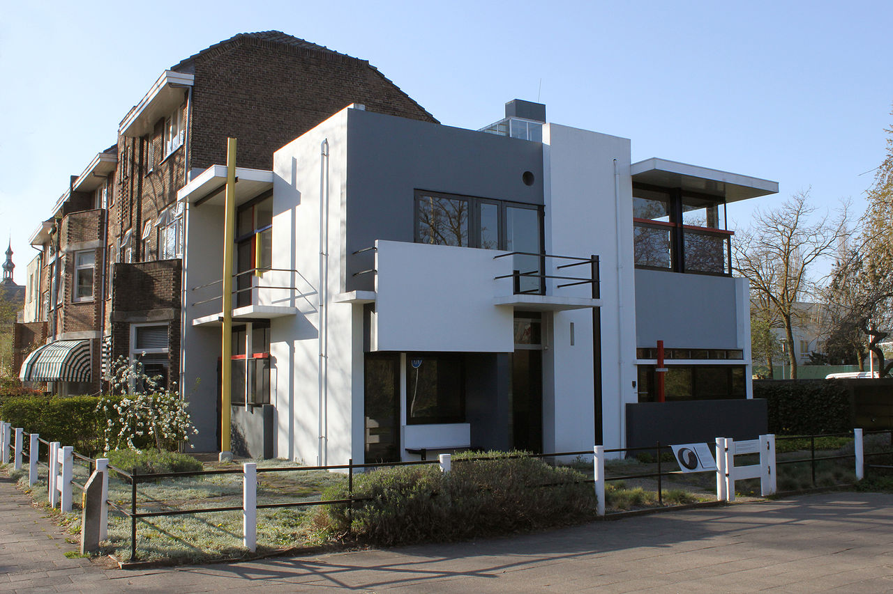

## 106. Composition with Red, Blue and Yellow 红黄蓝构成 1930 （Piet Mondrian, 皮埃特·蒙特里安）

[作品链接](https://artsandculture.google.com/asset/composition-with-red-blue-and-yellow/xwERWaqDyIcZ9w)

## 107. Composition No.1 构成第一号 1920 （Piet Mondrian, 皮埃特·蒙特里安）

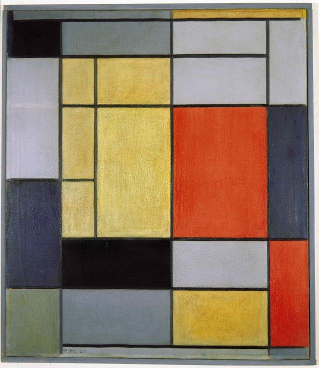

## 108. Composition with Red, Yellow, Blue and Black 红黄蓝黑构成 1921 （Piet Mondrian, 皮埃特·蒙特里安）

# 12 包豪斯：校园重聚，1919—1933

## 109. Wainwright Building 温赖特大厦 1891（Dankmar Adler and Louis Sullivan, 阿德勒和路易斯·沙利文）

[作品链接](https://en.wikipedia.org/wiki/Wainwright_Building)

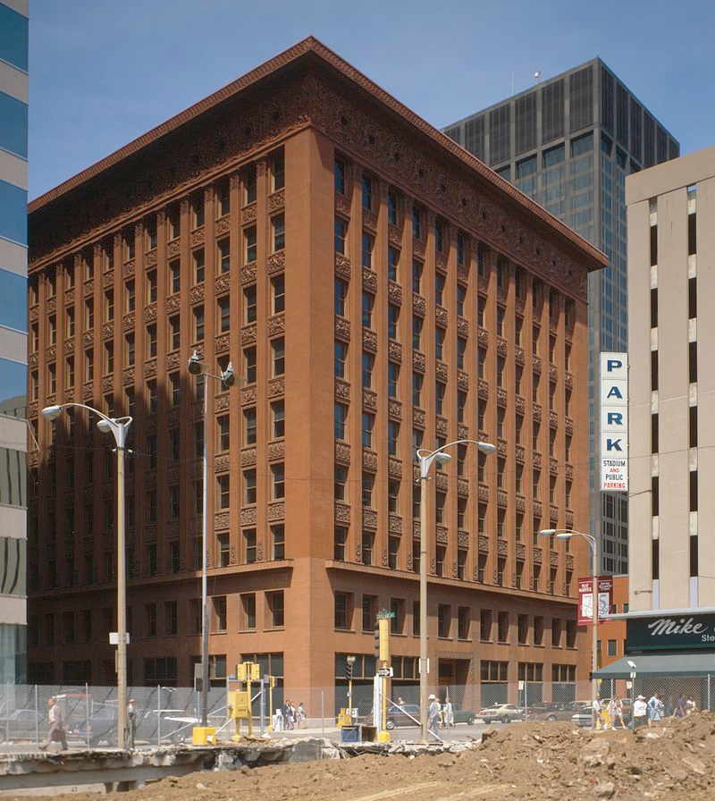

## 110. AEG turbine factory 通用电气涡轮机工厂 1909 （Peter Behrens, 彼特·贝伦斯）

[作品链接](https://en.wikipedia.org/wiki/AEG_turbine_factory)

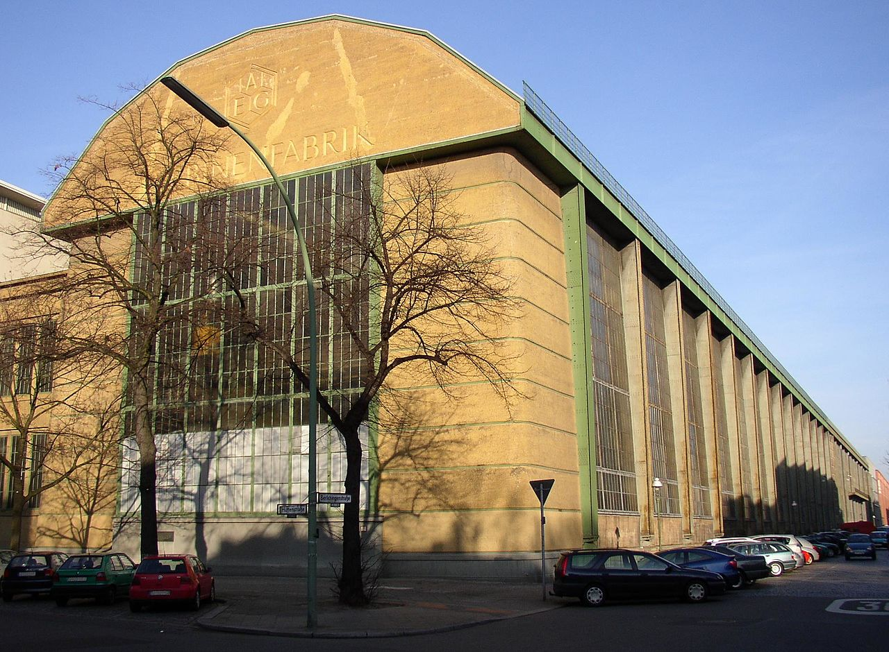

## 111. Fagus Factory (Fagus-Werk) 法古斯工厂 1911-1913 （Walter Gropius and Adolf Meyer, 沃尔特·格罗佩斯，阿道夫·梅耶）

[作品链接](https://www.bauhauskooperation.com/knowledge/the-bauhaus/phases/bauhaus-weimar/)

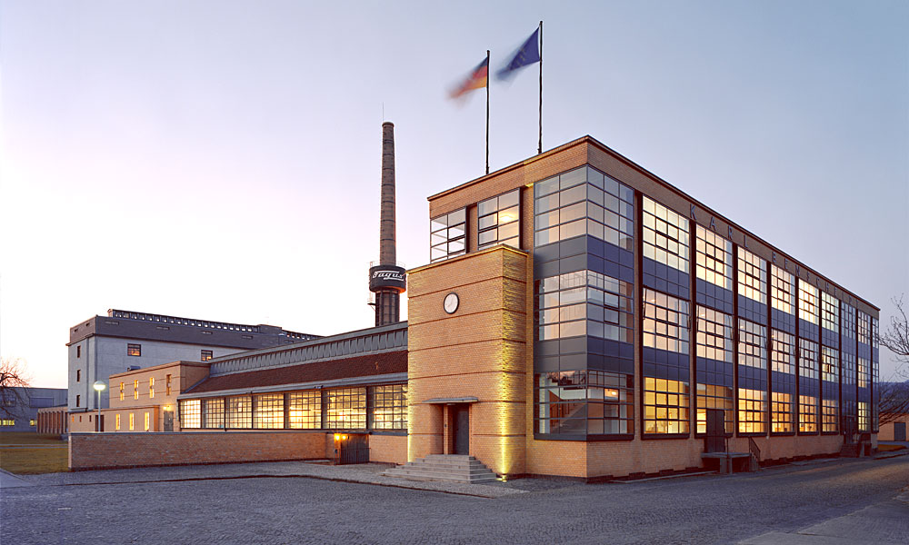

## 112. Cathedral 大教堂 1919 （Lyonel Feininger, 莱昂内尔·法宁格）

[作品链接](https://en.wikipedia.org/wiki/Fagus_Factory)

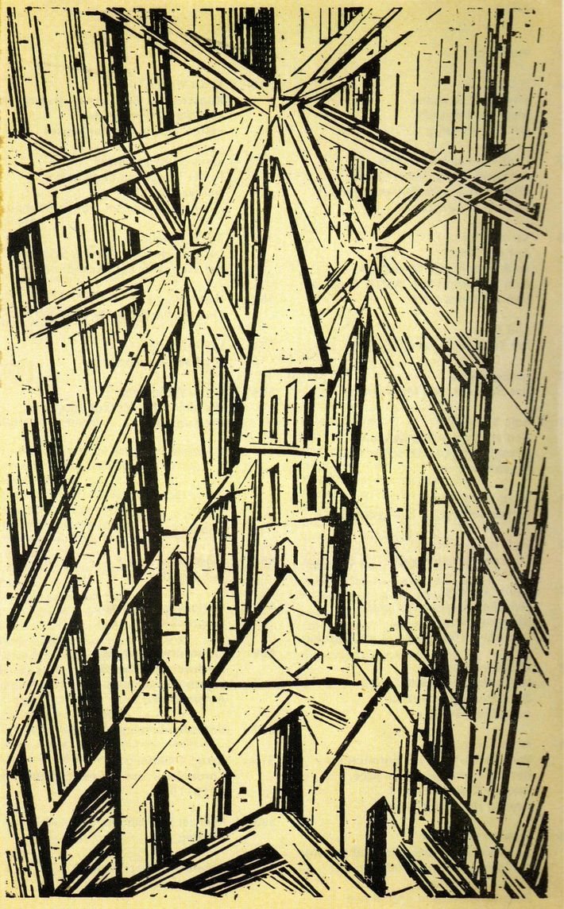

## 113. Self-Portrait as a Soldier 作为一个军人的自画像 1915（Ernst Ludwig Kirchner, 恩斯特·路德维希·凯尔希纳）

[作品链接](https://en.wikipedia.org/wiki/Self-Portrait_as_a_Soldier)

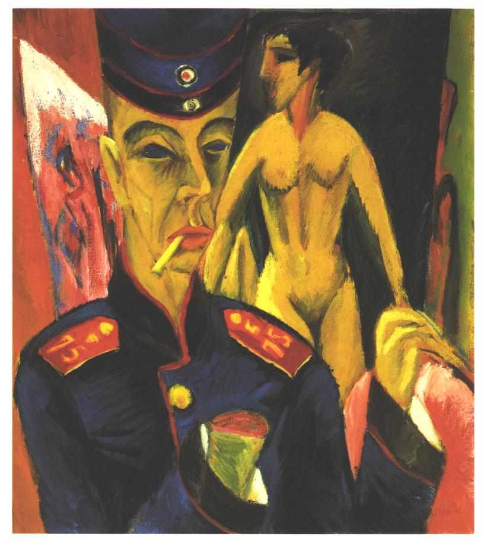

## 114. Hot-Water Jug 1924（Marianne Brandt, 玛丽安·布兰德）

[作品链接](https://www.moma.org/collection/works/2440)

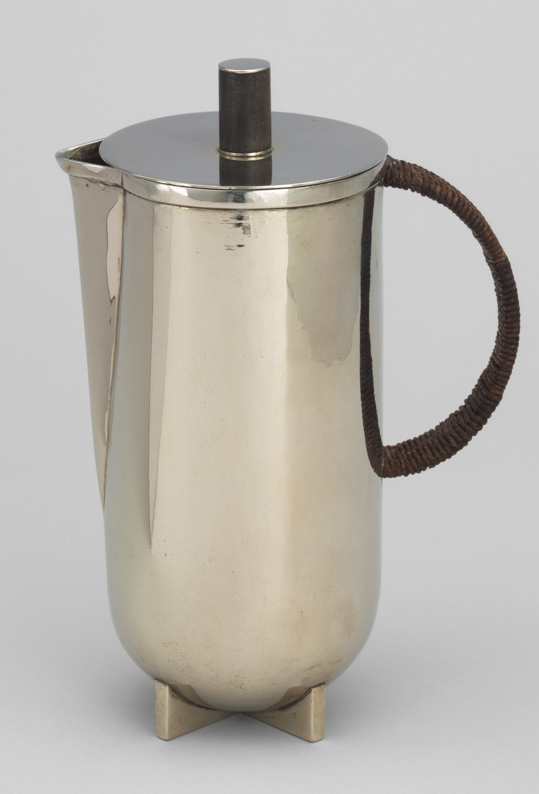

## 115. Table Lamp 华根菲尔德台灯 1924（Wilhelm Wagenfeld & Carl Jakob Jucker, 威尔赫姆·华根菲尔德，卡尔·朱克）

[作品链接](https://www.moma.org/collection/works/4056?locale=en)

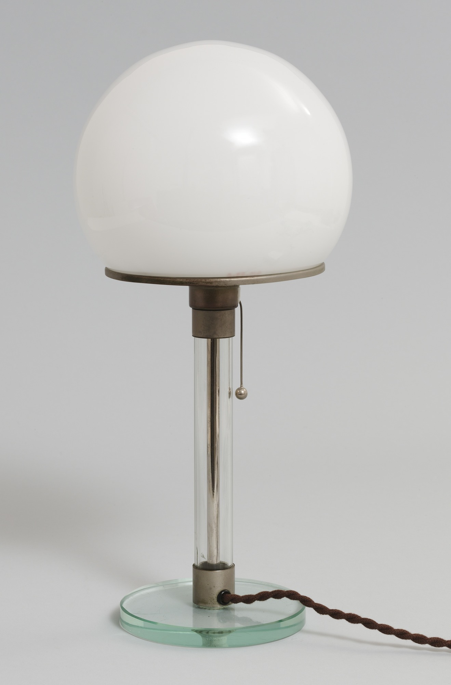

## 116. EM 1 (Telephone Picture) 电话图 EM1 1923 （László Moholy-Nagy, 莫霍利·纳吉）

[作品链接](https://www.moma.org/collection/works/147626)

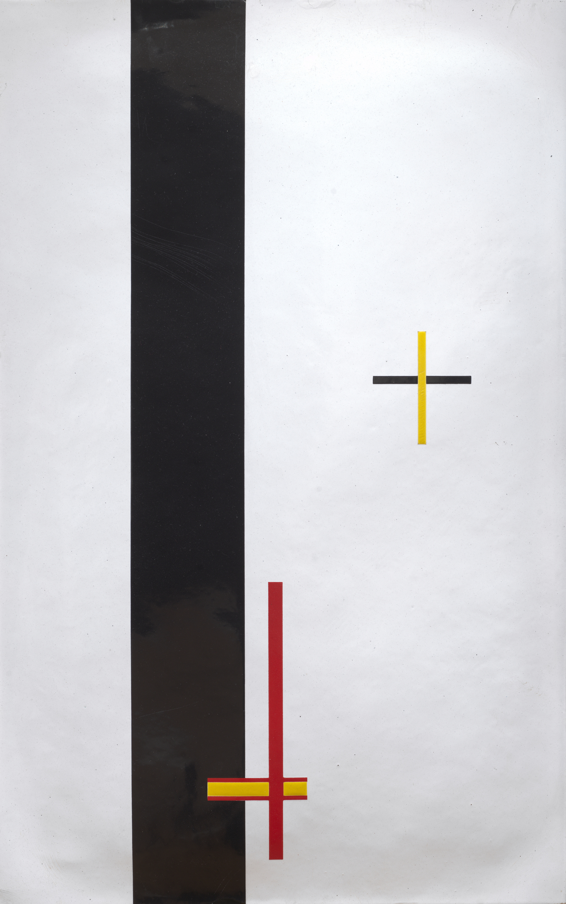

## 117. Nesting Tables 嵌套桌组 1927 （Josef Albers, 约瑟夫·亚伯斯）

[作品链接](https://blog.timelesswroughtiron.com/2014/09/modern-history-bauhaus-nesting-tables/)

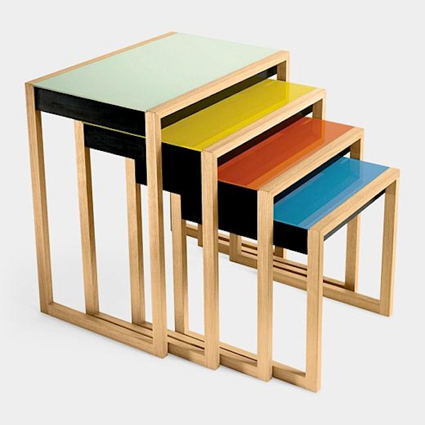

## 118. Wassily Chair 瓦西里椅 1925（Marcel Lajos Breuer, 马塞尔·布劳耶）

[作品链接](https://en.wikipedia.org/wiki/Wassily_Chair)

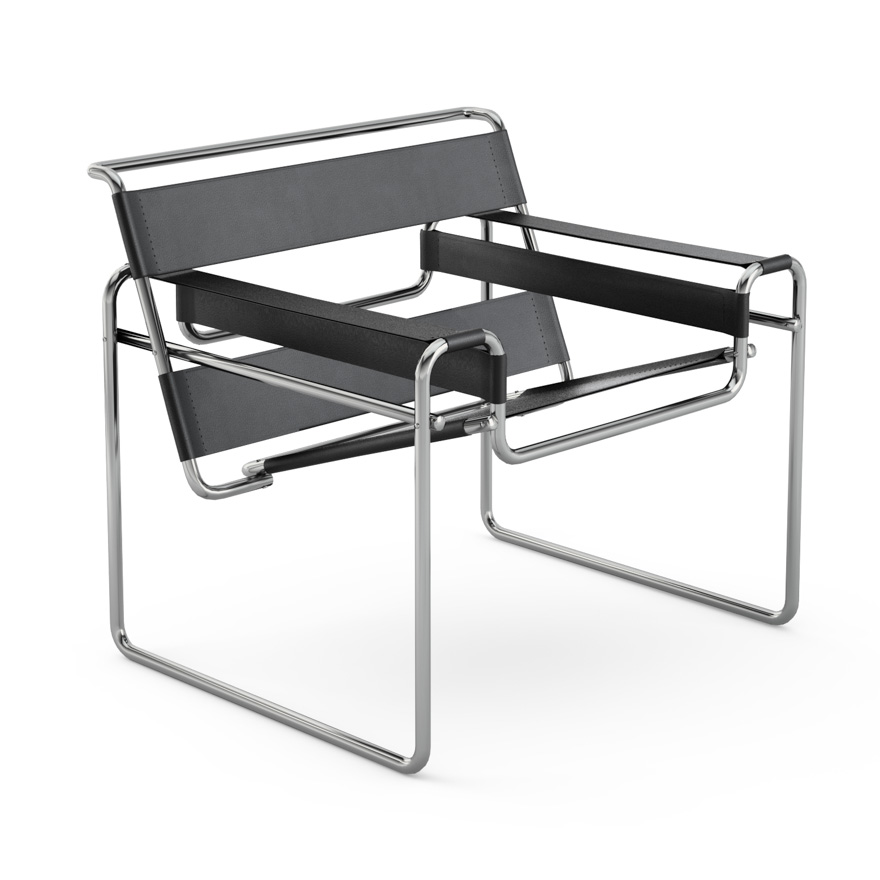

## 119. Bauhaus 包豪斯 1926 （Walter Gropius, 沃尔特·格罗佩斯）

[作品链接](https://en.wikipedia.org/wiki/Bauhaus)

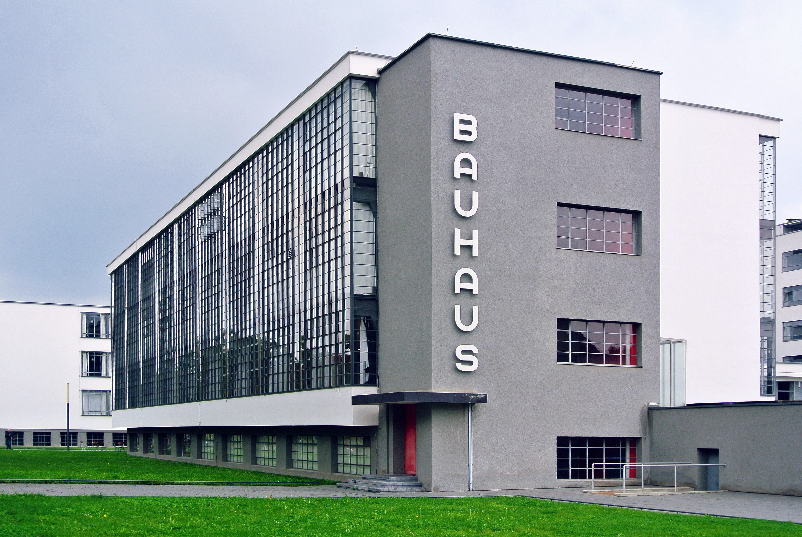

## 120. Barcelona Pavilion 巴塞罗那世博会德国馆 1929 （Ludwig Mies van der Rohe, 路德维希·密斯·凡德罗）

[作品链接](https://en.wikipedia.org/wiki/Barcelona_Pavilion)

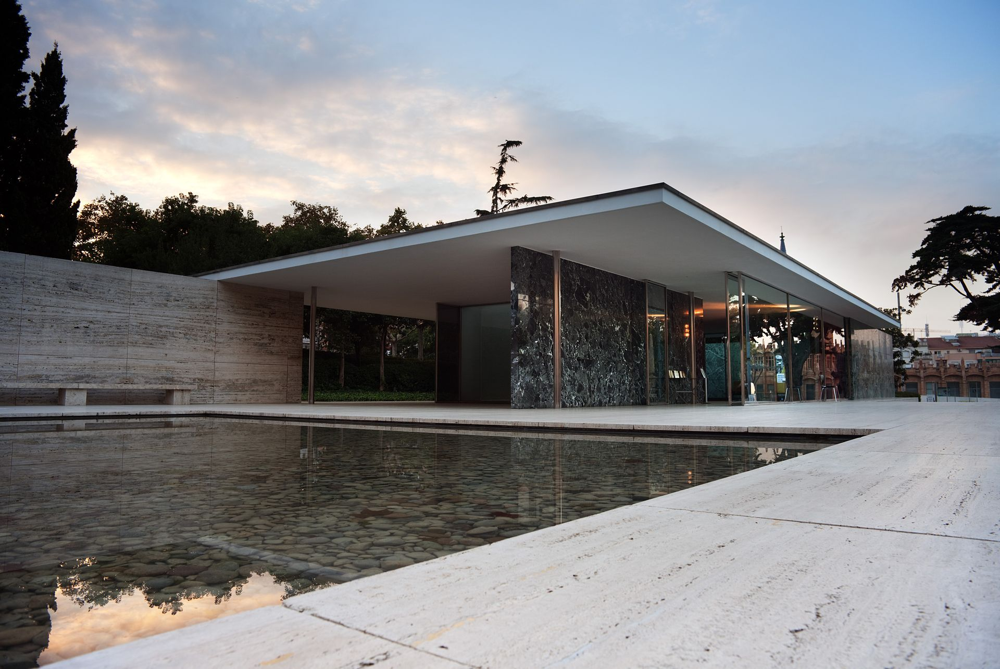

## 121. Barcelona Chair 巴塞罗那椅 1929 （Ludwig Mies van der Rohe, 路德维希·密斯·凡德罗）

[作品链接](https://www.moma.org/collection/works/4369?locale=en)

# 13 达达主义：混乱的秩序，1916—1923

## 122. La Nona Ora (The Ninth Hour) 第九时辰 1999（Maurizio Cattelan, 莫瑞吉奥·卡特兰）

[作品链接](https://farticulate.wordpress.com/2010/10/21/la-nona-ora-the-ninth-hour-1999/)

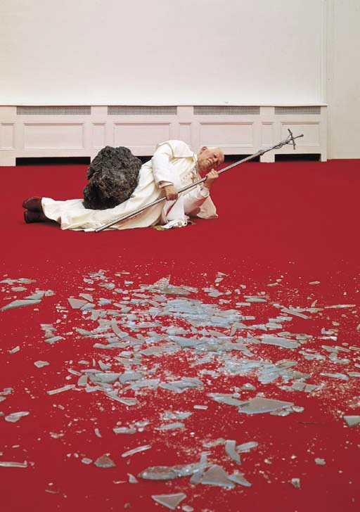

## 123. Collage with Squares Arranged according to the Laws of Chance 根据随机法则排布的正方形的拼贴画 1916-1917 （Jean （Hans）Arp, 让·阿尔普（汉斯·阿尔普））

[作品链接](https://www.moma.org/collection/works/37013?locale=en)

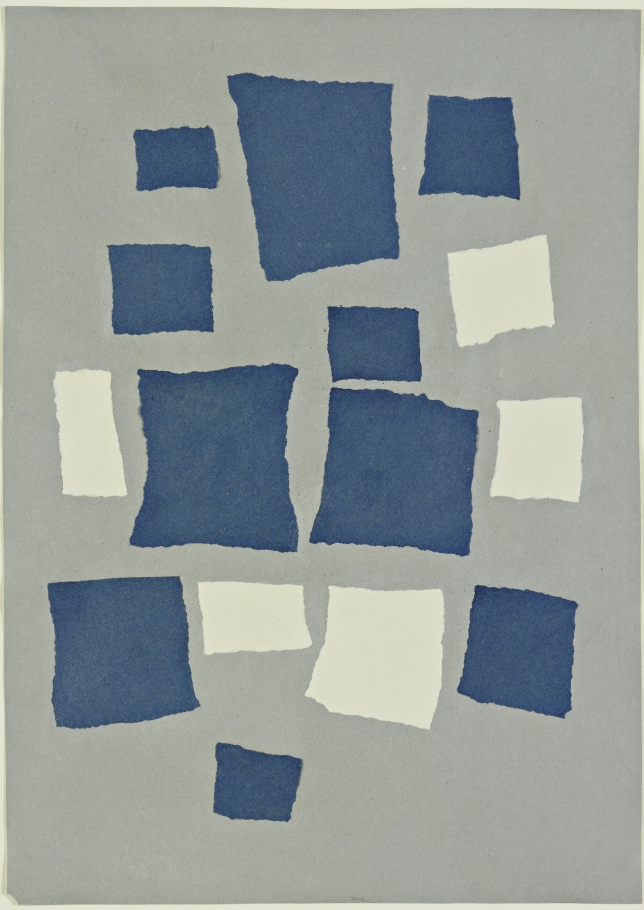

## 124. Revolving 旋转 1919 （Kurt Schwitters, 库尔特·施维特斯）

[作品链接](https://www.moma.org/collection/works/79211?locale=en)

## 125. Merzbau 梅尔兹堡 1933 （Kurt Schwitters, 库尔特·施维特斯）

[作品链接](https://www.moma.org/explore/inside_out/2012/07/09/in-search-of-lost-art-kurt-schwitterss-merzbau/)

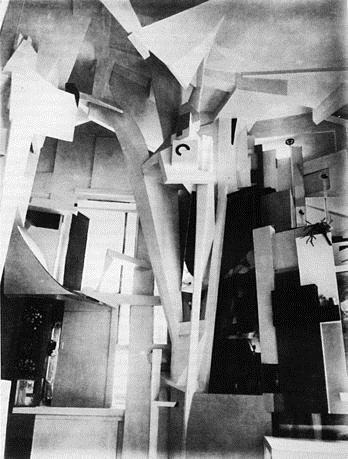

## 126. 3 Standard Stoppages 三个标准的终止 1913-1914（Marcel Duchamp, 马塞尔·杜尚）

[作品链接](https://www.moma.org/collection/works/78990?locale=en)

## 127. L.H.O.O.Q. 1919 （Marcel Duchamp, 马塞尔·杜尚）

[作品链接](https://en.wikipedia.org/wiki/L.H.O.O.Q.)

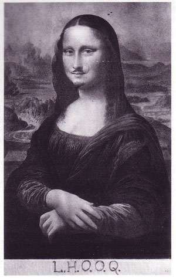

## 128. Beautiful Breath: Veil Water 美丽气息 1921 （Marcel Duchamp, 马塞尔·杜尚）

[作品链接](http://www.toutfait.com/unmaking_the_museum/Belle%20Haleine.html)

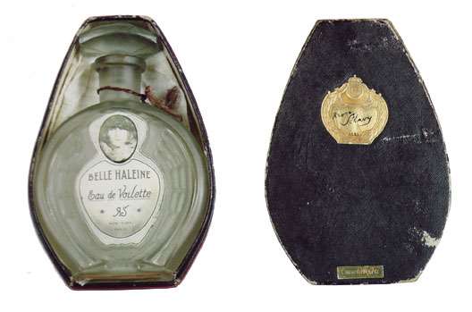

# 14 超现实主义：以梦为生，1924—1945

## 129. The Persistence of Memory 永恒的记忆 1931（Salvador Dalí, 萨尔瓦多·达利）

[作品链接](https://www.moma.org/collection/works/79018?locale=en)

## 130. Lobster Telephone 龙虾电话 1936 （Salvador Dalí, 萨尔瓦多·达利）

[作品链接](https://en.wikipedia.org/wiki/Lobster_Telephone)

## 131. Maman 妈妈 1999（Louise Bourgeois, 路易丝·布尔乔亚）

[作品链接](https://en.wikipedia.org/wiki/Maman_(sculpture))

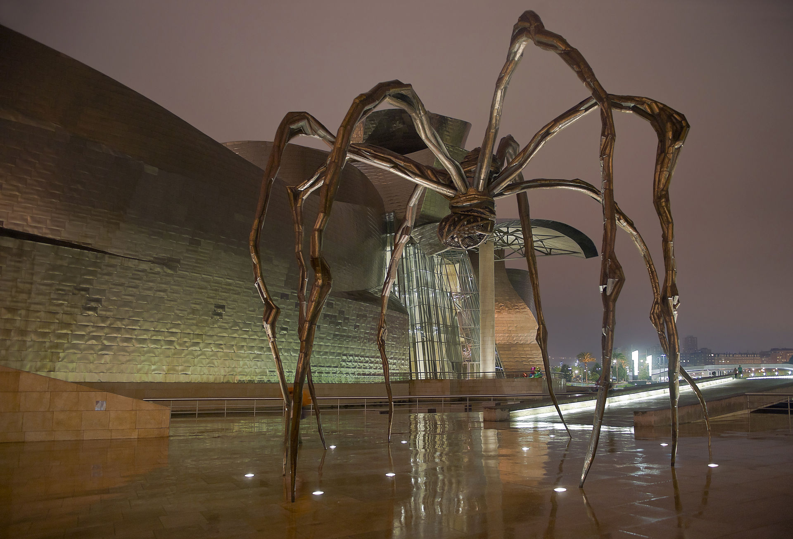

## 132. The Three Dancers 三个舞蹈者 1925（Pablo Picasso, 巴勃罗·毕加索）

[作品链接](http://www.tate.org.uk/art/artworks/picasso-the-three-dancers-t00729)

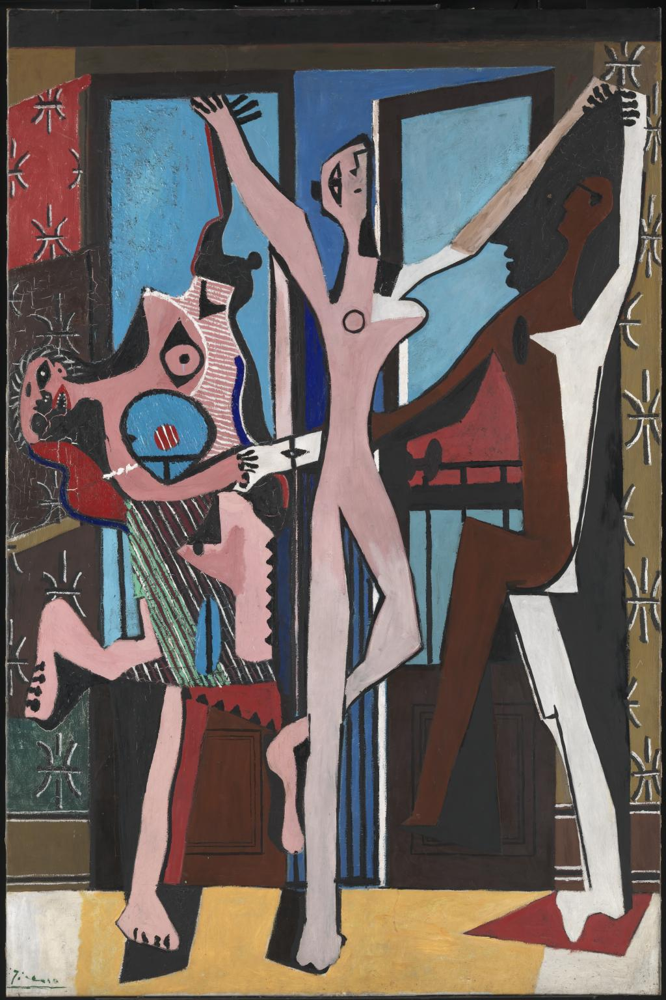

## 133. The Harlequin's Carnival 小丑的狂欢夜 1924-1925（Joan Miró, 胡安·米罗）

[作品链接](https://en.wikipedia.org/wiki/The_Harlequin%27s_Carnival)

## 134. The Elephant Celebes (or short Celebes) 西里伯斯 1921（Max Ernst, 马克斯·恩斯特）

[作品链接](https://en.wikipedia.org/wiki/The_Elephant_Celebes)

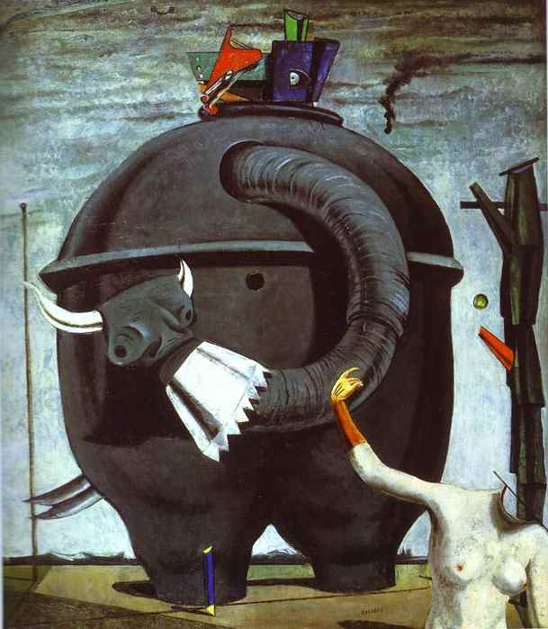

## 135. Forest and Dove 森林与鸽子 1927 （Max Ernst, 马克斯·恩斯特）

[作品链接](http://www.tate.org.uk/art/artworks/ernst-forest-and-dove-t00548)

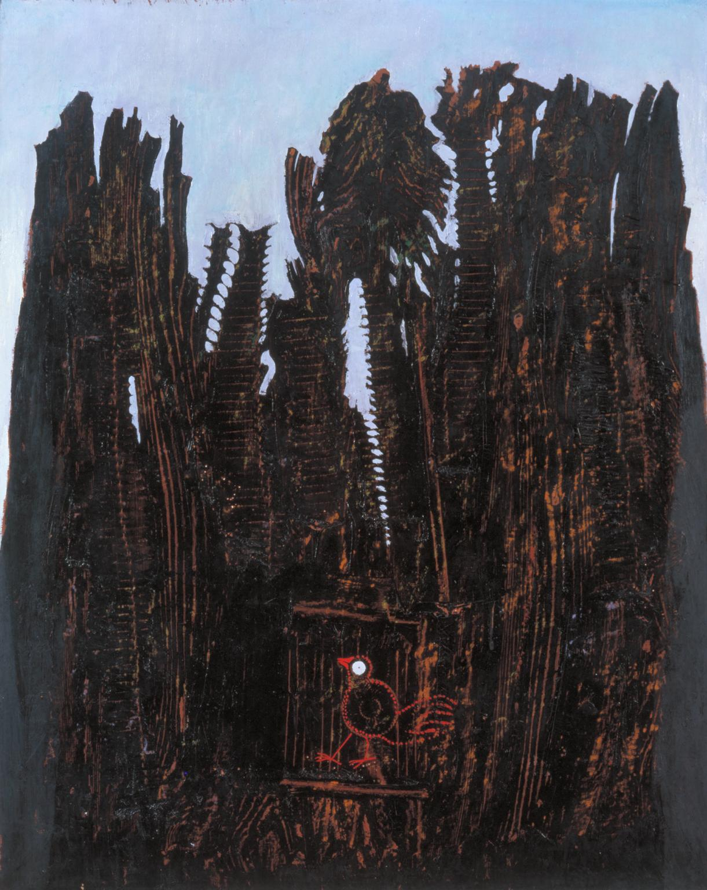

## 136. The Menaced Assassin 受威胁的暗杀者 1927 （René Magritte, 勒内·马格里特）

[作品链接](https://www.moma.org/collection/works/79267?locale=zh)

## 137. The Song of Love 爱之歌 1914（Giorgio de Chirico, 乔治·德·基里科）

[作品链接](https://en.wikipedia.org/wiki/The_Song_of_Love)

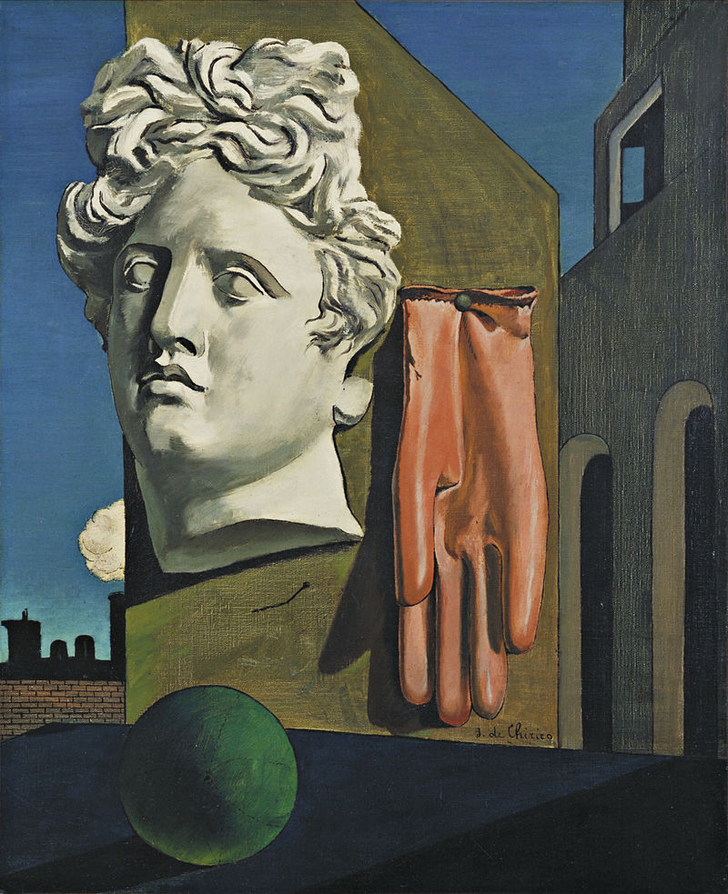

## 138. Nighthawks 夜鹰 1924（Edward Hopper, 爱德华·霍普）

[作品链接](https://en.wikipedia.org/wiki/Nighthawks)

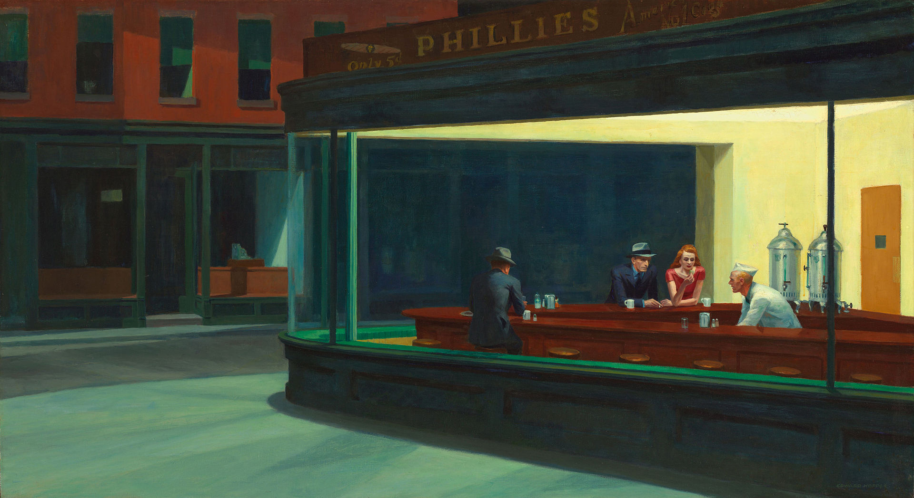

## 139. Primacy of Matter over Thought 物质相对于思想的第一性 1929（Man Ray (Emmanuel Radnitzky）, 曼·雷）

[作品链接](https://www.wikiart.org/en/man-ray/primacy-of-matter-over-thought-1929)

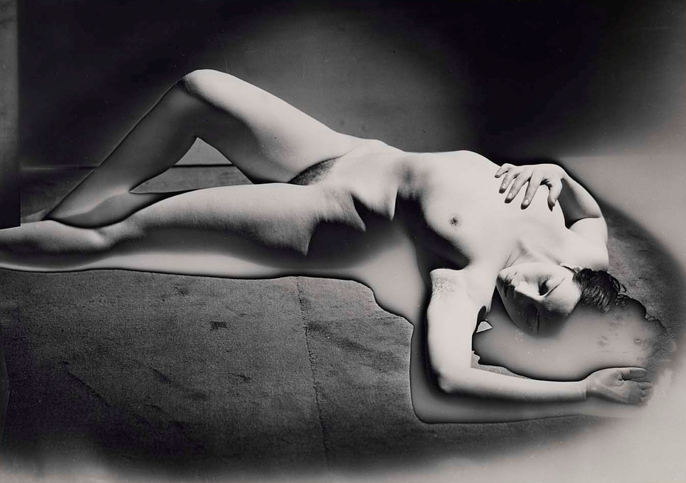

## 140. Object ("The Luncheon in Fur") 物体（皮毛餐具） 1936（Méret Oppenheim, 莫瑞特·奥本海姆）

[作品链接](https://www.moma.org/collection/works/80997?locale=en)

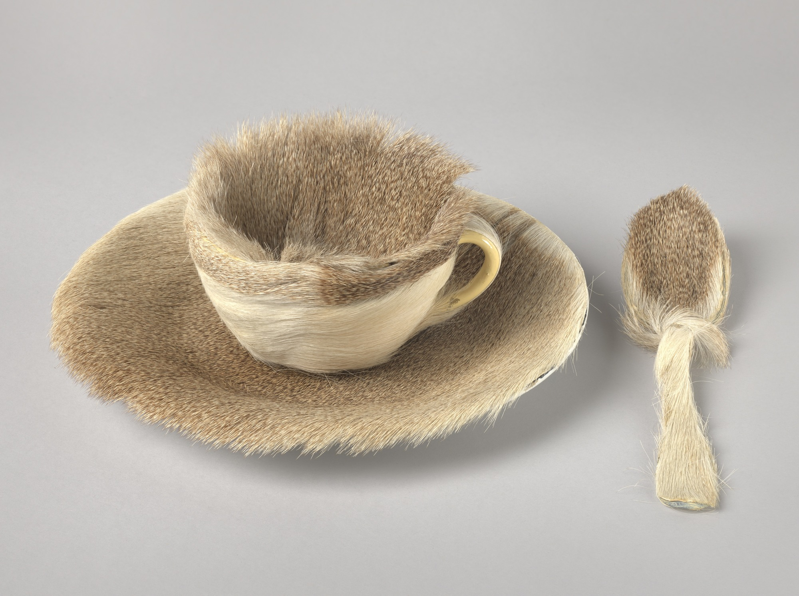

## 141. Erotique voilée 色情的面纱 1933（Man Ray (Emmanuel Radnitzky), 曼·雷）

[作品链接](http://www.museoreinasofia.es/en/collection/artwork/erotique-voilee-veiled-erotic)

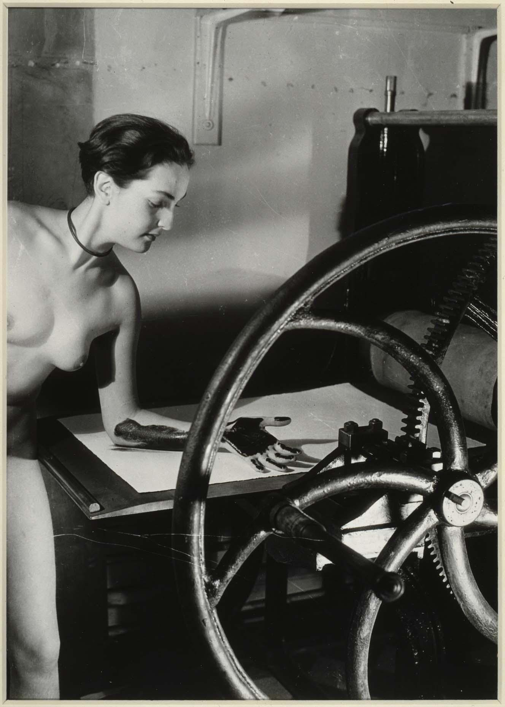

## 142. The Dream (The Bed) 梦 1940（Frida Kahlo, 弗里达·卡罗）

[作品链接](https://www.wikiart.org/en/frida-kahlo/the-dream-the-bed-1940)

## 143. Self Portrait - The Frame 自画像：框架 1938 （Frida Kahlo, 弗里达·卡罗）

[作品链接](https://www.wikiart.org/en/frida-kahlo/self-portrait-the-frame-1938)

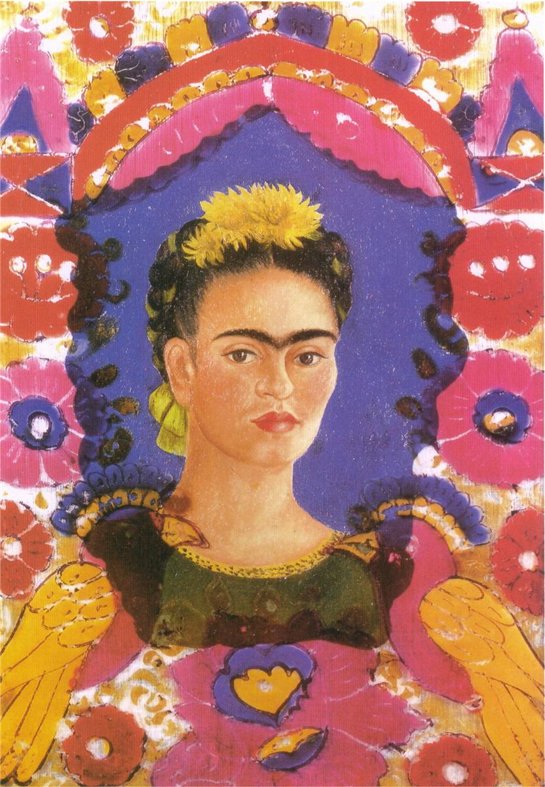

## 144. Self-Portrait: The Inn of the Dawn Horse 自画像：黎明马客栈 1937-1938 （Leonora Carrington, 利奥诺拉·卡灵顿）

[作品链接](https://curiator.com/art/leonora-carrington/self-portrait-inn-of-the-dawn-horse)

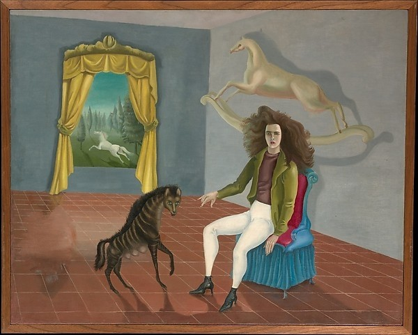

# 15 抽象表现主义：宏大的姿态，1943—1970

## 145. Men in the city 城市里的人 1919（Fernand Léger, 费尔南德·莱热）

[作品链接](https://www.wikiart.org/en/fernand-leger/men-in-the-city-1919)

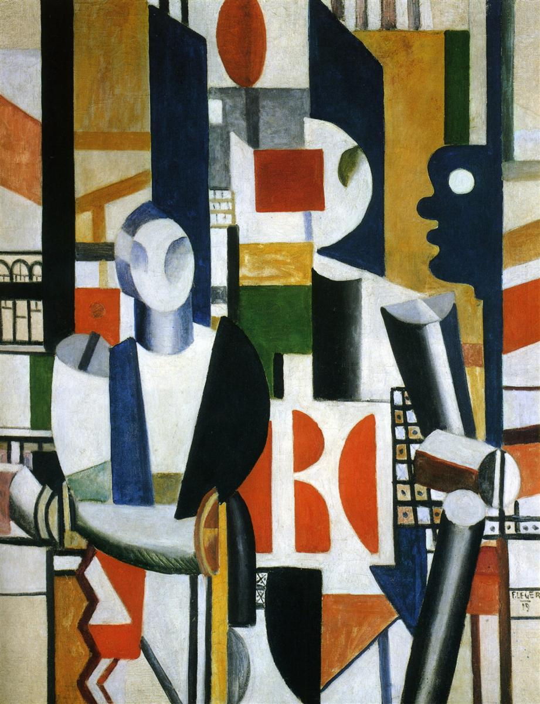

## 146. Bird in Space 空间中的鸟 1928（Constantin Brâncuși, 康斯坦丁·布朗库西）

[作品链接](https://www.moma.org/collection/works/81033?locale=en)

## 147. Stenographic Figure 速记人物 1942 （Jackson Pollock, 杰克逊·波洛克）

[作品链接](https://www.moma.org/collection/works/79686?locale=en)

## 148. Mural 壁画 1943（Jackson Pollock, 杰克逊·波洛克）

[作品链接](https://www.wikiart.org/en/jackson-pollock/mural-1943-1)

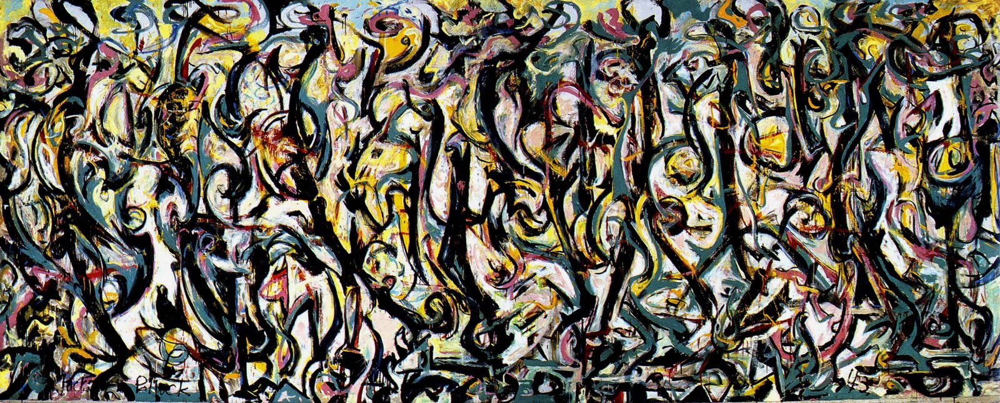

## 149. The She-Wolf 母狼 1943 （Jackson Pollock, 杰克逊·波洛克）

[作品链接](https://www.moma.org/collection/works/78719?locale=en)

## 150. Full Fathom Five 满五英寻 1947 （Jackson Pollock, 杰克逊·波洛克）

[作品链接](https://www.moma.org/collection/works/79070?locale=en)

## 151. Painting 画 1948 （Willem de Kooning, 威廉·德·库宁）

[作品链接](https://www.moma.org/collection/works/79242?locale=en)

## 152. Excavation 挖掘 1950 （Willem de Kooning, 威廉·德·库宁）

[作品链接](https://www.wikiart.org/en/willem-de-kooning/excavation)

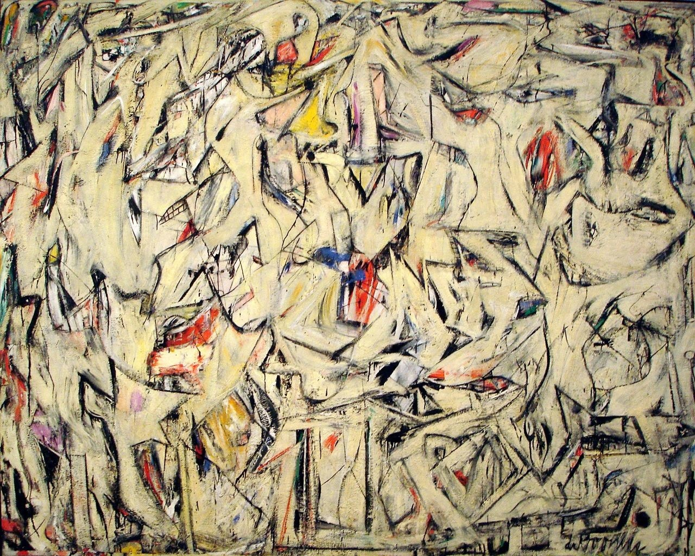

## 153. Woman I 女人1 1950-1952 （Willem de Kooning, 威廉·德·库宁）

[作品链接](https://www.moma.org/collection/works/79810?locale=en)

## 154. Onement, I 太一 1 1948 （Barnett Newman, 巴尼特·纽曼）

[作品链接](https://www.moma.org/collection/works/79601?locale=en)

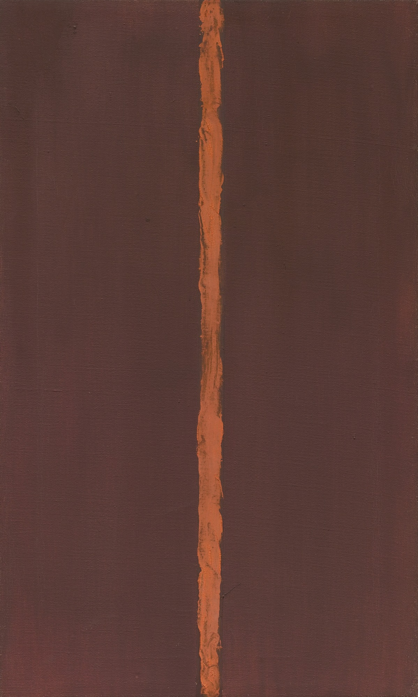

## 155. Vir Heroicus Sublimis 人，英勇而崇高 1950-1951 （Barnett Newman, 巴尼特·纽曼）

[作品链接](https://www.moma.org/collection/works/79250?locale=en)

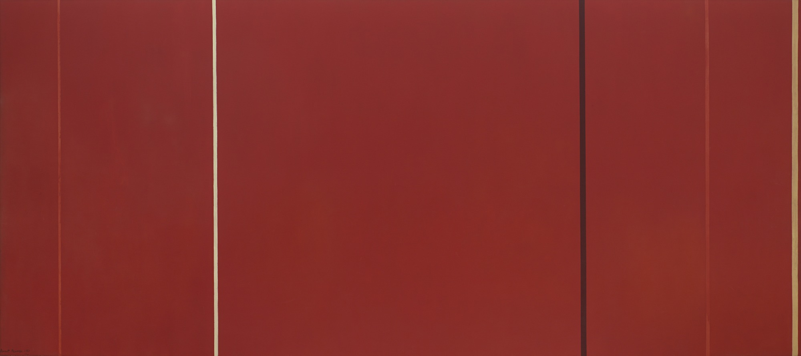

## 156. Untitled (Violet, Black, Orange, Yellow on White and Red) 无题（白红上的紫罗兰色、黑色、橙色和黄色） 1949 （Mark Rothko, 马克·罗斯科）

[作品链接](https://www.guggenheim.org/artwork/3533)

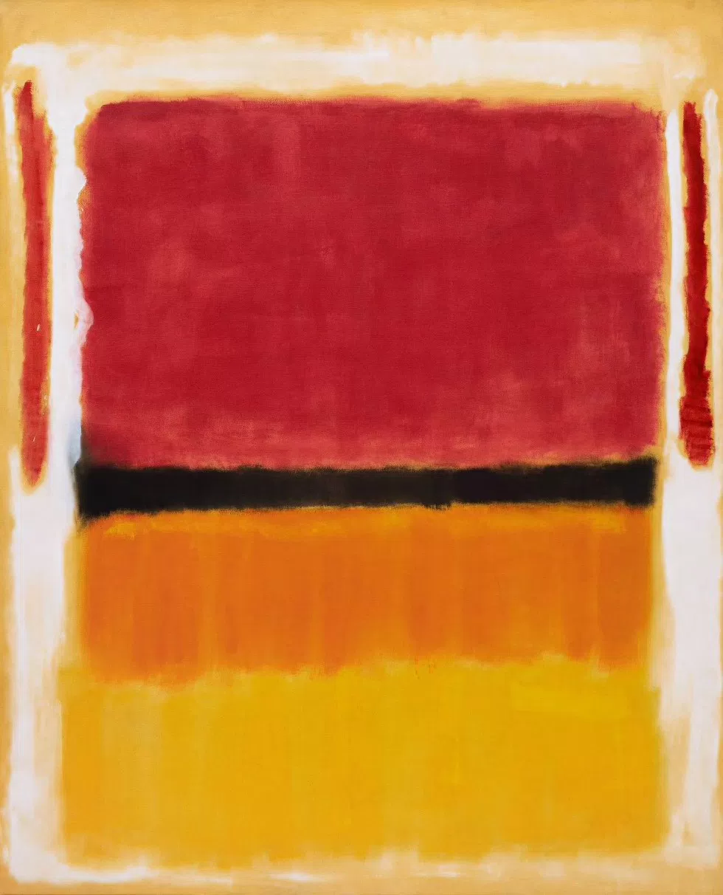

## 157. Ochre and Red on Red 赭石，红上之红 1949 （Mark Rothko, 马克·罗斯科）

[作品链接](https://www.wikiart.org/en/mark-rothko/ochre-and-red-on-red-1)

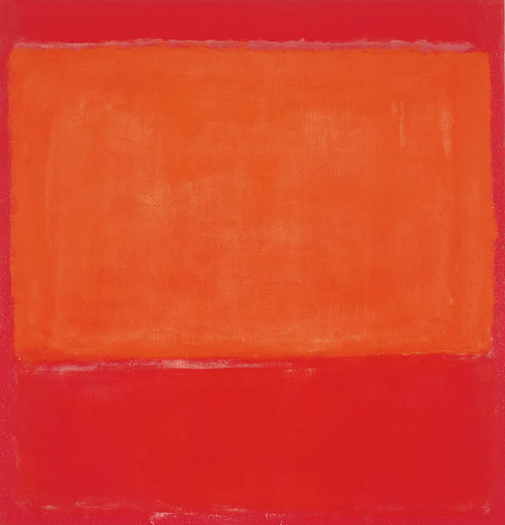

## 158. Australia 澳大利亚 1951 （David Smith, 大卫·史密斯）

[作品链接](https://www.moma.org/collection/works/82047?locale=en)

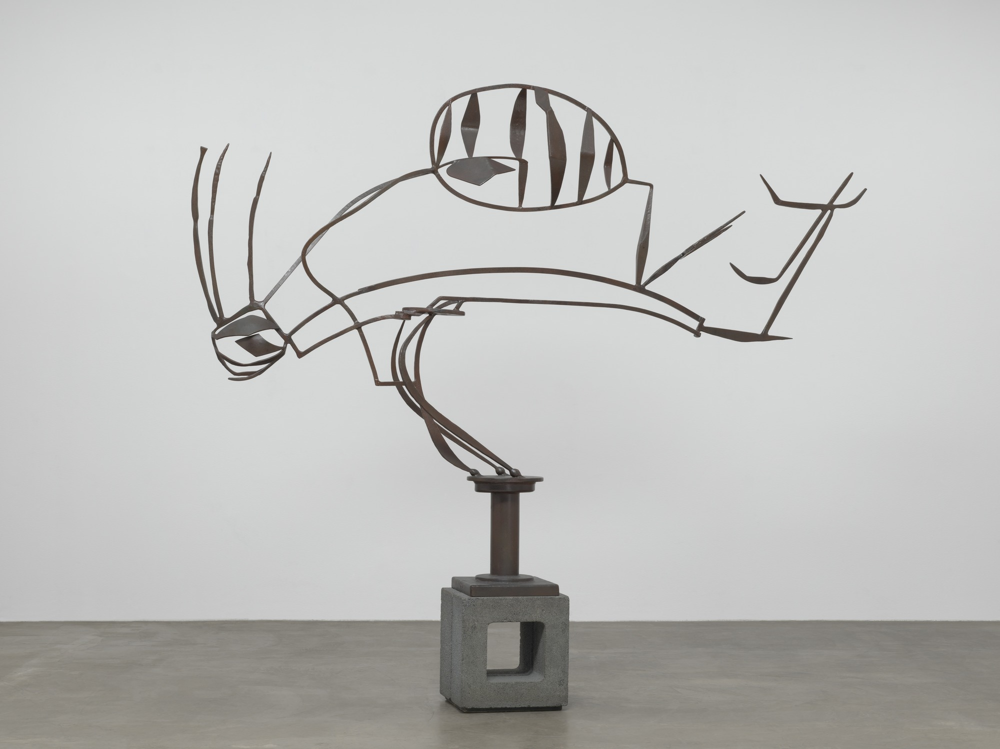

## 159. Early One Morning 一天清晨 1962 （Anthony Caro, 安东尼·卡洛）

[作品链接](http://www.tate.org.uk/art/artworks/caro-early-one-morning-t00805)

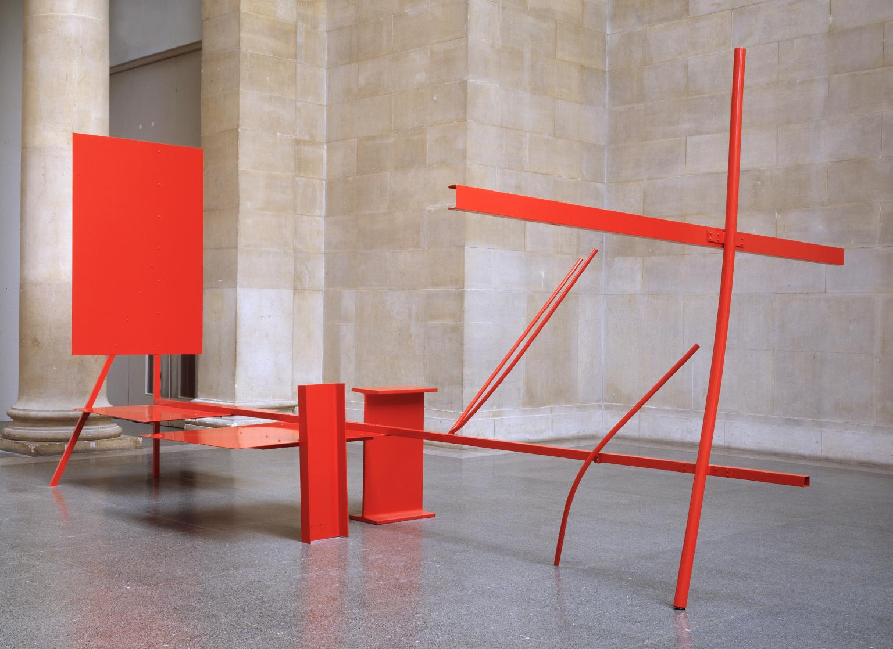

# SIXTEEN

## 160. I was a Rich Man’s Plaything 我是一个有钱人的玩物 1947 （Eduardo Paolozzi, 爱德华多·保罗齐）

[作品链接](http://www.tate.org.uk/art/artworks/paolozzi-i-was-a-rich-mans-plaything-t01462)

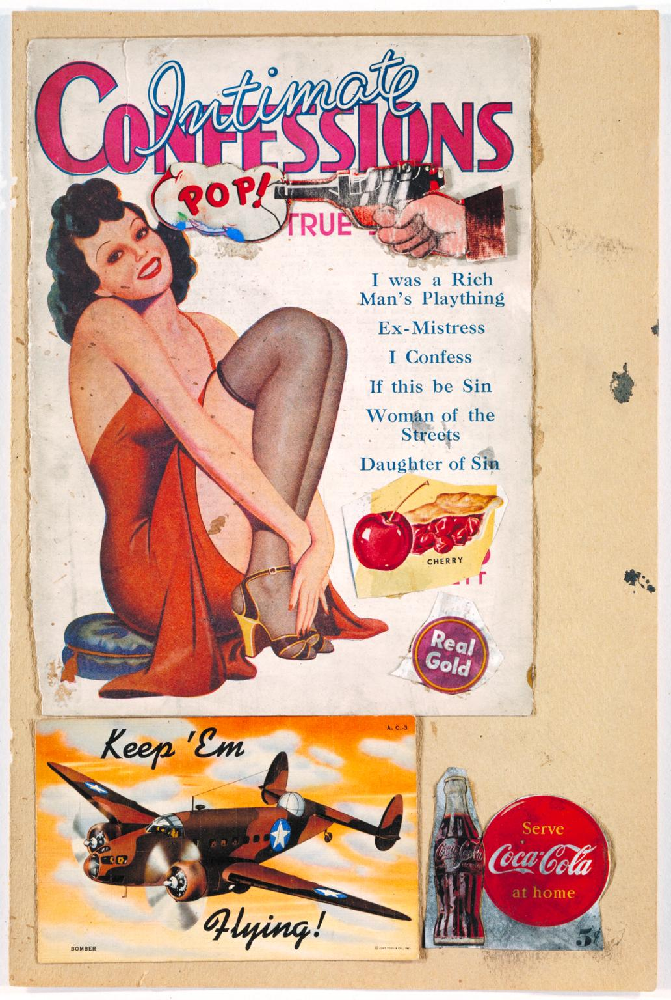

## 161. Just what is it that makes today's homes so different, so appealing? 是什么让今天的家庭如此不同、如此富有魅力？ 1956 （Richard Hamilton, 理查德·汉密尔顿）

[作品链接](https://en.wikipedia.org/wiki/Just_what_is_it_that_makes_today%27s_homes_so_different,_so_appealing%3F)

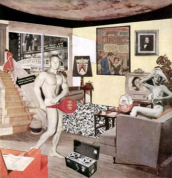

## 162. Flag 旗 1954-1955（Jasper Johns, 贾斯培·琼斯）

[作品链接](https://www.moma.org/collection/works/78805?locale=en)

## 163. Monogram 字母组合 1955-1959（Robert Rauschenberg, 罗伯特·劳森伯格）

[作品链接](https://www.moma.org/audio/playlist/40/648)

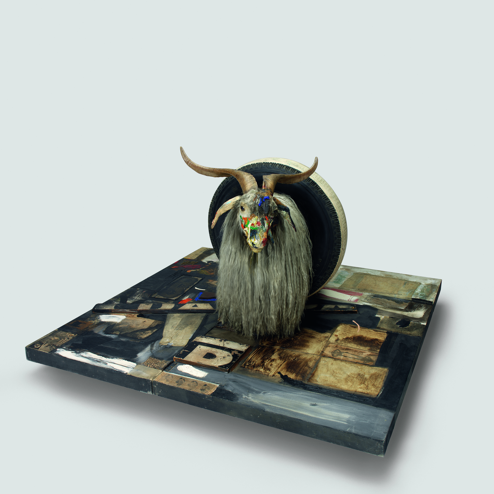

## 164.  White Painting 白色绘画 1951 （Robert Rauschenberg, 罗伯特·劳森伯格）

[作品链接](https://www.moma.org/audio/playlist/40/639)

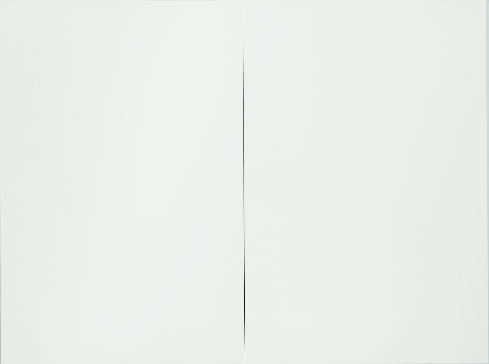

## 165. Erased de Kooning Drawing 擦除的德·库宁绘画 1953 （Robert Rauschenberg, 罗伯特·劳森伯格）

[作品链接](https://www.rauschenbergfoundation.org/art/artwork/erased-de-kooning-drawing)

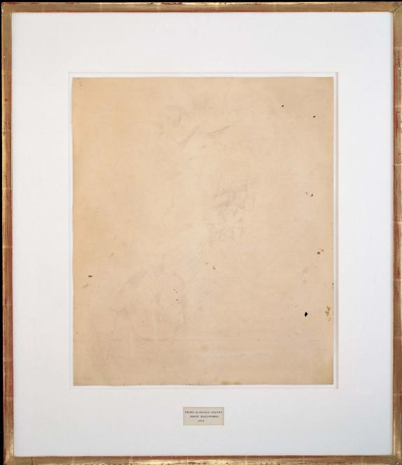

## 166. Coca-Cola[1] 可口可乐[1] 1961（Andy Warhol, 安迪·沃霍尔）

[作品链接](https://www.zhihu.com/question/22057640)

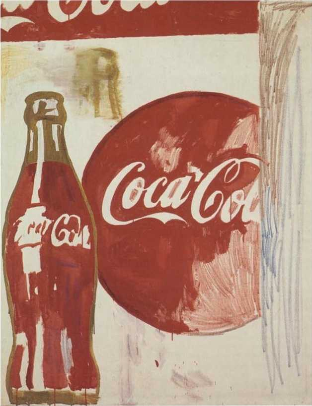

## 167. Water Heater 热水器 1961 （Andy Warhol, 安迪·沃霍尔）

[作品链接](https://www.moma.org/collection/works/80290?locale=en)

## 168. Campbell's Soup Cans 金宝汤罐头 1962 （Andy Warhol, 安迪·沃霍尔）

[作品链接](https://www.moma.org/collection/works/79809?locale=en)

## 169. Marilyn Diptych 玛丽莲双联画 1962 （Andy Warhol, 安迪·沃霍尔）

[作品链接](https://en.wikipedia.org/wiki/Marilyn_Diptych)

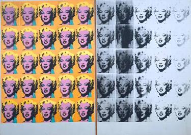

## 170. Superman 超人 1961 （Andy Warhol, 安迪·沃霍尔）

[作品链接](https://theartstack.com/artist/andy-warhol/superman-1961)

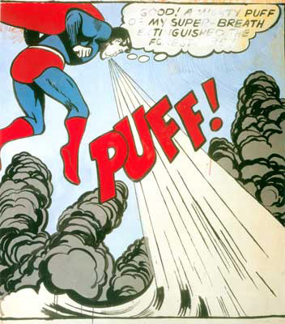

## 171. Whaam! 嘭！ 1963 （Roy Lichtenstein, 罗伊·利希滕斯坦）

[作品链接](https://en.wikipedia.org/wiki/Whaam!)

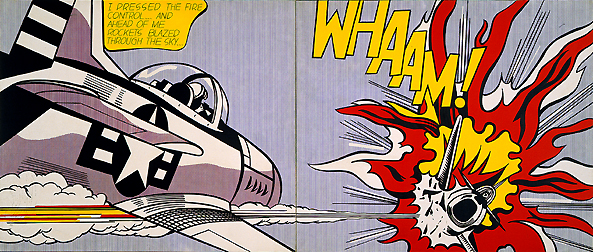

## 172. Brushstroke 笔触 1965（Roy Lichtenstein, 罗伊·利希滕斯坦）

[作品链接](https://www.moma.org/collection/works/60284?locale=en)

## 173. Two Cheeseburgers, with Everything (Dual Hamburgers) 两个一切都有的芝士汉堡（双份汉堡） 1962 （Claes Oldenburg, 克拉斯·欧登伯格）

[作品链接](https://www.moma.org/collection/works/81183?locale=en)

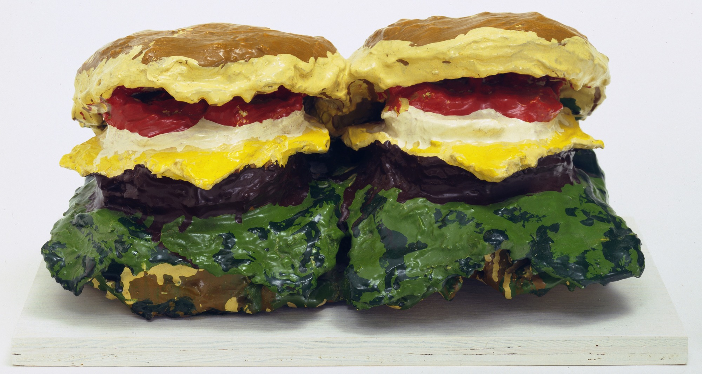

# SEVENTEEN

## 174. The Artist Is Present 艺术家在现场 2010 （Marina Abramović, 玛丽娜·阿布拉莫维奇）

[作品链接](https://www.moma.org/learn/moma_learning/marina-abramovic-marina-abramovic-the-artist-is-present-2010)

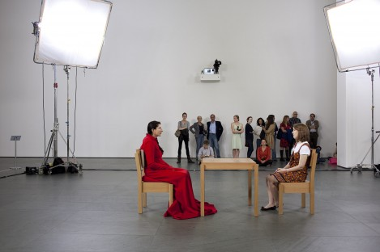

## 175. 18 Happenings in 6 Parts 6处18次即兴表演 1959 （Allan Kaprow, 艾伦·卡普罗）

[作品链接](http://www.medienkunstnetz.de/works/18-happenings-in-6-parts/)

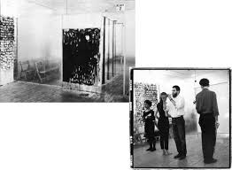

## 176. Spatial Concept: Expectations 空间概念：等待 1960 （Lucio Fontana, 卢齐欧·冯塔纳）

[作品链接](https://www.moma.org/collection/works/79874?locale=en)

## 177. Newspaper Sphere 报纸球 1966（Michelangelo Pistoletto, 米开朗基罗·皮斯特莱托）

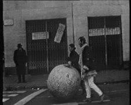

## 178. Venus of the Rags 破衫中的维纳斯 1967 （Michelangelo Pistoletto, 米开朗基罗·皮斯特莱托）

[作品链接](http://www.tate.org.uk/art/artworks/pistoletto-venus-of-the-rags-t12200)

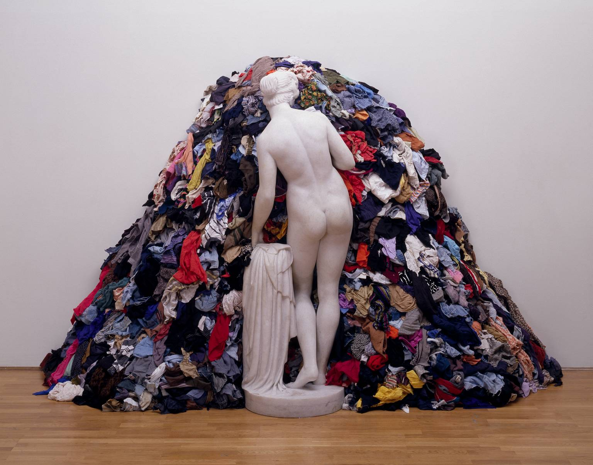

## 179. Untitled (12 Horses) 无题（12匹马）1969（Jannis Kounellis, 简尼斯·库奈利斯）

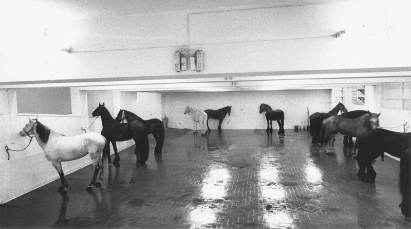

## 180. The Pack 一群 1969（Joseph Beuys, 约瑟夫·博伊斯）

[作品链接](https://www.wikiart.org/en/joseph-beuys/the-pack-1969)

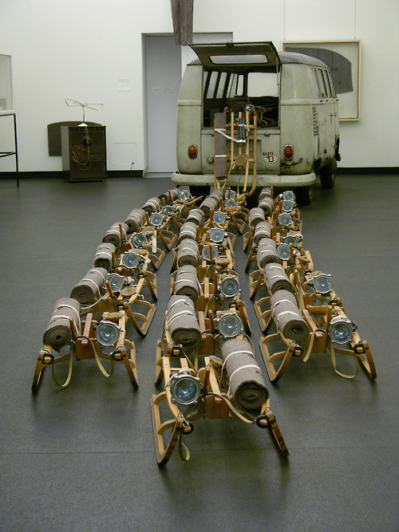

## 181. I Like America and America Likes Me 我爱美国，美国爱我 1974 （Joseph Beuys, 约瑟夫·博伊斯）

[作品链接](https://www.wikiart.org/en/joseph-beuys/i-like-america-and-america-likes-me)

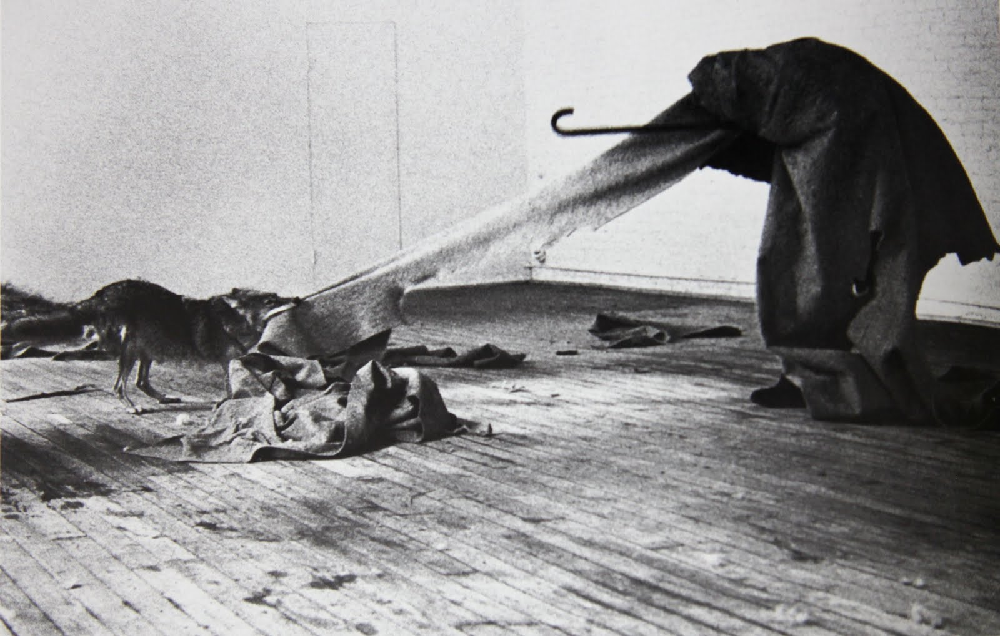

## 182. How to Explain Pictures to a Dead Hare 怎样向一只死兔子解释绘画 1965（Joseph Beuys, 约瑟夫·博伊斯）

[作品链接](https://www.wikiart.org/en/joseph-beuys/how-to-explain-pictures-to-a-dead-hare-1965-1)

## 183. Cut Piece 切片 1964 （Yoko Ono, 小野洋子）

[知乎链接](https://www.zhihu.com/question/30260734?sort=created)

[作品链接](https://www.moma.org/learn/moma_learning/yoko-ono-cut-piece-1964)

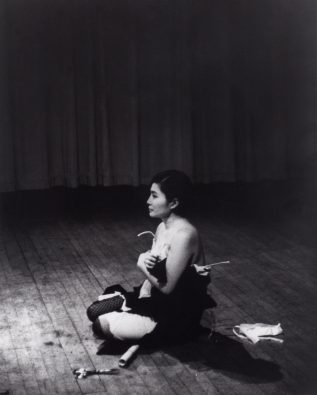

## 184. Failure to Levitate in the Studio 未能在工作室漂浮 1966（Bruce Nauman, 布鲁斯·瑙曼）

[作品链接](http://www.artda.cn/view.php?tid=2306&cid=29)

[作品链接](http://www.stedelijkmuseum.nl/kunstwerk/96022-failing-to-levitate-in-the-studio)

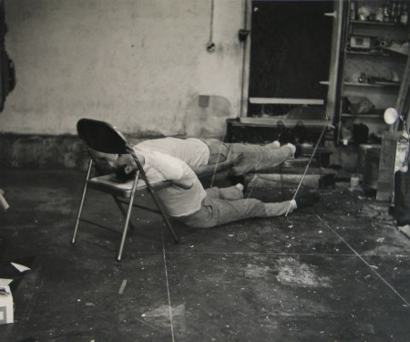

## 185. Dance or Exercise on the Perimeter of a Square (Square Dance) 在广场周边跳舞或锻炼（广场舞） 1967（Bruce Nauman, 布鲁斯·瑙曼）

[作品链接](https://www.moma.org/collection/works/119087)

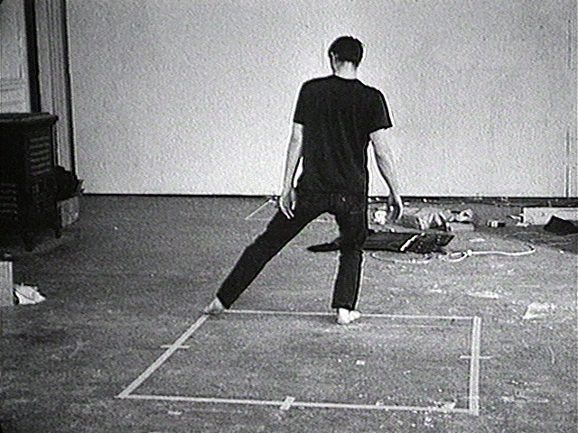

## 186. The Collectors 收藏家 1990-1992 （Francis Alÿs, 弗朗西斯·阿里斯）

[作品链接](http://www.tate.org.uk/whats-on/tate-modern/exhibition/francis-alys/francis-alys-story-deception-room-guide/francis-alys-0)

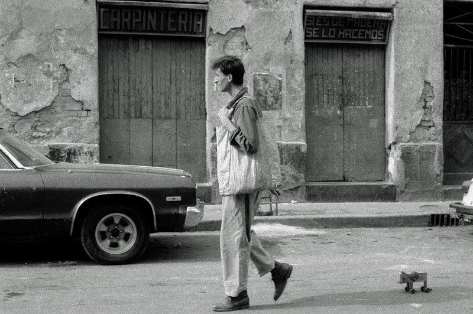

## 187. Re-enactments 重演 2001（Francis Alÿs, 弗朗西斯·阿里斯）

[作品链接](https://www.moma.org/collection/works/130829)

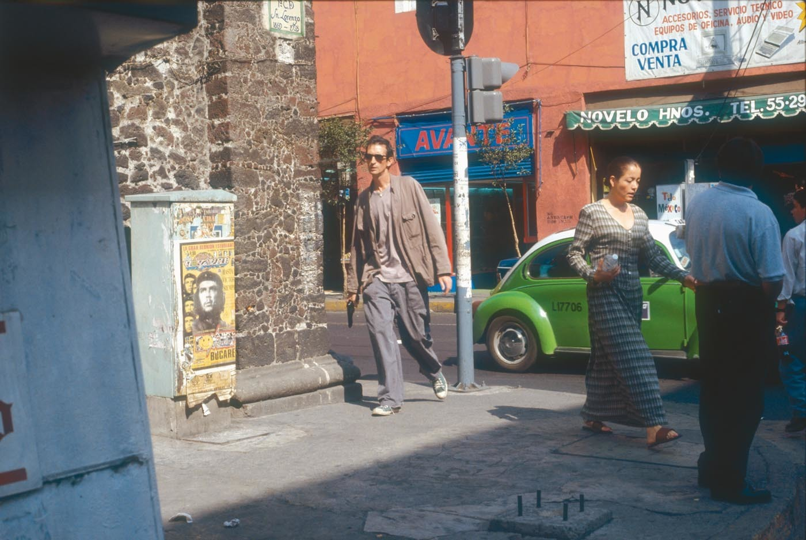

## 188. A Line Made by Walking 走出来的线 1967（Richard Long, 理查德·朗）

[作品链接](http://www.tate.org.uk/art/artworks/long-a-line-made-by-walking-ar00142)

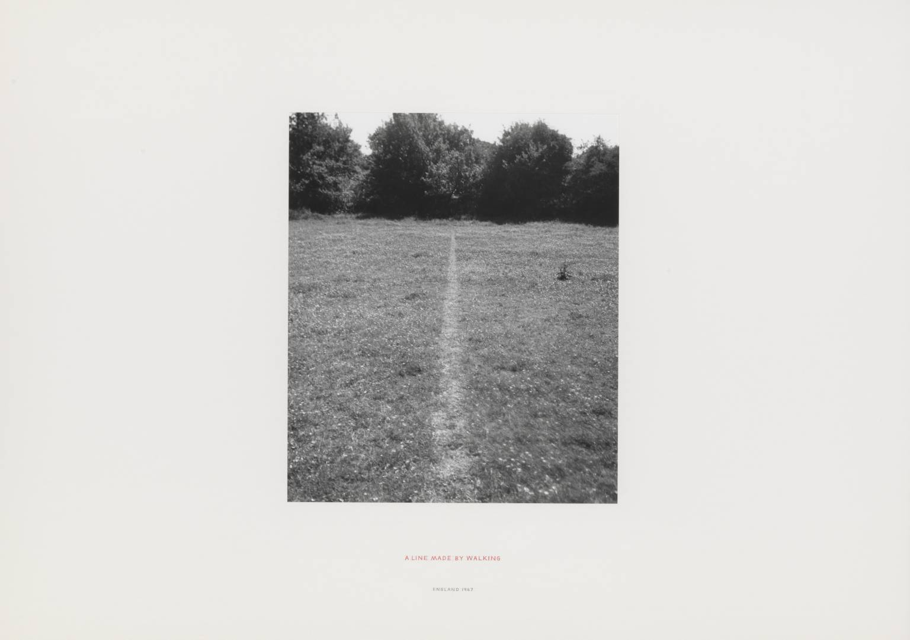

## 189. Spiral Jetty 螺旋形的防波堤 1970（Robert Smithon, 罗伯特•史密森）

[作品链接](https://en.wikipedia.org/wiki/Spiral_Jetty)

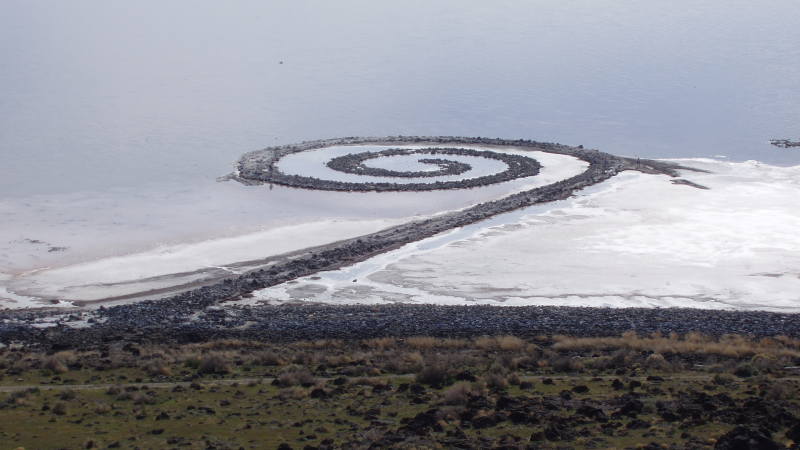

# EIGHTEEN

## 190. Untitled 无题 1972（Donald Judd, 唐纳德·贾德）

[作品链接](http://www.tate.org.uk/art/artworks/judd-untitled-t06524)

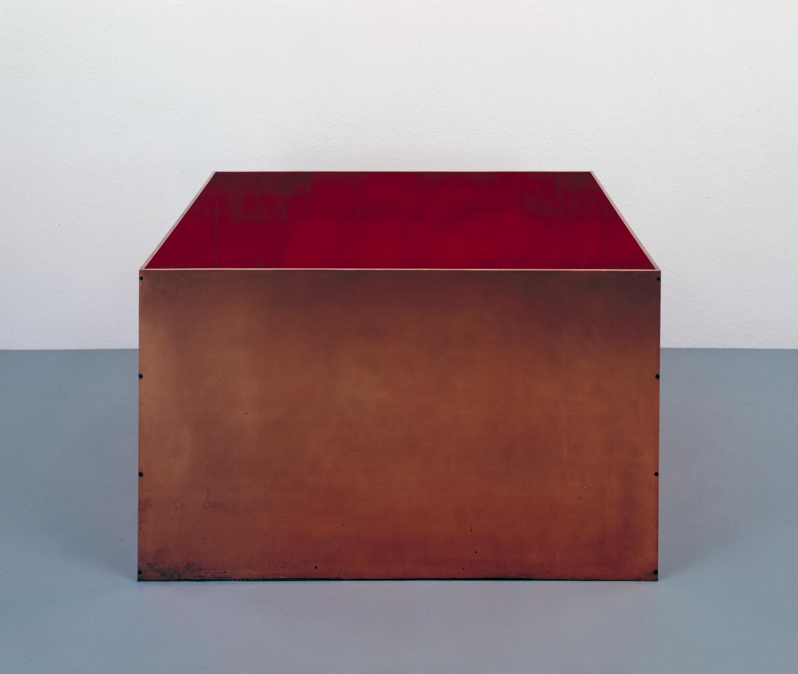

## 191. Untitled (Stack)  无题（堆叠）1967（Donald Judd, 唐纳德·贾德）

[作品链接](https://www.moma.org/collection/works/81324?locale=en)

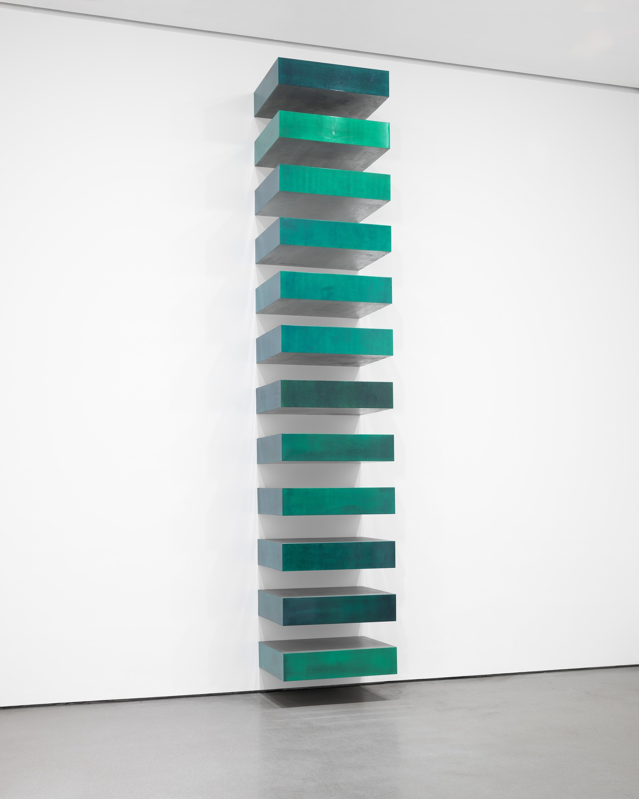

## 192. The Marriage of Reason and Squalor, II 理性与卑劣的联姻 2 1959（Frank Stella, 弗兰克·斯特拉）

[作品链接](https://www.moma.org/collection/works/80316)

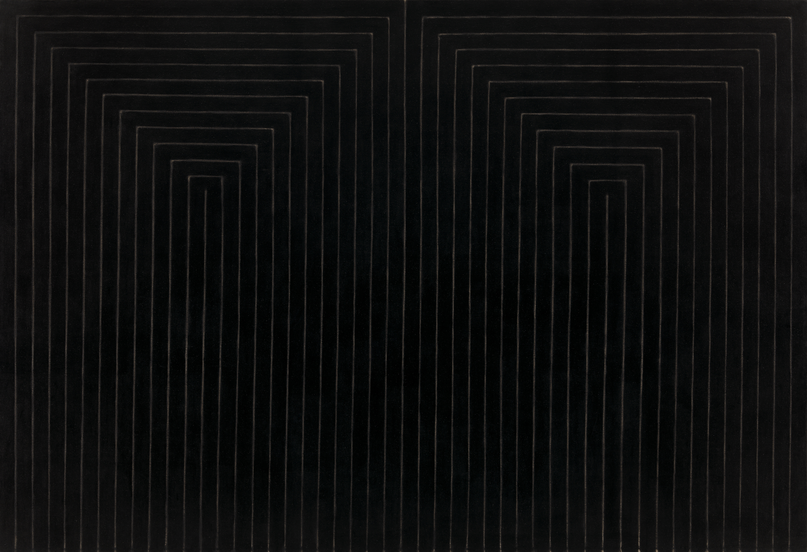

## 193. Hyena Stomp 鬣狗爵士舞 1962（Frank Stella, 弗兰克·斯特拉）

[作品链接](http://www.tate.org.uk/art/artworks/stella-hyena-stomp-t00730)

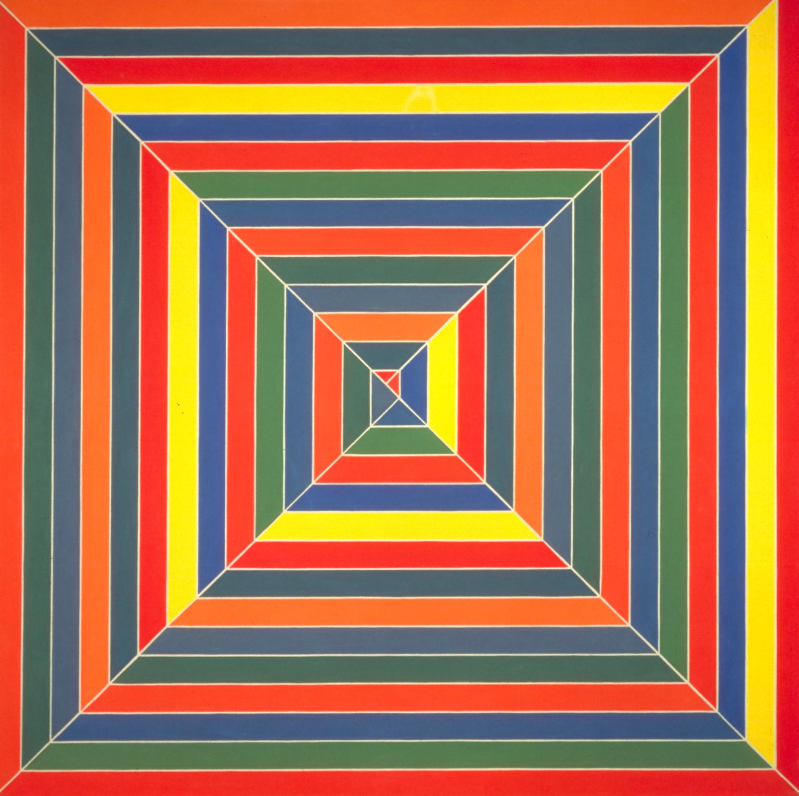

## 194. 144 Magnesium Square 144块镁方砖 1969 （Carl Andre, 卡尔·安德烈）

[作品链接](http://www.tate.org.uk/art/artworks/andre-144-magnesium-square-t01767)

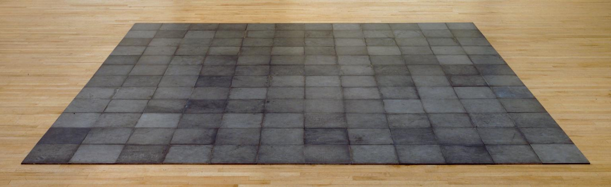

## 195. "monument" 1 for V. Tatlin 献给 V·塔特林之纪念碑 1 1964（Dan Flavin, 丹·弗莱文）

[作品链接](https://www.moma.org/collection/works/81337?locale=en)

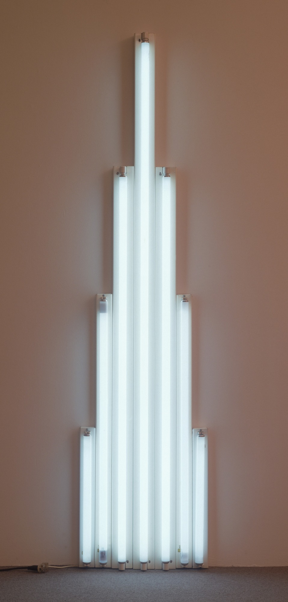

## 196. Serial Project, I (ABCD) 序列工程 1 （ABCD） 1966 （Sol LeWitt, 索尔·勒维特）

[作品链接](https://www.moma.org/collection/works/81533?locale=en)

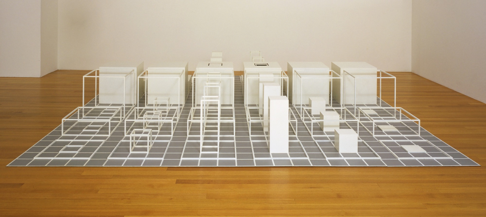

# NINETEEN

## 197. Untitled Film Still #21 无题电影剧照 #21 1978（Cindy Sherman, 辛迪·舍曼）

[作品链接](https://www.moma.org/collection/works/56618?locale=en)

## 198. The Destroyed Room 损毁的房间 1978（Jeff Wall, 杰夫·沃尔）

[作品链接](http://www.tate.org.uk/whats-on/tate-modern/exhibition/jeff-wall/jeff-wall-room-guide/jeff-wall-room-guide-room-1)

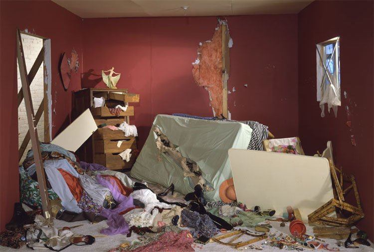

## 199. The Death of Sardanapalus 萨丹纳帕鲁斯之死 1827（Eugène Delacroix, 欧仁·德拉克罗瓦）

[作品链接](https://en.wikipedia.org/wiki/The_Death_of_Sardanapalus)

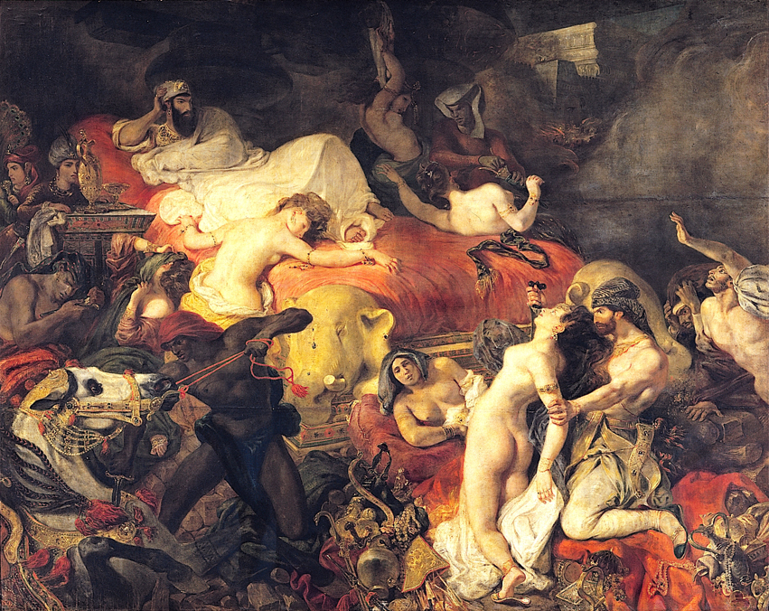

## 200. Mimic 模拟 1982（Jeff Wall, 杰夫·沃尔）

[作品链接](http://www.tate.org.uk/whats-on/tate-modern/exhibition/jeff-wall/jeff-wall-room-guide/jeff-wall-room-guide-room-3)

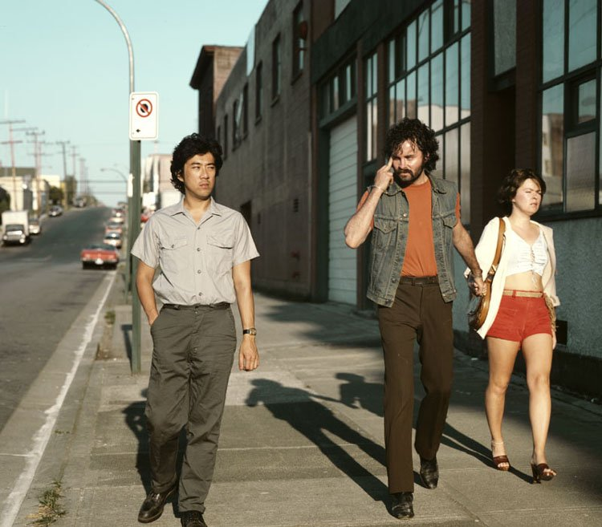

## 201. Paris Street; Rainy Day 巴黎街道：雨天 1877（Gustave Caillebotte, 古斯塔夫·卡耶博特）

[作品链接](https://en.wikipedia.org/wiki/Paris_Street;_Rainy_Day)

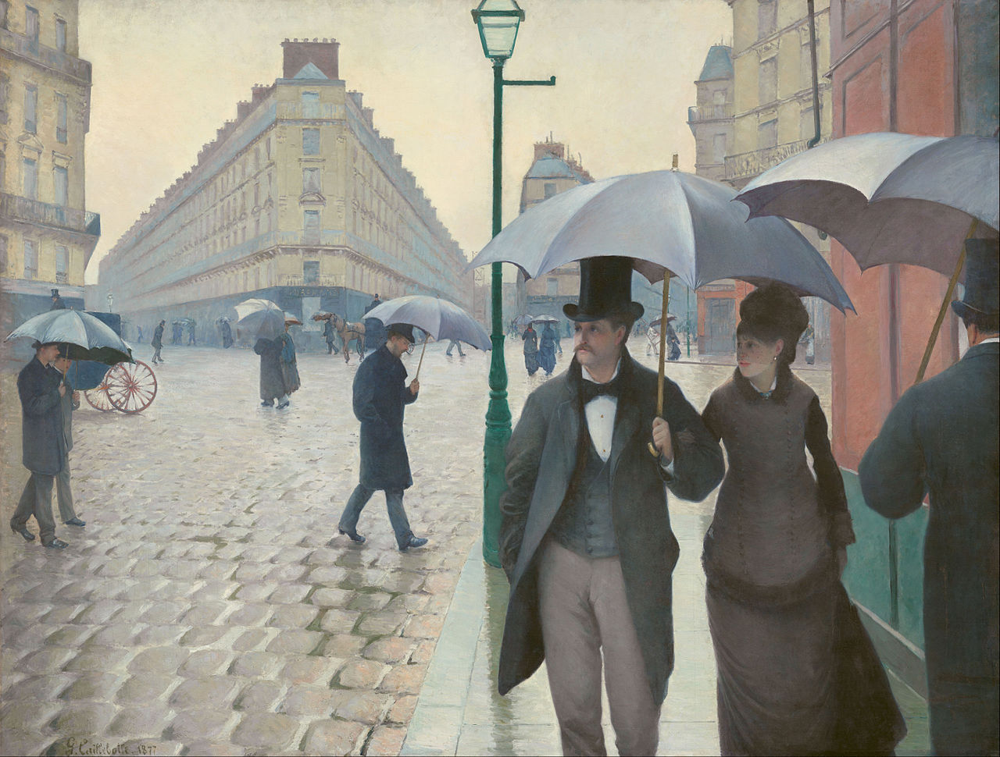

## 202. Untitled (I shop therefore I am) 无题（我买故我在） 1987（Barbara Kruger, 芭芭拉·克鲁格）

[作品链接](https://www.wikiart.org/en/barbara-kruger/untitled-i-shop-therefore-i-am-1987)

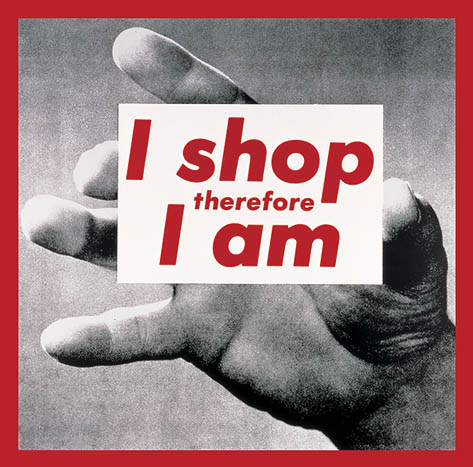

## 203. Untitled (Your body is a battleground)  无题（你的身体是战场）1989（Barbara Kruger, 芭芭拉·克鲁格）

[作品链接](https://www.artsy.net/artwork/barbara-kruger-untitled-your-body-is-a-battleground-1)

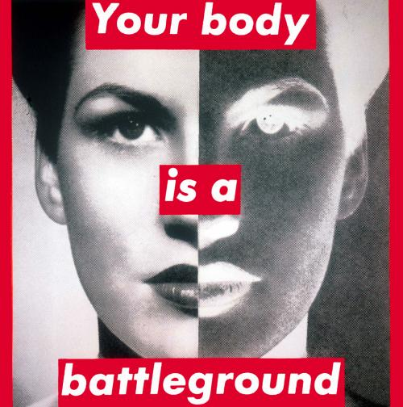

## 204. Untitled (You Invest in the Divinity of the Masterpiece) 无题（你投资杰作之神圣性）1982（Barbara Kruger, 芭芭拉·克鲁格）

[作品链接](https://www.moma.org/collection/works/79334)

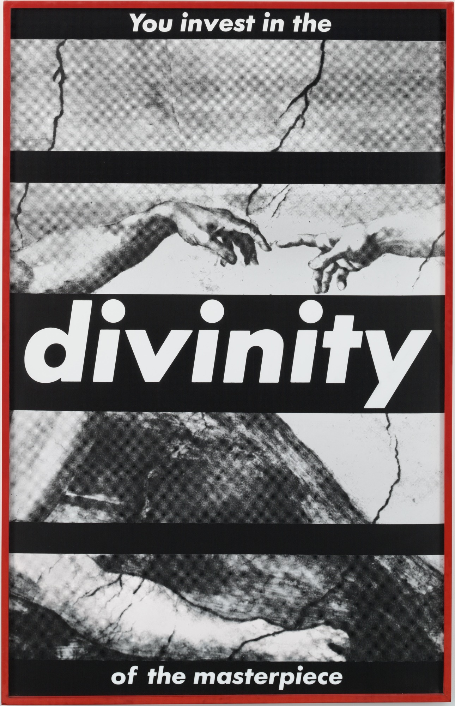

## 205. How to Work Better 怎么更好工作 1991（Peter Fischli & David Weiss, 彼得·弗施利与大卫·韦斯）

[作品链接](https://www.moma.org/collection/works/222300?locale=en&recent_acquisitions=1)

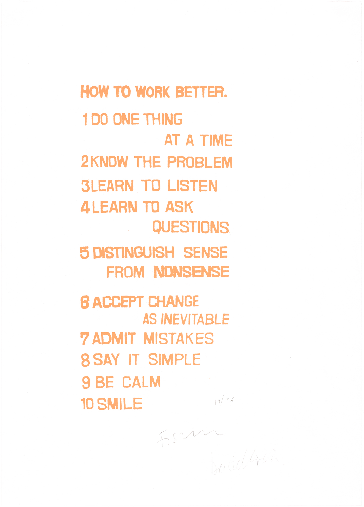

## 206. Tips for Artists Who Want to Sell 给想卖作品的艺术家的建议 1966-1968 （John Baldessari, 约翰·巴尔代萨里）

[作品链接](https://www.thebroad.org/art/john-baldessari/tips-artists-who-want-sell)

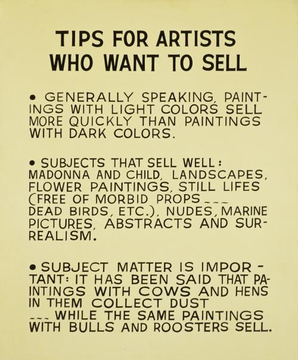

## 207. Heel 脚后跟 1986 （John Baldessari, 约翰·巴尔代萨里）

[作品链接](https://theartstack.com/artist/john-baldessari/heel)

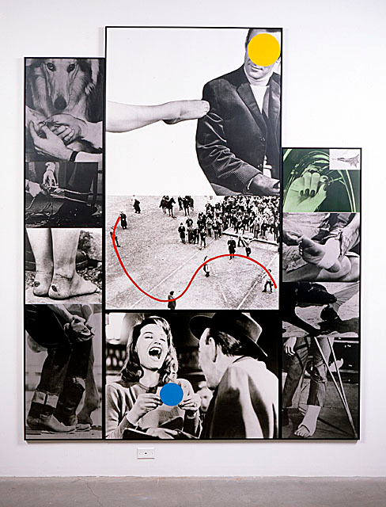

## 208. The Way Things Go 天衣无缝的连锁反应 1987（Peter Fischli & David Weiss, 彼得·弗施利与大卫·韦斯） *art film*

[作品链接](https://en.wikipedia.org/wiki/The_Way_Things_Go )

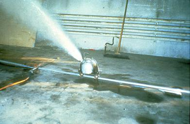

# TWENTY

## 209. Made in Heaven 天堂制造 1989（Jeff Koons，杰夫·昆斯）

[作品链接](http://www.jeffkoons.com/artwork/made-in-heaven)

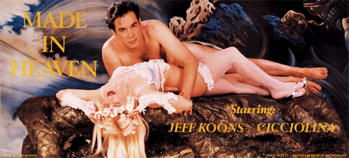

## 210. Spot Painting 现场画 1986（Damien Hirst, 达米恩·赫斯特）

[作品链接](http://www.damienhirst.com/spot-painting)

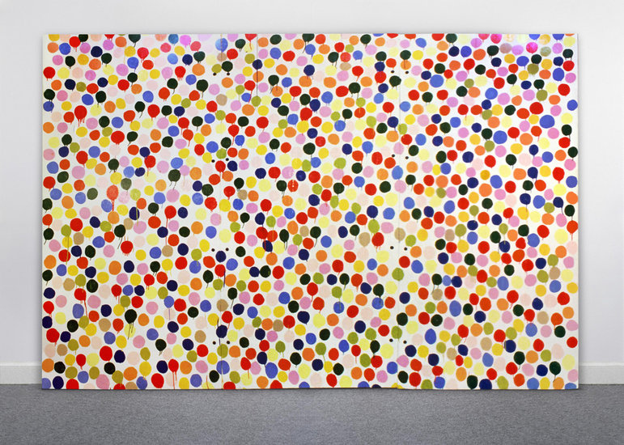

## 211. A Thousand Years 一千年 1990 （Damien Hirst, 达米恩·赫斯特）

[作品链接](http://www.damienhirst.com/a-thousand-years)

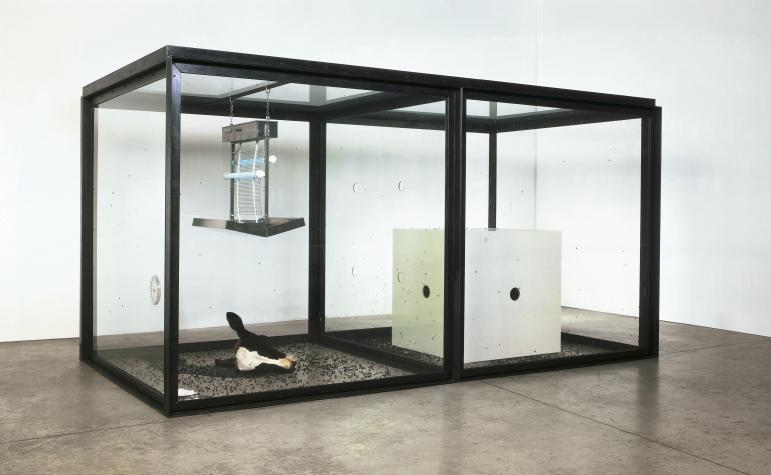

## 212. The Physical Impossibility of Death in the Mind of Someone Living 生者对于死亡的无动于衷 1991（Damien Hirst, 达米恩·赫斯特）

[作品链接](http://www.damienhirst.com/the-physical-impossibility-of)

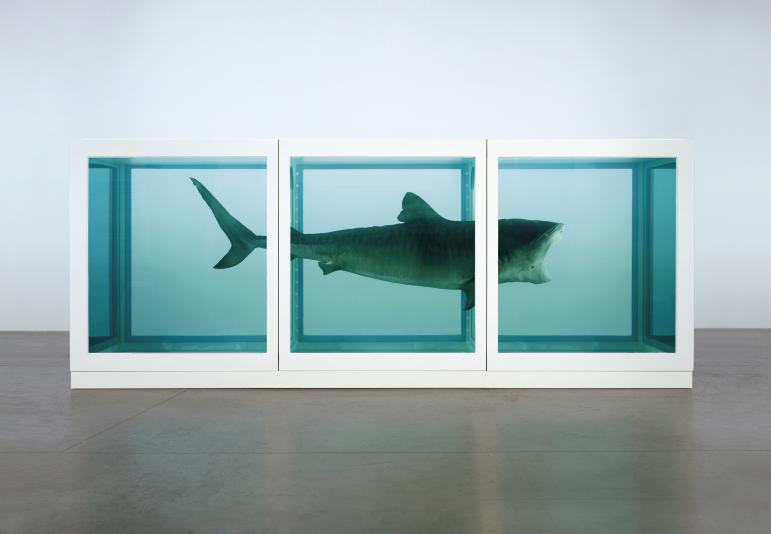

## 213. Self 自己 1991（Marc Quinn, 马克·奎恩）

[作品链接](http://marcquinn.com/artworks/single/self-1991)

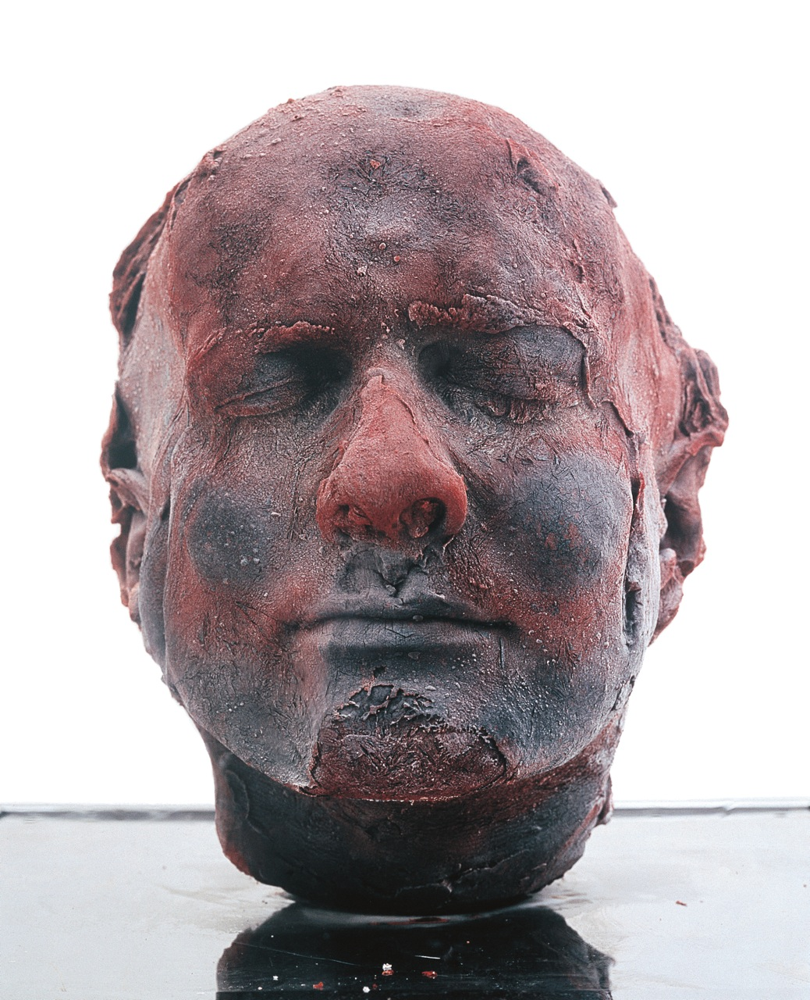

## 214. Myra 迈尔 1995 （Marcus Harvey, 马克斯·哈维）

[作品链接](https://en.wikipedia.org/wiki/Myra_(painting))

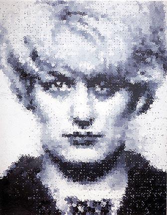

## 215. For the Love of God 献给上帝的爱 2007（Damien Hirst, 达米恩·赫斯特）

[作品链接](http://www.damienhirst.com/for-the-love-of-god)

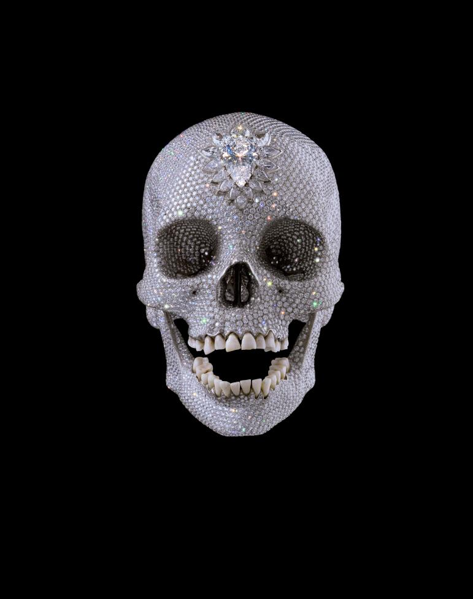

## 216. Two Fried Eggs and a Kebab 两个煎鸡蛋和一根烤肉串 1992（Sarah Lucas, 莎拉·卢卡斯）

[作品链接](http://www.saatchigallery.com/artists/artpages/sarah_lucas_2.htm)

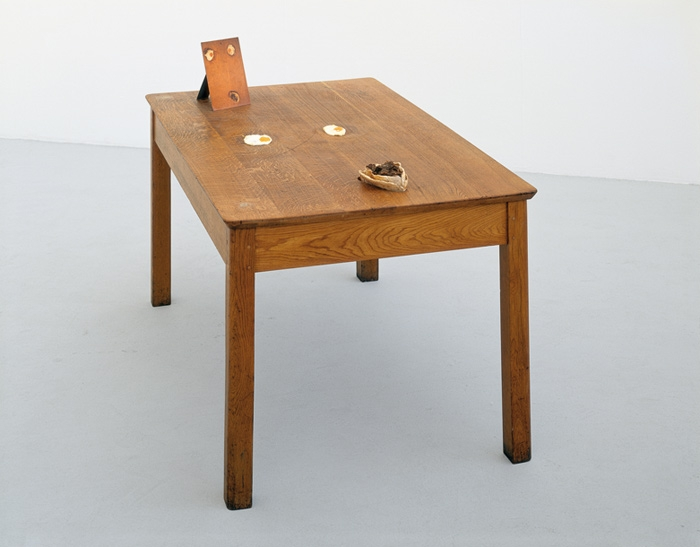

## 217. Au Naturel 裸体 1994（Sarah Lucas, 莎拉·卢卡斯）

[作品链接](http://www.saatchigallery.com/artists/artpages/sarah_lucas_1.htm)

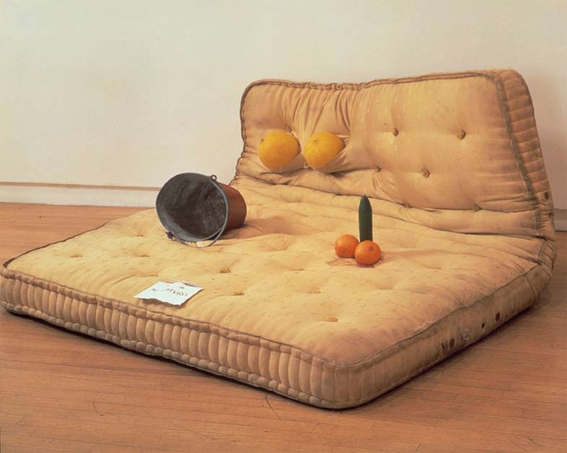

## 218. Everyone I Have Ever Slept With 1963–1995 1963至1995年曾经和我睡在一起的每一个人 1995 （Tracey Emin, 翠西·艾敏）

[作品链接](https://en.wikipedia.org/wiki/Everyone_I_Have_Ever_Slept_With_1963%E2%80%931995)

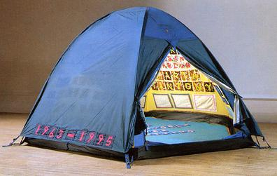

## 219. My Bed 我的床 1998 （Tracey Emin, 翠西·艾敏）

[作品链接](https://en.wikipedia.org/wiki/My_Bed)

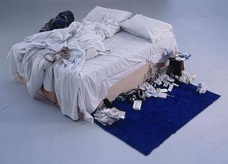

## 220. Hotel International 国际酒店 1993（Tracey Emin, 翠西·艾敏）

[作品链接](https://www.artsy.net/artwork/tracey-emin-hotel-international)

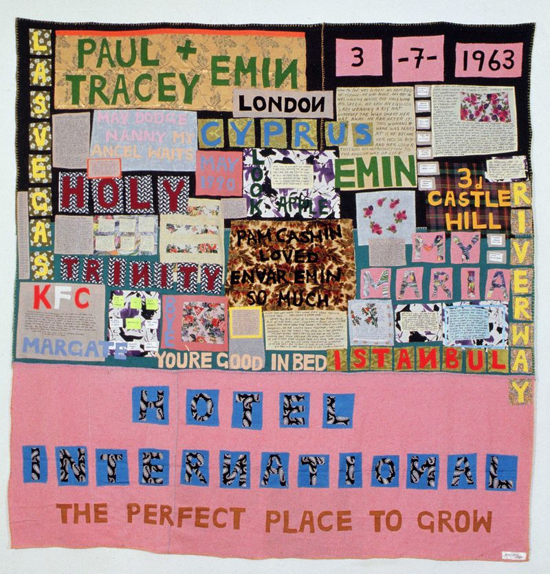

## 221. Tea Painting in an Illusionistic Style 透视风格的茶画 1961（David Hockney, 大卫·霍克尼）

[作品链接](http://www.tate.org.uk/art/artworks/hockney-tea-painting-in-an-illusionistic-style-t07075)

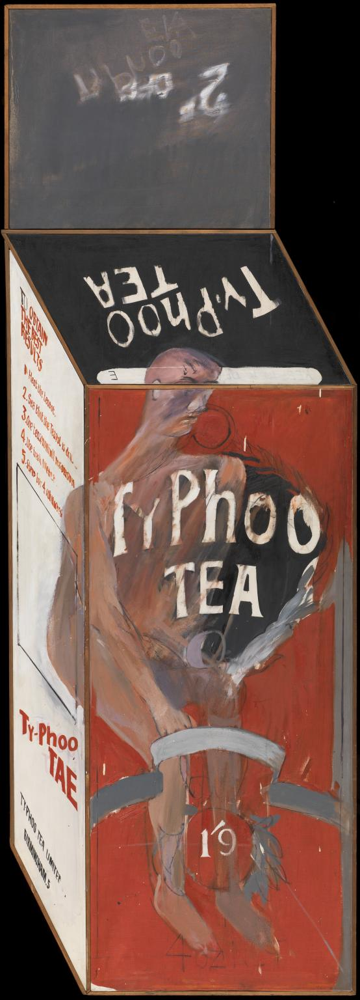

## 222. Victory Boogie Woogie 胜利之舞 1942-1943（Piet Mondrian, 皮埃特·蒙特里安）

[作品链接](https://en.wikipedia.org/wiki/Victory_Boogie_Woogie)

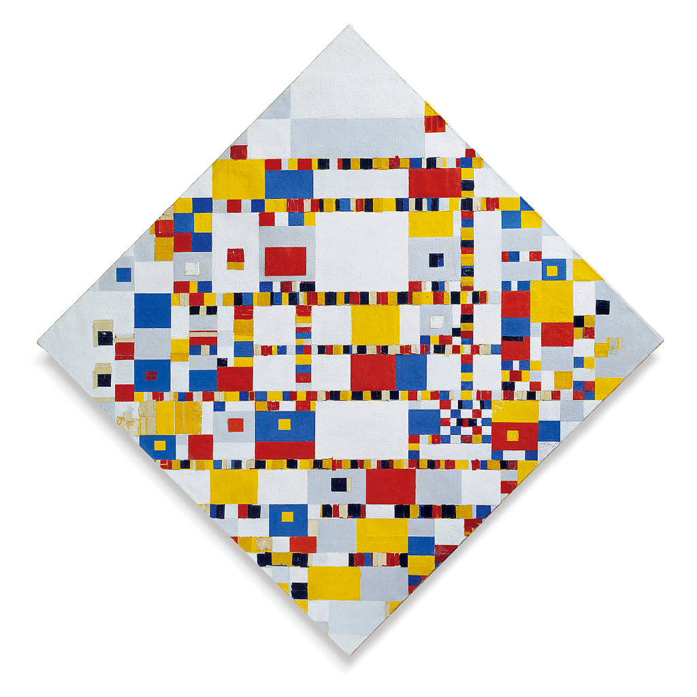

## 223. Woman III 妇女 3 1953（Willem de Kooning, 威廉·德·库宁）

[作品链接](https://en.wikipedia.org/wiki/Woman_III)

## 224. Miss ko² ko小姐 1997（Takashi Murakami, 村上隆）

[作品链接](https://www.wikiart.org/en/takashi-murakami/miss-ko-1997)

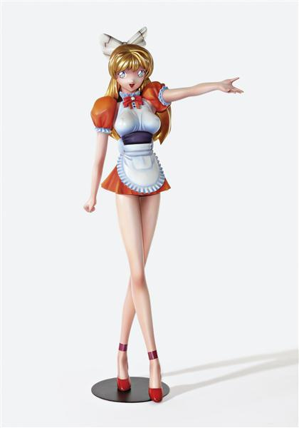

## 225. Hiropon 1997 （Takashi Murakami, 村上隆）

[作品链接](http://www.artnet.com/artists/takashi-murakami/hiropon-dMN_9UQNrw4mGMprXpeWBg2)

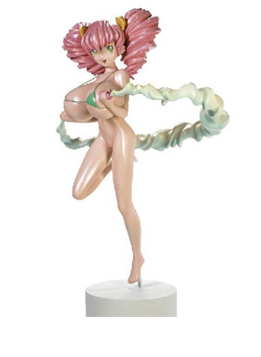

## 226. My Lonesome Cowboy 我的寂寞牛仔 1998 （Takashi Murakami, 村上隆）

[作品链接](https://www.wikiart.org/en/takashi-murakami/my-lonesome-cowboy-1998)

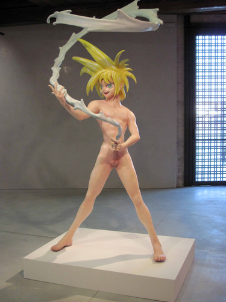

## 227. 摔破一个汉代陶罐 Dropping a Han Dynasty Urn 1995（艾未未, Ai Weiwei）

[作品链接](https://www.artsy.net/artwork/ai-weiwei-dropping-a-han-dynasty-urn-1)

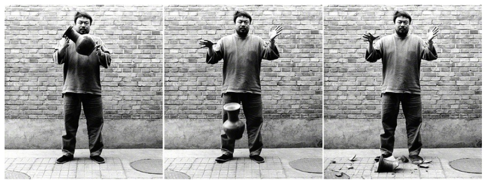
